# Tarea Integradora 02: Detección de Fraude con Tarjetas de Crédito

**Dataset:** *Credit Card Fraud Detection* [Kaggle](https://www.kaggle.com/datasets/mlg-ulb/creditcardfraud)

Este dataset contiene 284.807 transacciones realizadas con tarjeta de crédito en septiembre de 2013 por titulares europeos. De estas, 492 son fraudes (≈0.17%). El objetivo de esta tarea es aplicar técnicas de aprendizaje automático en un contexto realista y altamente desbalanceado.

## Objetivos de Aprendizaje

1. Comprender el impacto del desbalance de clases en problemas reales.
2. Explorar y analizar un dataset financiero con fuerte desbalance.
3. Aplicar técnicas de preprocesamiento y re-muestreo (undersampling, oversampling, SMOTE).
4. Entrenar y comparar modelos de clasificación (Regresión Logística, Árboles de Decisión, Random Forest, Gradient Boosting).
5. Evaluar modelos con métricas adecuadas para datasets desbalanceados (Precision, Recall, F1, AUC-ROC, AUC-PR).
6. Reflexionar sobre los trade-offs entre precisión y recall en un problema crítico como el fraude.

## Características del dataset

Solo contiene variables numericas que son el resultado de una trasformación de PCA.
Desafortunadamente, por problemas confidenciales, no se puede proveer de las columnas originales ni más información adicional sobre los datos.

Las columnas `V1`, `V2`, `V28` son los componentes principales obtenidos con PCA, las únicas columnas que no fueron transformadas con PCA son `Time` y `Amount`.

La columna `Time` contiene el tiempo transcurrido entre la primer transacción del dataset y la seleccionada.

La columna `Amount` es la cantidad de dinero transaccionado.

La columna `Class` es la variable de respuesta y toma los valores (1 = en caso de fraude, y 0 = en caso contrario).

Dado el coeficiente de desequilibrio de clases, recomendamos medir la precisión utilizando el Área Bajo la Curva de Precisión-Recall (AUPRC). La precisión de la matriz de confusión no es significativa para la clasificación desequilibrada.

- Total de **fraudes** registrados en el dataset: 492
- Total de **no fraudes** registrados en el dataset: 284315
- Proporción de **fraude**: 0.0017
  
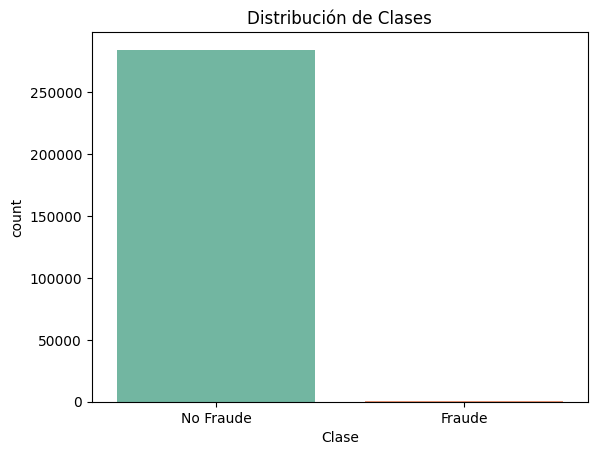
 
---

# 1. Análisis exploratorio

Las columnas `V1` a `V28` son el resultado de una transformación PCA. Por lo tanto, ya están normalizadas. Sin embargo para las columnas `Time` y `Amount` serán analizadas para saber si necesitan escalado.

**Rango** de la columna **Time**: [0.0 a 172792.0]
**Rango** de la columna **Amount**: [0.0 a 25691.16]

<table border="1" class="dataframe">
  <thead>
    <tr style="text-align: right;">
      <th></th>
      <th>count</th>
      <th>mean</th>
      <th>std</th>
      <th>min</th>
      <th>1%</th>
      <th>5%</th>
      <th>25%</th>
      <th>50%</th>
      <th>75%</th>
      <th>95%</th>
      <th>99%</th>
      <th>max</th>
      <th>skew</th>
      <th>kurtosis</th>
    </tr>
  </thead>
  <tbody>
    <tr>
      <th>Time</th>
      <td>284807.0</td>
      <td>94813.859575</td>
      <td>47488.145955</td>
      <td>0.0</td>
      <td>2422.00</td>
      <td>25297.60</td>
      <td>54201.5</td>
      <td>84692.0</td>
      <td>139320.500</td>
      <td>164143.4</td>
      <td>170560.94</td>
      <td>172792.00</td>
      <td>-0.035568</td>
      <td>-1.293530</td>
    </tr>
    <tr>
      <th>Amount</th>
      <td>284807.0</td>
      <td>88.349619</td>
      <td>250.120109</td>
      <td>0.0</td>
      <td>0.12</td>
      <td>0.92</td>
      <td>5.6</td>
      <td>22.0</td>
      <td>77.165</td>
      <td>365.0</td>
      <td>1017.97</td>
      <td>25691.16</td>
      <td>16.977724</td>
      <td>845.092646</td>
    </tr>
  </tbody>
</table>

    
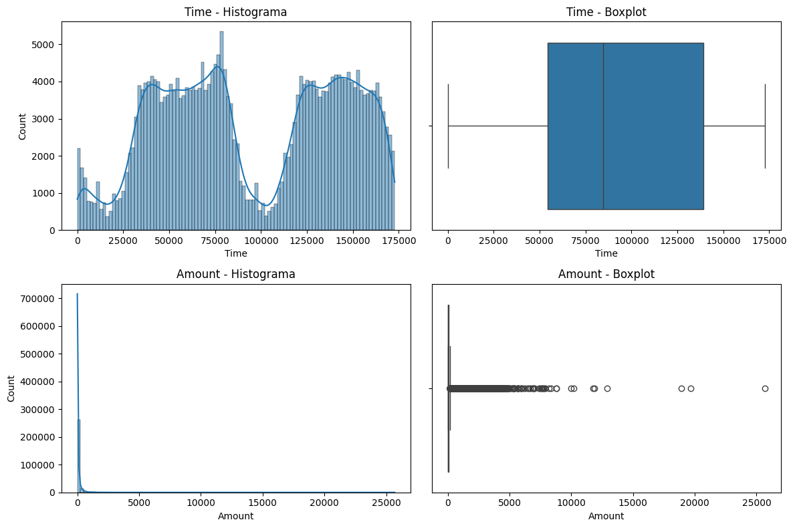

**Columna `Time`**

- Media ≈ 94,813
- Rango: 0 – 172,792 (≈ 2 días)
- Skewness ≈ -0.035 (muy cerca de 0 → simétrica).
- Kurtosis ≈ -1.29 (distribución más plana que la normal → no heavy-tailed).

`Time` esta bastante balanceado y no muestra un sesgo fuerte.

Se puede analizar que la cantidad de transacciones se ve afectada por la hora, ya que se puede ver como baja la cantidad de transacciones a los 25000 segundos y a los 100000 segundos. Este comportamiento me hace suponer que el dataset comenzo a recabar datos a las 00:00 y las transacciones bajan en gran cantidad por la madrugada ya que 100000 segundos son aproximadamente 27 horas.

Al usar modelos sensibles a magnitudes (LogisticRegression, SVM, NN) es necesario escalar los valores de esta variable.

**Columna `Amount`**

- Media ≈ 88, pero std ≈ 250 (muy disperso).
- Percentiles:
  - 50% de los valores ≤ 22.0
  - 75% ≤ 77.1
  - 95% ≤ 365
  - 99% ≤ 1017.9
- Máximo = 25,691 (demasiados outliers fuertes).
- Skewness = 16.98 (altamente sesgada a la derecha).
- Kurtosis = 845 (cola muy pesada: outliers extremos).

Amount es la típica variable monetaria con muchos valores pequeños y pocas transacciones muy grandes.

Necesita transformación logarítmica (np.log1p) para corregir la asimetría.

Conviene luego aplicar RobustScaler (mejor que StandardScaler) porque no se deja influenciar tanto por los outliers.

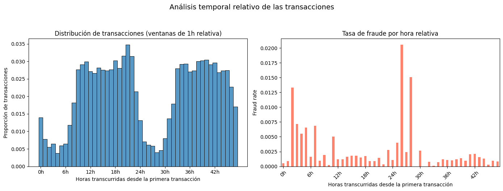
    

A través del análisis del tiempo, se puede notar que cuando hay menos transacciones es cuando hay más fraudes. Lo que me lleva a pensar que: en la madrugada hay menos transacciones por lo tanto, en la madrugada se da la mayor cantidad de fraudes. Pero solo es suposición. 

Justificación de transformación de la variable `Amount`: 

- Skew Amount: 16.978
- Skew log1p(Amount): 0.163
    

    
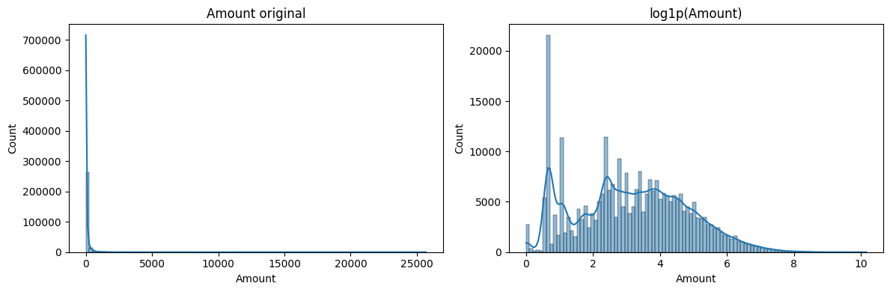
    

**¿Para qué se usa en este problema?**

`Amount` suele estar muy sesgado a la derecha y con outliers. `log1p`:
- Comprime grandes valores (reduce la cola).
- Reduce la asimetría (skew) → modelos lineales como la Regresión Logística suelen comportarse mejor.
- Después de log1p, es común aplicar un escalado robusto (RobustScaler) para atenuar aún más outliers.

---

# 2. Modelo base

Luego del análisis de las features, comenzamos aplicando modelos de Aprendizaje Automático. Nos aseguramos de separar el dataset en dos partes (Train y Test) y luego comenzamos a implementar distintos modelos.

## Regresión Logística sin re-balanceo

Aplicamos el modelo de Regresión Logística **sin el parámetro** `class_weight=balanced` para ver como rinde el modelo sin tener en cuenta este balanceo del dataset.

Estos son los resultados obtenidos:

<table id="T_a186b">
  <thead>
    <tr>
      <th class="blank level0" >&nbsp;</th>
      <th id="T_a186b_level0_col0" class="col_heading level0 col0" >Logistic Regression (sin rebalanceo)</th>
    </tr>
  </thead>
  <tbody>
    <tr>
      <th id="T_a186b_level0_row0" class="row_heading level0 row0" >Accuracy</th>
      <td id="T_a186b_row0_col0" class="data row0 col0" >0.9992</td>
    </tr>
    <tr>
      <th id="T_a186b_level0_row1" class="row_heading level0 row1" >Balanced Accuracy</th>
      <td id="T_a186b_row1_col0" class="data row1 col0" >0.8213</td>
    </tr>
    <tr>
      <th id="T_a186b_level0_row2" class="row_heading level0 row2" >Precision</th>
      <td id="T_a186b_row2_col0" class="data row2 col0" >0.8289</td>
    </tr>
    <tr>
      <th id="T_a186b_level0_row3" class="row_heading level0 row3" >Recall</th>
      <td id="T_a186b_row3_col0" class="data row3 col0" >0.6429</td>
    </tr>
    <tr>
      <th id="T_a186b_level0_row4" class="row_heading level0 row4" >F1</th>
      <td id="T_a186b_row4_col0" class="data row4 col0" >0.7241</td>
    </tr>
    <tr>
      <th id="T_a186b_level0_row5" class="row_heading level0 row5" >ROC-AUC</th>
      <td id="T_a186b_row5_col0" class="data row5 col0" >0.9571</td>
    </tr>
    <tr>
      <th id="T_a186b_level0_row6" class="row_heading level0 row6" >PR-AUC</th>
      <td id="T_a186b_row6_col0" class="data row6 col0" >0.7390</td>
    </tr>
  </tbody>
</table>

Los resultados de la regresión logística sin aplicar ninguna técnica de rebalanceo muestran, en primer lugar, una accuracy muy alta (0.9992), aunque esta métrica es poco informativa dado el fuerte desbalance de clases. Métricas más adecuadas, como la balanced accuracy (0.8213), evidencian que el modelo logra un rendimiento razonable en ambas clases, aunque con cierta asimetría. En cuanto al desempeño sobre la clase minoritaria (fraude), se observa una precisión alta (0.8289), lo que significa que la mayoría de las transacciones identificadas como fraudulentas realmente lo son, pero un recall más bajo (0.6429), indicando que aún se pierden una proporción importante de fraudes. Esto se refleja en un F1 de 0.7241, que resume el equilibrio entre precisión y recall. Finalmente, el ROC-AUC (0.9571) sugiere una buena capacidad general de discriminación, pero es el PR-AUC (0.7390) el que refleja mejor la dificultad del problema y confirma que, aunque el modelo es capaz de concentrar fraudes en sus predicciones, todavía queda margen de mejora en la detección de casos positivos.

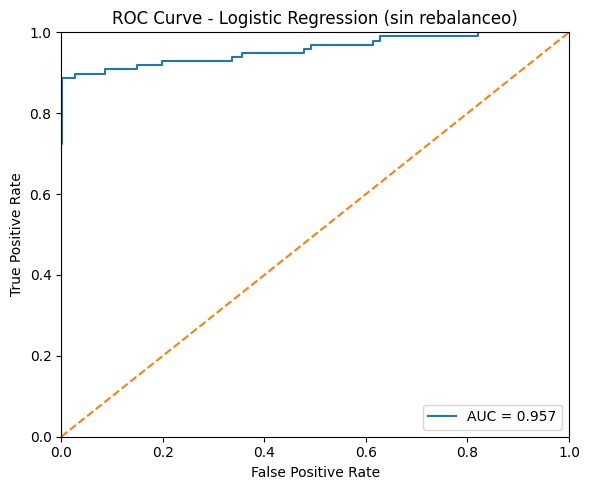

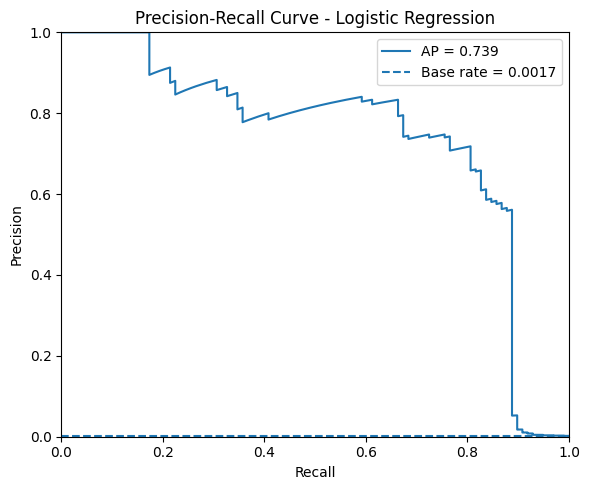
    
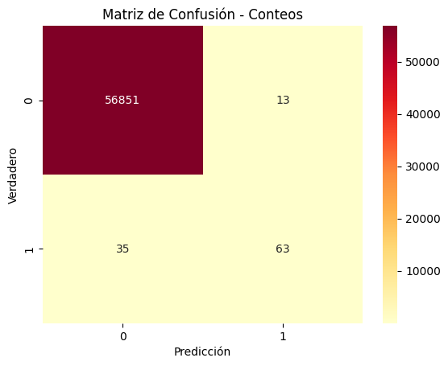

---

## Regresión Logística con re-balanceo `class_weight='balanced'`

Aplicamos el modelo de Regresión Logística **con el parámetro** `class_weight=balanced` para ver como rinde el modelo balanceando el dataset.

<table id="T_3baad">
  <thead>
    <tr>
      <th class="blank level0" >&nbsp;</th>
      <th id="T_3baad_level0_col0" class="col_heading level0 col0" >Logistic Regression (balanceadas)</th>
    </tr>
  </thead>
  <tbody>
    <tr>
      <th id="T_3baad_level0_row0" class="row_heading level0 row0" >Accuracy</th>
      <td id="T_3baad_row0_col0" class="data row0 col0" >0.9753</td>
    </tr>
    <tr>
      <th id="T_3baad_level0_row1" class="row_heading level0 row1" >Balanced Accuracy</th>
      <td id="T_3baad_row1_col0" class="data row1 col0" >0.9469</td>
    </tr>
    <tr>
      <th id="T_3baad_level0_row2" class="row_heading level0 row2" >Precision</th>
      <td id="T_3baad_row2_col0" class="data row2 col0" >0.0604</td>
    </tr>
    <tr>
      <th id="T_3baad_level0_row3" class="row_heading level0 row3" >Recall</th>
      <td id="T_3baad_row3_col0" class="data row3 col0" >0.9184</td>
    </tr>
    <tr>
      <th id="T_3baad_level0_row4" class="row_heading level0 row4" >F1</th>
      <td id="T_3baad_row4_col0" class="data row4 col0" >0.1133</td>
    </tr>
    <tr>
      <th id="T_3baad_level0_row5" class="row_heading level0 row5" >ROC-AUC</th>
      <td id="T_3baad_row5_col0" class="data row5 col0" >0.9712</td>
    </tr>
    <tr>
      <th id="T_3baad_level0_row6" class="row_heading level0 row6" >PR-AUC</th>
      <td id="T_3baad_row6_col0" class="data row6 col0" >0.7114</td>
    </tr>
  </tbody>
</table>

La regresión logística con el parámetro `class_weight=balanced` muestra un cambio notable en el comportamiento del modelo frente al desbalance. La accuracy cae a 0.9753, lo cual es esperado, ya que el modelo ahora da más peso a la clase minoritaria y deja de “aprovechar” la abundancia de negativos para inflar esta métrica. En contraste, la balanced accuracy sube hasta 0.9469, evidenciando un rendimiento más equilibrado entre ambas clases. El gran cambio se ve en el recall (0.9184), lo que significa que el modelo detecta la mayoría de los fraudes, aunque esto ocurre a costa de una precisión muy baja (0.0604): gran parte de las transacciones marcadas como fraude son falsos positivos. Este desbalance entre precisión y recall se refleja en un F1 muy bajo (0.1133), indicando que la calidad de las predicciones positivas es deficiente. A nivel global, el ROC-AUC (0.9712) sigue siendo alto y el PR-AUC (0.7114) se mantiene competitivo, lo que sugiere que, si bien el modelo logra “capturar” a casi todos los fraudes, la enorme cantidad de falsas alarmas limita su utilidad práctica sin un umbral de decisión ajustado o un postprocesamiento adecuado.
    
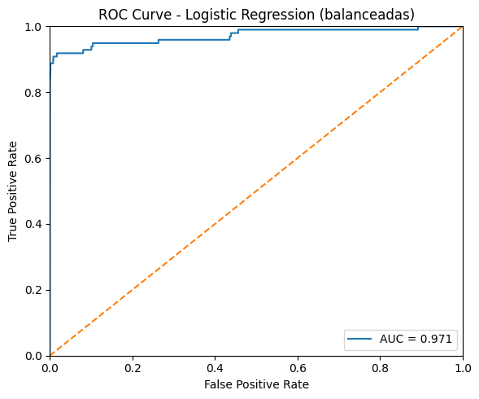
    
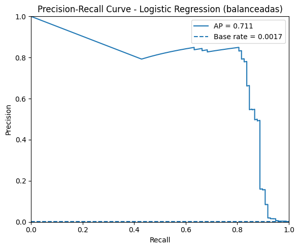
    

---
    
## Regresión Logística con SMOTE

Aplicamos la técnica de re-muestreo con **SMOTE** (Synthetic Minority Oversampling Technique) para balancear las clases del dataset, generando muestras sintéticas de la clase minoritaria. De esta forma, buscamos que el modelo de Regresión Logística entrene con un conjunto de datos más equilibrado y pueda mejorar su capacidad de detección de fraudes.

Estos son los resultados obtenidos:

<table id="T_d8777">
  <thead>
    <tr>
      <th class="blank level0" >&nbsp;</th>
      <th id="T_d8777_level0_col0" class="col_heading level0 col0" >Logistic Regression (SMOTE)</th>
    </tr>
  </thead>
  <tbody>
    <tr>
      <th id="T_d8777_level0_row0" class="row_heading level0 row0" >Accuracy</th>
      <td id="T_d8777_row0_col0" class="data row0 col0" >0.9741</td>
    </tr>
    <tr>
      <th id="T_d8777_level0_row1" class="row_heading level0 row1" >Balanced Accuracy</th>
      <td id="T_d8777_row1_col0" class="data row1 col0" >0.9463</td>
    </tr>
    <tr>
      <th id="T_d8777_level0_row2" class="row_heading level0 row2" >Precision</th>
      <td id="T_d8777_row2_col0" class="data row2 col0" >0.0579</td>
    </tr>
    <tr>
      <th id="T_d8777_level0_row3" class="row_heading level0 row3" >Recall</th>
      <td id="T_d8777_row3_col0" class="data row3 col0" >0.9184</td>
    </tr>
    <tr>
      <th id="T_d8777_level0_row4" class="row_heading level0 row4" >F1</th>
      <td id="T_d8777_row4_col0" class="data row4 col0" >0.1089</td>
    </tr>
    <tr>
      <th id="T_d8777_level0_row5" class="row_heading level0 row5" >ROC-AUC</th>
      <td id="T_d8777_row5_col0" class="data row5 col0" >0.9693</td>
    </tr>
    <tr>
      <th id="T_d8777_level0_row6" class="row_heading level0 row6" >PR-AUC</th>
      <td id="T_d8777_row6_col0" class="data row6 col0" >0.7220</td>
    </tr>
  </tbody>
</table>

La implementación de SMOTE con la regresión logística muestra un comportamiento muy similar al caso con `class_weight=balanced`. La accuracy (0.9741) disminuye respecto al modelo sin rebalanceo, ya que ahora el modelo se enfoca en la clase minoritaria y deja de aprovechar la abundancia de negativos. En contraste, la balanced accuracy (0.9463) es mucho más alta y evidencia un desempeño equilibrado entre ambas clases. El modelo alcanza un recall elevado (0.9184), lo que significa que logra detectar la mayoría de los fraudes, pero a costa de una precisión muy baja (0.0579): la mayoría de las alertas son falsos positivos. Esto se refleja en un F1 bajo (0.1089), indicador de que la calidad de las predicciones positivas es limitada. Sin embargo, el ROC-AUC (0.9693) se mantiene alto y el PR-AUC (0.7220) confirma que el modelo logra concentrar los fraudes en los puntajes más altos. En conclusión, SMOTE permite mejorar la detección de fraudes (alto recall), pero introduce una gran cantidad de falsas alarmas, por lo que sería necesario ajustar umbrales o aplicar estrategias adicionales para mejorar la utilidad práctica del modelo.
    

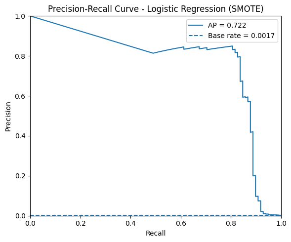
    
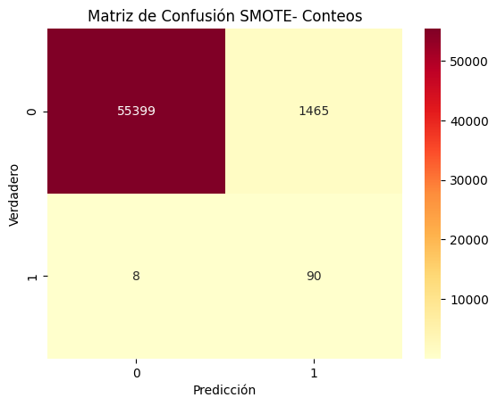

---

## Regresión Logística con Undersampling

Aplicamos la técnica de **undersampling** de la clase mayoritaria, reduciendo el número de transacciones no fraudulentas para equilibrar la proporción de clases en el conjunto de entrenamiento. Con esta estrategia buscamos que la regresión logística tenga un aprendizaje más balanceado y pueda mejorar su capacidad de identificar fraudes, aunque a costa de perder parte de la información de la clase negativa.

Estos son los resultados obtenidos:

<table id="T_a0323">
  <thead>
    <tr>
      <th class="blank level0" >&nbsp;</th>
      <th id="T_a0323_level0_col0" class="col_heading level0 col0" >Logistic Regression (Undersampling)</th>
    </tr>
  </thead>
  <tbody>
    <tr>
      <th id="T_a0323_level0_row0" class="row_heading level0 row0" >Accuracy</th>
      <td id="T_a0323_row0_col0" class="data row0 col0" >0.9587</td>
    </tr>
    <tr>
      <th id="T_a0323_level0_row1" class="row_heading level0 row1" >Balanced Accuracy</th>
      <td id="T_a0323_row1_col0" class="data row1 col0" >0.9386</td>
    </tr>
    <tr>
      <th id="T_a0323_level0_row2" class="row_heading level0 row2" >Precision</th>
      <td id="T_a0323_row2_col0" class="data row2 col0" >0.0370</td>
    </tr>
    <tr>
      <th id="T_a0323_level0_row3" class="row_heading level0 row3" >Recall</th>
      <td id="T_a0323_row3_col0" class="data row3 col0" >0.9184</td>
    </tr>
    <tr>
      <th id="T_a0323_level0_row4" class="row_heading level0 row4" >F1</th>
      <td id="T_a0323_row4_col0" class="data row4 col0" >0.0711</td>
    </tr>
    <tr>
      <th id="T_a0323_level0_row5" class="row_heading level0 row5" >ROC-AUC</th>
      <td id="T_a0323_row5_col0" class="data row5 col0" >0.9764</td>
    </tr>
    <tr>
      <th id="T_a0323_level0_row6" class="row_heading level0 row6" >PR-AUC</th>
      <td id="T_a0323_row6_col0" class="data row6 col0" >0.6244</td>
    </tr>
  </tbody>
</table>

La regresión logística con **undersampling** muestra un desempeño distinto respecto a las otras estrategias de rebalanceo. La **accuracy cae a 0.9587**, lo cual es esperable ya que se reduce drásticamente la cantidad de ejemplos de la clase mayoritaria y el modelo deja de priorizar los “no fraudes”. Sin embargo, la **balanced accuracy (0.9386)** indica que logra un rendimiento bastante equilibrado entre ambas clases. El **recall es muy alto (0.9184)**, mostrando que el modelo detecta la mayoría de los fraudes, pero la **precisión es extremadamente baja (0.0370)**, lo que significa que la gran mayoría de las alertas son falsos positivos. Esto provoca que el **F1 score se desplome hasta 0.0711**, evidenciando una baja calidad de predicción sobre la clase positiva. A nivel global, el **ROC-AUC (0.9764)** se mantiene alto, aunque el **PR-AUC (0.6244)** disminuye respecto a SMOTE y `class_weight=balanced`, reflejando que el modelo no logra concentrar de manera tan efectiva los fraudes en las primeras posiciones. En conclusión, aunque el undersampling logra un excelente recall, la pérdida de información de la clase mayoritaria deteriora la precisión y limita la utilidad práctica del modelo.
    
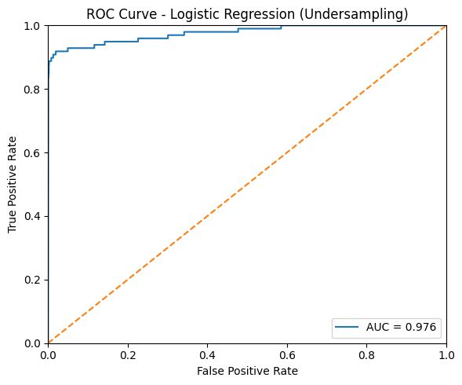
    
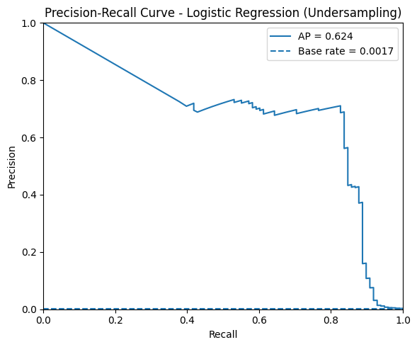
    
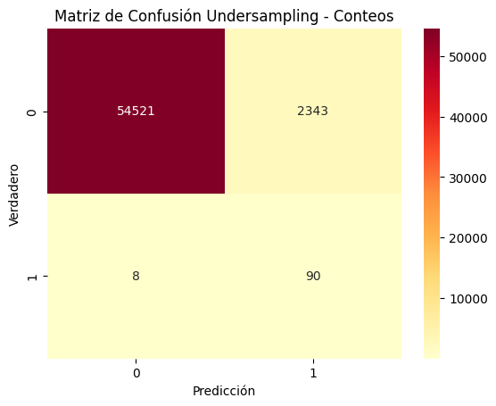

---
    

## Comparación de resultados

En esta sección se presentan los resultados comparativos de la regresión logística sin rebalanceo y con las distintas técnicas de tratamiento del desbalance (uso de class_weight=balanced, aplicación de SMOTE y undersampling). 

<table border="1" class="dataframe">
  <thead>
    <tr>
      <th></th>
      <th>Baseline</th>
      <th>Balanced</th>
      <th>SMOTE</th>
      <th>Undersampling</th>
    </tr>
  </thead>
  <tbody>
    <tr>
      <th>Accuracy</th>
      <td>0.999157</td>
      <td>0.975264</td>
      <td>0.974141</td>
      <td>0.958727</td>
    </tr>
    <tr>
      <th>Balanced Accuracy</th>
      <td>0.821314</td>
      <td>0.946865</td>
      <td>0.946302</td>
      <td>0.938582</td>
    </tr>
    <tr>
      <th>Precision</th>
      <td>0.828947</td>
      <td>0.060362</td>
      <td>0.057878</td>
      <td>0.036991</td>
    </tr>
    <tr>
      <th>Recall</th>
      <td>0.642857</td>
      <td>0.918367</td>
      <td>0.918367</td>
      <td>0.918367</td>
    </tr>
    <tr>
      <th>F1</th>
      <td>0.724138</td>
      <td>0.113279</td>
      <td>0.108893</td>
      <td>0.071118</td>
    </tr>
    <tr>
      <th>ROC-AUC</th>
      <td>0.957063</td>
      <td>0.971189</td>
      <td>0.969268</td>
      <td>0.976388</td>
    </tr>
    <tr>
      <th>PR-AUC</th>
      <td>0.739038</td>
      <td>0.711369</td>
      <td>0.721962</td>
      <td>0.624423</td>
    </tr>
  </tbody>
</table>

La comparación de resultados entre las distintas configuraciones de regresión logística muestra claramente el impacto que tienen las técnicas de rebalanceo en un problema de detección de fraude con clases desbalanceadas. El modelo **baseline (sin rebalanceo)** presenta una **accuracy muy alta (0.9991)**, pero esto se debe a la dominancia de la clase negativa; aun así, logra un equilibrio aceptable con **precision alta (0.8289)** y un **recall moderado (0.6428)**. Al introducir **class_weight=balanced**, **SMOTE** o **undersampling**, se observa un cambio de enfoque: la **accuracy cae** porque el modelo deja de priorizar la clase mayoritaria, mientras que el **recall aumenta significativamente (0.9184 en los tres casos)**, indicando que los fraudes son detectados en su mayoría. Sin embargo, esto se logra a costa de una **caída drástica en la precisión**, especialmente en undersampling (0.0370), lo que genera muchos falsos positivos y un **F1 muy bajo**. En términos globales, todas las variantes mantienen **ROC-AUC altos (~0.96–0.97)**, pero la métrica más reveladora es el **PR-AUC**, donde el baseline (0.7390) y SMOTE (0.7220) son los que mejor concentran fraudes en las primeras posiciones, mientras que undersampling muestra el peor desempeño (0.6244). En conclusión, aunque los métodos de rebalanceo mejoran notablemente la **sensibilidad (recall)**, reducen de forma importante la **precisión**, por lo que la utilidad práctica del modelo dependerá de encontrar un umbral de decisión que equilibre adecuadamente la cantidad de fraudes detectados y la cantidad de falsas alarmas.

---

# 3. Modelos avanzados

## Decision Tree

Aplicamos un modelo de árbol de decisión con el objetivo de evaluar su desempeño frente al problema de detección de fraudes. Este tipo de modelo es sencillo de interpretar y permite identificar de manera clara las reglas de decisión que separan las clases, lo que lo convierte en una buena referencia inicial dentro de los métodos basados en árboles. Además, ajustamos hiperparámetros básicos mediante `GridSearchCV` y analizar cómo varía su capacidad de generalización en un dataset altamente desbalanceado.

**Mejores hiperparámetros Árbol:** {'model__max_depth': None, 'model__min_samples_split': 10}

Los resultados obtenidos fueron:

<table id="T_83c9c">
  <thead>
    <tr>
      <th class="blank level0" >&nbsp;</th>
      <th id="T_83c9c_level0_col0" class="col_heading level0 col0" >Decision Tree</th>
    </tr>
  </thead>
  <tbody>
    <tr>
      <th id="T_83c9c_level0_row0" class="row_heading level0 row0" >Accuracy</th>
      <td id="T_83c9c_row0_col0" class="data row0 col0" >0.9986</td>
    </tr>
    <tr>
      <th id="T_83c9c_level0_row1" class="row_heading level0 row1" >Balanced Accuracy</th>
      <td id="T_83c9c_row1_col0" class="data row1 col0" >0.8669</td>
    </tr>
    <tr>
      <th id="T_83c9c_level0_row2" class="row_heading level0 row2" >Precision</th>
      <td id="T_83c9c_row2_col0" class="data row2 col0" >0.5669</td>
    </tr>
    <tr>
      <th id="T_83c9c_level0_row3" class="row_heading level0 row3" >Recall</th>
      <td id="T_83c9c_row3_col0" class="data row3 col0" >0.7347</td>
    </tr>
    <tr>
      <th id="T_83c9c_level0_row4" class="row_heading level0 row4" >F1</th>
      <td id="T_83c9c_row4_col0" class="data row4 col0" >0.6400</td>
    </tr>
    <tr>
      <th id="T_83c9c_level0_row5" class="row_heading level0 row5" >ROC-AUC</th>
      <td id="T_83c9c_row5_col0" class="data row5 col0" >0.8671</td>
    </tr>
    <tr>
      <th id="T_83c9c_level0_row6" class="row_heading level0 row6" >PR-AUC</th>
      <td id="T_83c9c_row6_col0" class="data row6 col0" >0.6027</td>
    </tr>
  </tbody>
</table>

Los resultados obtenidos con el **árbol de decisión** muestran que, aunque el modelo logra una **accuracy elevada (0.9986)**, este valor está influenciado por el fuerte desbalance del dataset y no refleja de manera justa su rendimiento. Al observar métricas más adecuadas, se aprecia una **balanced accuracy de 0.8669**, lo que indica un desempeño aceptable en ambas clases. El modelo alcanza una **precisión moderada (0.5669)**, es decir, poco más de la mitad de las transacciones clasificadas como fraude son correctas, y un **recall de 0.7347**, lo que significa que detecta alrededor de tres cuartas partes de los fraudes. El **F1 (0.64)** refleja un equilibrio razonable entre precisión y recall, aunque lejos de ser óptimo. Sin embargo, el **ROC-AUC (0.8671)** y especialmente el **PR-AUC (0.6027)** muestran que el árbol de decisión tiene limitaciones claras para concentrar efectivamente los fraudes.

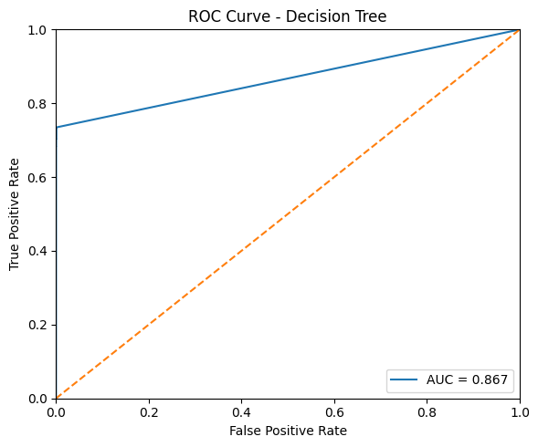
    
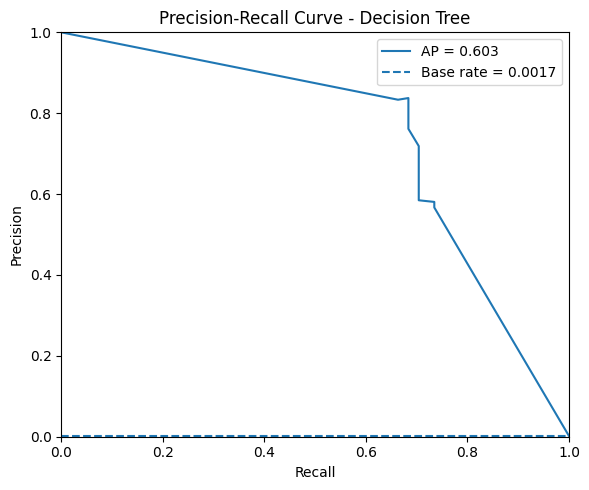
    

---
    
## Random Forest

Aplicamos un modelo de Random Forest para abordar el problema de detección de fraudes, aprovechando su capacidad de combinar múltiples árboles de decisión y reducir tanto la varianza como el sobreajuste presentes en un árbol individual. Este enfoque de ensamble permite obtener un modelo más robusto y con mejor capacidad de generalización. Para optimizar su desempeño, ajustamos hiperparámetros básicos como el número de árboles `n_estimators` y la profundidad máxima `max_depth` mediante `GridSearchCV`, con el fin de evaluar cómo influyen en la detección de fraudes dentro de un dataset altamente desbalanceado.

**Mejores hiperparámetros RF**: {'model__max_depth': None, 'model__n_estimators': 200}

Estos son los resultados obtenidos:

<table id="T_e27e5">
  <thead>
    <tr>
      <th class="blank level0" >&nbsp;</th>
      <th id="T_e27e5_level0_col0" class="col_heading level0 col0" >Random Forest</th>
    </tr>
  </thead>
  <tbody>
    <tr>
      <th id="T_e27e5_level0_row0" class="row_heading level0 row0" >Accuracy</th>
      <td id="T_e27e5_row0_col0" class="data row0 col0" >0.9995</td>
    </tr>
    <tr>
      <th id="T_e27e5_level0_row1" class="row_heading level0 row1" >Balanced Accuracy</th>
      <td id="T_e27e5_row1_col0" class="data row1 col0" >0.8826</td>
    </tr>
    <tr>
      <th id="T_e27e5_level0_row2" class="row_heading level0 row2" >Precision</th>
      <td id="T_e27e5_row2_col0" class="data row2 col0" >0.9615</td>
    </tr>
    <tr>
      <th id="T_e27e5_level0_row3" class="row_heading level0 row3" >Recall</th>
      <td id="T_e27e5_row3_col0" class="data row3 col0" >0.7653</td>
    </tr>
    <tr>
      <th id="T_e27e5_level0_row4" class="row_heading level0 row4" >F1</th>
      <td id="T_e27e5_row4_col0" class="data row4 col0" >0.8523</td>
    </tr>
    <tr>
      <th id="T_e27e5_level0_row5" class="row_heading level0 row5" >ROC-AUC</th>
      <td id="T_e27e5_row5_col0" class="data row5 col0" >0.9676</td>
    </tr>
    <tr>
      <th id="T_e27e5_level0_row6" class="row_heading level0 row6" >PR-AUC</th>
      <td id="T_e27e5_row6_col0" class="data row6 col0" >0.8622</td>
    </tr>
  </tbody>
</table>

Los resultados obtenidos con el **Random Forest** evidencian una mejora sustancial respecto al árbol de decisión individual. La **accuracy alcanza 0.9995**, aunque, como en modelos anteriores, esta métrica es poco informativa en un contexto tan desbalanceado. Más relevante es la **balanced accuracy (0.8826)**, que indica un rendimiento equilibrado en ambas clases. El modelo logra una **precisión muy alta (0.9615)**, lo que significa que casi todas las transacciones señaladas como fraude efectivamente lo son, y mantiene un **recall de 0.7653**, detectando más de tres cuartas partes de los fraudes. Este balance se refleja en un **F1 de 0.8523**, significativamente superior al del árbol de decisión. Además, tanto el **ROC-AUC (0.9676)** como el **PR-AUC (0.8622)** confirman la capacidad del Random Forest para discriminar fraudes y concentrarlos en las predicciones con mayor probabilidad. El Random Forest se presenta como un modelo mucho más robusto y eficaz para la detección de fraudes, reduciendo falsos positivos y maximizando la utilidad práctica frente a las alternativas más simples.

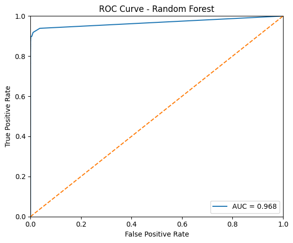
    
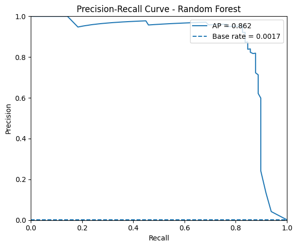

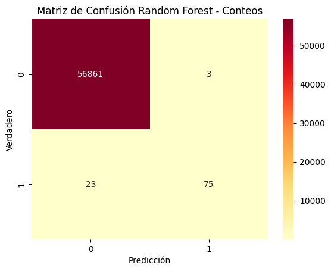

---
    
## Comparación de resultados

Para cerrar el análisis de los modelos avanzados, se realiza una comparación entre el Árbol de Decisión y el Random Forest. El objetivo es evaluar cómo el ensamble de múltiples árboles mejora el rendimiento respecto a un único clasificador y qué diferencias se observan en las métricas clave para la detección de fraude. Mientras que el árbol de decisión ofrece un modelo simple y fácilmente interpretable, el Random Forest incorpora mayor robustez y capacidad de generalización al combinar múltiples árboles, lo que permite contrastar interpretabilidad frente a desempeño predictivo en un escenario altamente desbalanceado.

<table border="1" class="dataframe">
  <thead>
    <tr>
      <th></th>
      <th>Decision Tree</th>
      <th>Random Forest</th>
    </tr>
  </thead>
  <tbody>
    <tr>
      <th>Accuracy</th>
      <td>0.998578</td>
      <td>0.999544</td>
    </tr>
    <tr>
      <th>Balanced Accuracy</th>
      <td>0.866863</td>
      <td>0.882627</td>
    </tr>
    <tr>
      <th>Precision</th>
      <td>0.566929</td>
      <td>0.961538</td>
    </tr>
    <tr>
      <th>Recall</th>
      <td>0.734694</td>
      <td>0.765306</td>
    </tr>
    <tr>
      <th>F1</th>
      <td>0.640000</td>
      <td>0.852273</td>
    </tr>
    <tr>
      <th>ROC-AUC</th>
      <td>0.867102</td>
      <td>0.967572</td>
    </tr>
    <tr>
      <th>PR-AUC</th>
      <td>0.602740</td>
      <td>0.862180</td>
    </tr>
  </tbody>
</table>

* **Accuracy (≈0.999 en ambos):**
  Muy alta, pero **poco informativa** en este problema, porque casi todas las transacciones son “no fraude”.

* **Balanced Accuracy:**

  * Árbol: 0.867
  * Random Forest: 0.883
  
    Ambos bastante buenos, pero el RF gana.

* **Precision (proporción de fraudes detectados que realmente lo eran):**

  * Árbol: 0.567
  * RF: 0.962 
    El Random Forest casi no da falsos positivos.

* **Recall (tasa de fraudes detectados):**

  * Árbol: 0.735
  * RF: 0.765
    Bastante parecidos, aunque RF ligeramente mejor.

* **F1 (equilibrio precision-recall):**

  * Árbol: 0.64
  * RF: 0.85
    RF mejora muchísimo, porque logra alto recall sin perder precisión.

* **ROC-AUC:**

  * Árbol: 0.867
  * RF: 0.968
    Ambos buenos, pero de nuevo RF domina.

* **PR-AUC (Average Precision, la métrica más relevante aquí):**

  * Árbol: 0.603
  * RF: 0.862 
    El Random Forest concentra mucho mejor los fraudes en las predicciones con mayor probabilidad, lo que lo hace **más útil en un escenario real** donde se prioriza revisar las transacciones más sospechosas.

* **Random Forest > Decision Tree** en prácticamente todas las métricas, sobre todo en las más críticas (Precision, F1 y PR-AUC).
* El árbol simple es fácil de interpretar, pero no logra separar bien fraudes de no fraudes.
* El Random Forest, al promediar muchos árboles, reduce el sobreajuste y captura mejor los patrones, siendo claramente el mejor modelo de los dos.

---

# Reflexión Crítica

### ¿Por qué **accuracy** es engañosa en este dataset?

El dataset está **extremadamente desbalanceado**: más del **99.8%** de las transacciones son legítimas y menos del **0.2%** son fraudes.
Un modelo trivial que predijera “todo es no fraude” alcanzaría una accuracy cercana al **99.8%**, pero no detectaría **ningún fraude**.
Por eso la accuracy no refleja la verdadera capacidad del modelo de identificar la clase minoritaria, que es la más importante en este problema.

### ¿Qué métrica recomendarías para un sistema de detección de fraude en producción?

La métrica más informativa en este caso es el **PR-AUC (Área bajo la curva Precision–Recall)**, porque:

* Se centra en la clase positiva (fraudes).
* Refleja la capacidad del modelo de **concentrar los fraudes en las predicciones más altas**.
* Evita la ilusión de buen desempeño que pueden dar métricas influenciadas por los verdaderos negativos (como accuracy o incluso ROC-AUC).

En un sistema productivo también es muy útil monitorear **precision y recall** a distintos umbrales, dependiendo del costo asociado a los errores.

### ¿Qué trade-off sería más importante: minimizar falsos positivos o falsos negativos?

Depende del contexto del negocio, pero en la mayoría de los sistemas de detección de fraude lo **más crítico es minimizar los falsos negativos** (fraudes que pasan desapercibidos), porque representan pérdidas económicas directas y riesgos reputacionales.
Los **falsos positivos** (transacciones legítimas bloqueadas) también son importantes porque afectan la experiencia del usuario, pero suelen tener un costo menor y pueden gestionarse con revisiones manuales o verificaciones adicionales.

Por lo tanto, en general se prioriza **maximizar el recall**, incluso si eso implica tolerar un mayor número de falsos positivos, siempre y cuando se mantenga un nivel de precisión aceptable para que el sistema siga siendo práctico.
