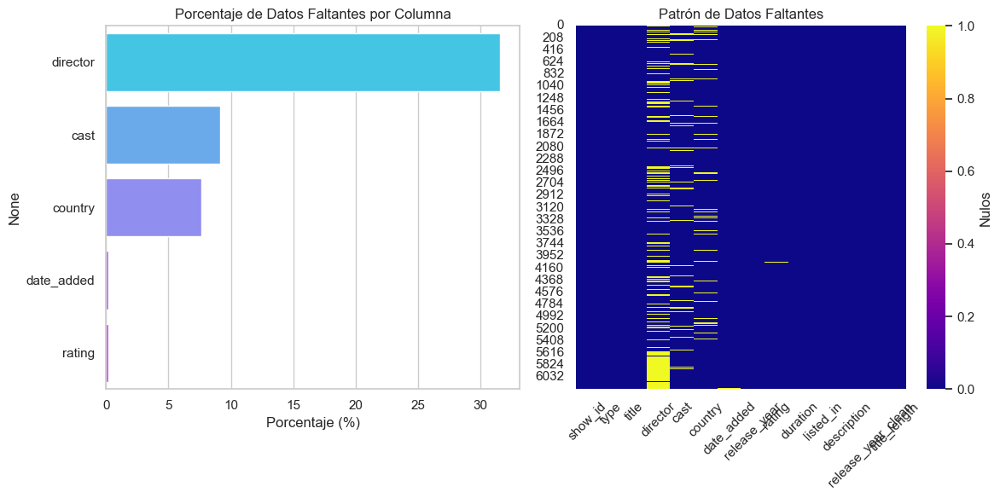
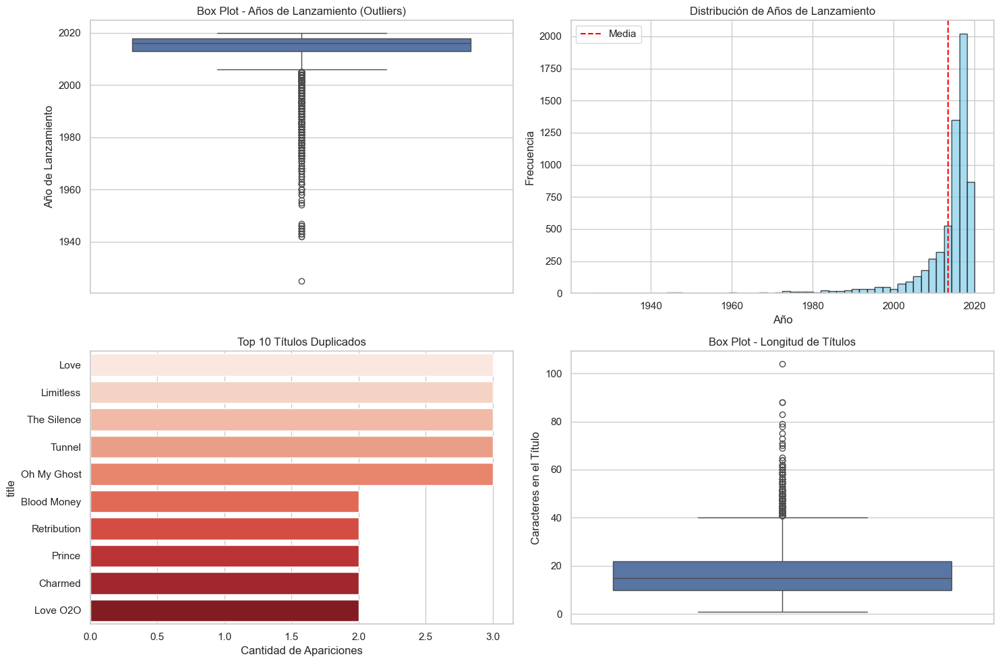
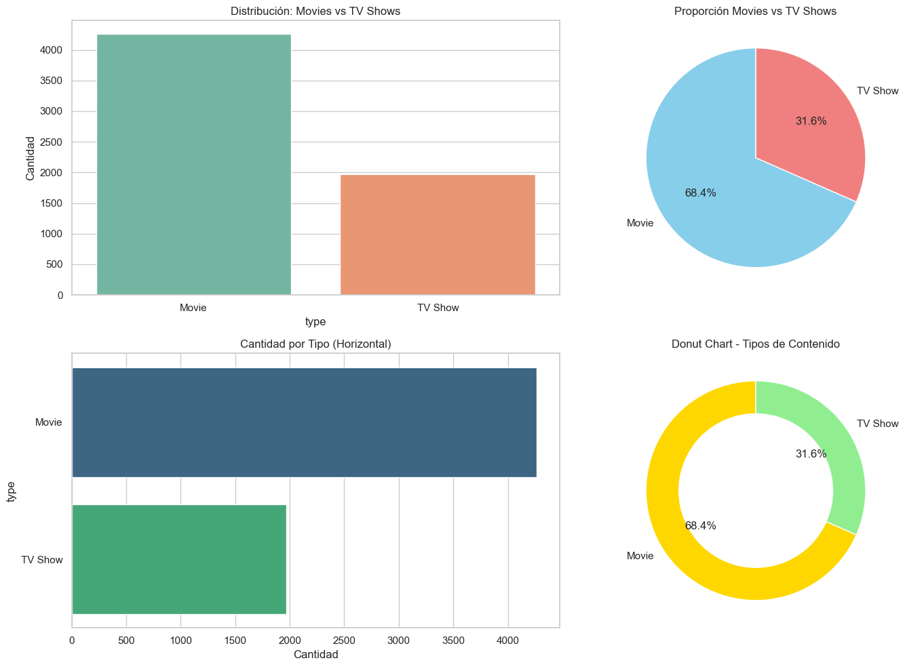
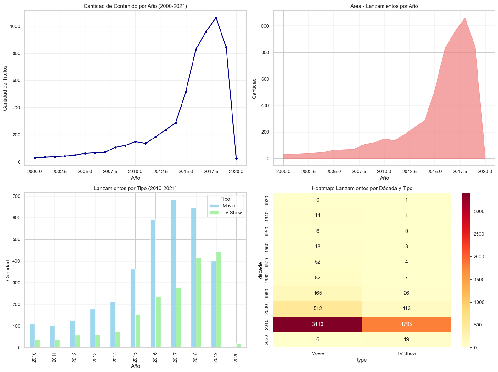
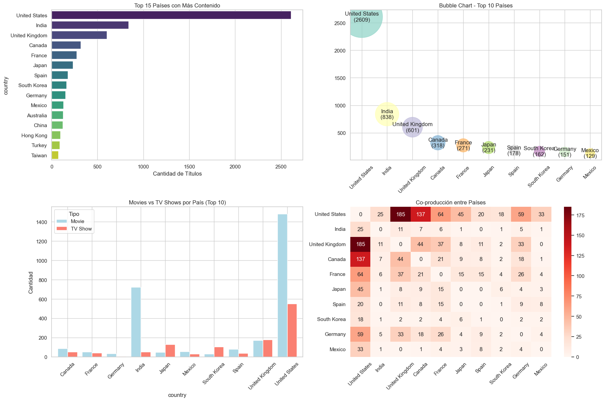
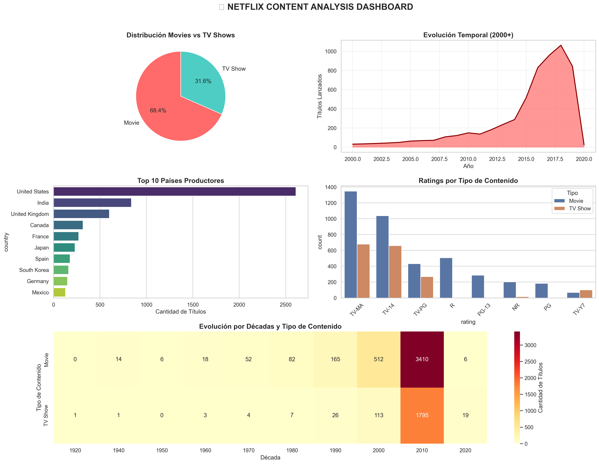

# 🎬 Explorando Netflix: descubriendo los patrones detrás de tus series y películas favoritas

---

## Contexto

Trabajamos con un catálogo público de **6.234 títulos** de Netflix (películas y series) para comprender **composición del catálogo, tendencias temporales, distribución geográfica y perfiles de audiencias por rating**. El dataset contiene 12 columnas (metadatos como `type`, `title`, `director`, `cast`, `country`, `date_added`, `release_year`, `rating`, `duration`, `listed_in`, etc.) sin variables numéricas de desempeño (views).

---

## Objetivos

- [x] Realizar un **EDA reproducible** en Colab: ingesta, chequeos, limpieza mínima y visualizaciones.
- [x] Documentar **calidad de datos** (faltantes, duplicados, rangos) y registrar artefactos.
- [x] Cuantificar **mix de catálogo, tendencias y distribución por países/ratings/géneros**.
- [x] Producir un **resumen ejecutivo** con **insights accionables** para decisiones de contenido.

---

## Desarrollo

> El analisis del dataset fue desarrollado con librerias como: `pandas`, `numpy`, `matplotlib`, `seaborn`.

El dataset es un CSV público `netflix_titles.csv` disponible en las referencias de este artículo.

El dataset contiene **6234 registros** y **12 variables** con datos de tipo **numérico** para `show_id` y `release_year`, el resto son de tipo `object`.

Se detectaron datos faltantes en varias comlumnas:

- `director` contiene un 31.6% de datos faltantes.
- `cast` contiene un 9.1% de datos faltantes.
- `country` contiene un 7.6%.
- `date_added` 0.18% y `rating` 0.16%.



Se encontraron **57** títulos duplicados con el mismo título(por `title`).

Además se identificaron outliers de texto: **títulos muy largos** (p99) y **muy cortos** (<5 chars).

El rango de publicación de las películas `release_year` es desde **1925–2020**, con concentración fuerte desde 2015.
Por ejemplo:

- Know Your Enemy, Japan 1945
- Let There Be Light, 1946  Movie
- Nazi Concentration Camps, 1945  Movie



### Distribución y tendencias

El catalogo de contenido es dividido en dos secciones:

- Movies que son el 68.4% de los registros.
- TV Shows que son el 31.6% de los registros.



Mientras que en la fecha de publicación del contenido se ve distribuido por varios años. Se ve un pico en **2018 (≈1.063)**, y una caída en 2020.



Además se pudieron analizar los **años con más lanzamientos**:
Aquí tienes la tabla en formato **Markdown**:

| Año  | Cantidad |
| ---- | -------- |
| 2011 | 136      |
| 2012 | 183      |
| 2013 | 237      |
| 2014 | 288      |
| 2015 | 517      |
| 2016 | 830      |
| 2017 | 959      |
| 2018 | 1063     |
| 2019 | 843      |
| 2020 | 25       |


Luego se analizaron los países con co-producciones frecuentes:
- Estados unidos: 2609
- India: 838
- UK: 601




## Evidencias
- **Carga y exploración**
```python
url = "https://raw.githubusercontent.com/swapnilg4u/Netflix-Data-Analysis/refs/heads/master/netflix_titles.csv"
netflix = pd.read_csv(url)
netflix.shape, netflix.info(), netflix.head(3)
```
- **Faltantes (conteos y %)**  
```python
missing = netflix.isna().sum().sort_values(ascending=False)
missing_pct = (netflix.isna().sum()/len(netflix)*100).sort_values(ascending=False)
missing[missing>0], missing_pct[missing_pct>0]
```
- **Outliers / duplicados / títulos extremos**
```python
netflix["release_year_clean"] = pd.to_numeric(netflix["release_year"], errors="coerce")
very_old = netflix[netflix["release_year_clean"] < 1950]
dup_titles = netflix["title"].value_counts()[lambda s: s>1]
netflix["title_length"] = netflix["title"].str.len()
very_long = netflix[netflix["title_length"] > netflix["title_length"].quantile(0.99)]
very_short = netflix[netflix["title_length"] < 5]
```



**Se puede ver el desarrollo del práctico detalladamente [aquí](../ut1-netflix-data/analysis_prueba.md)**

## Reflexión

- **Qué aprendí**: a mantener una línea de **trazabilidad de calidad de datos** (faltantes/duplicados/rangos) y a **vincular métricas** (mix, tiempos, países, ratings) con *implicancias de negocio*.  
- **Decisiones de visualización**: *line plot* para continuidad temporal (tendencias), *barplot* para categorías (país/ratings/géneros) y *heatmaps* para co-ocurrencias.  
- **Limitaciones**: no hay variables de audiencia/ingresos; algunos picos/caídas pueden deberse a **recortes del dataset** (e.g., bajo 2020).  
- **Mejoras inmediatas**:
  - Normalizar `duration` a minutos/temporadas y tratar multi-valor en `country`/`listed_in` con tablas auxiliares.
  - Corregir pie charts del dashboard si falta una coma entre argumentos (`autopct=...`, `colors=...`) y ordenar categorías para legibilidad.
  - Exportar todas las figuras con `dpi>=200`, `bbox_inches='tight'` y nombres consistentes.

!!! warning "Atención"
    - **Metadatos incompletos** (director/cast/country) afectan búsqueda y recomendación.  
    - **Duplicados** pueden sesgar conteos si no se desambiguan por (`title`, `release_year`) o ID canónico.  
    - Evitar **gráficos redundantes** (pie + donut del mismo dato); priorizar el más legible.

## 📚 Referencias
- Dataset base: *Netflix Titles* (CSV público).  
- Documentación: `pandas` (describe, dtypes, isna), `seaborn` (countplot, heatmap), `matplotlib` (savefig), buenas prácticas de EDA.  

---
