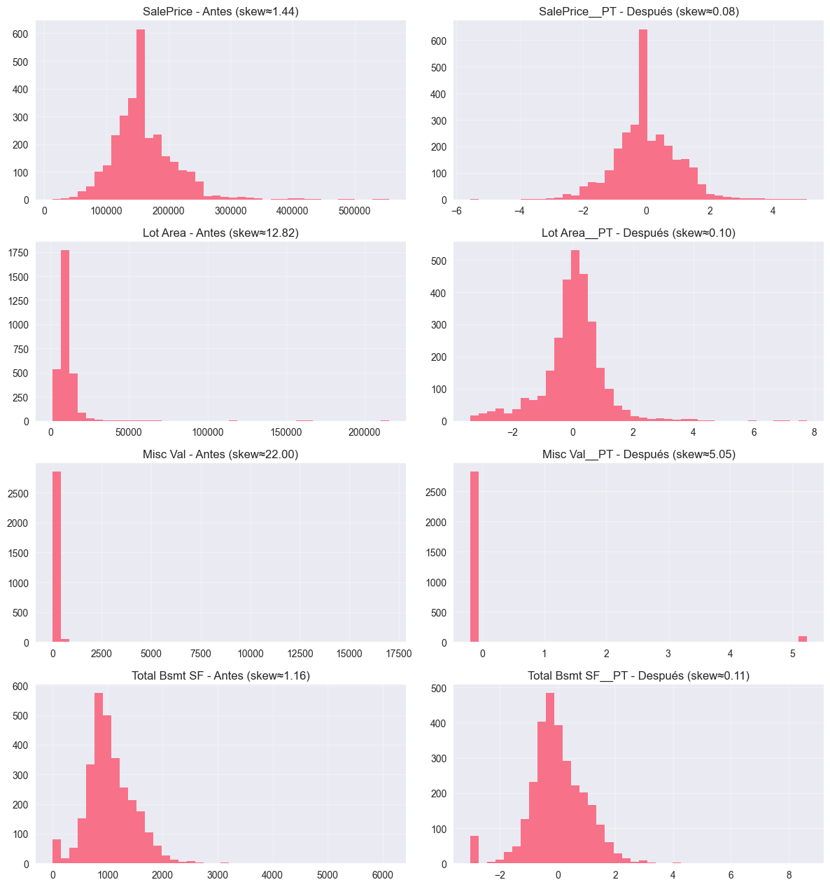

---

title: "Feature Scaling y Leakage en Ames Housing"
date: 2025-10-12
author: "Juan Paroli"
categories: ["Feature Engineering", "Modeling", "Best Practices"]
tags: ["Scaling", "Outliers", "Pipelines", "Ames Housing", "PowerTransformer", "Data Leakage"]

---

# Feature Scaling y Leakage en Ames Housing

## Contexto

Esta práctica extiende el trabajo previo de calidad de datos en [Ames Housing](../ut2-missing-data-detection/missing_data.md) para centrarse en **escalado de features**, **detección/tratamiento de outliers** y **prevención de data leakage**.
Además, incluye una **investigación avanzada** sobre `PowerTransformer (Yeo–Johnson)` y su comparación con los scalers clásicos.

> Objetivo: construir un **pipeline honesto (anti-leakage)**, seleccionar transformaciones adecuadas según la **distribución** de cada variable y demostrar su impacto en la **performance**.

---

## Objetivos

* [x] Diagnosticar **escalas dispares** y **outliers** que afecten algoritmos sensibles a distancia.
* [x] Comparar `StandardScaler`, `MinMaxScaler`, `RobustScaler` vs `PowerTransformer`.
* [x] Demostrar **data leakage** con tres estrategias (incorrecta/correcta/pipeline).
* [x] Validar con **cross-validation** y baseline para medir valor real.

---

## Desarrollo

* Dataset: **Ames Housing** (2930 filas, 82 columnas).
* *Missing* sintético agregado en la [práctica previa](../ut2-missing-data-detection/missing_data.md) (MCAR/MAR/MNAR) y luego guardado en `df_imputed` (cero NaN restantes con reglas simples + “smart” por vecindario/estilo/garage).

### 1. Exploración inicial

Comenzamos analizando las escalas de las variables mediante un boxplot que apliga la transformacion *log1p*.

Estas escalas se dan ya que estas variables tienen rangos enormes comparadas con otras.

- `PID`: va de 5.26e+08 a 1.00e+09 (escala de cientos de millones).

- `Lot Area`: va de 1300 a 215,245 (rango muy grande).

- `Mas Vnr Area`: de 0 a 1600, mientras que muchas otras están entre 1–10.

- `Year Built` y `Year Remod/Add`: rangos de ~100 años (1872–2010), mucho mayores que escalas ordinales (1–10).

- `Order`: de 1 a 2930, también más grande que calificaciones como Overall Qual (1–10).

---

### 2. Outliers

Para detectar los outlier se utilizaron dos enfoques:

| Método            | Cuándo usar                          |
| ----------------- | ------------------------------------ |
| **IQR (1.5×IQR)** | Distribuciones sesgadas/colas largas |
| **Z-Score (±3σ)** | Distribuciones ~normales             |

**Resultados clave**

* Por IQR, `Lot Area` tuvo **127** outliers (≈4.3%).
* Por Z-Score, `Lot Area` tuvo **29** outliers (≈1.0%).
* En el barrido completo, el % promedio de outliers por IQR fue ≈ **2.94%**; variables como `Enclosed Porch` y `Screen Porch` concentran muchos ceros (límites IQR en 0), elevando conteos.

Entre las aplicaciones de `StandardScaler`, `MinMaxScaler` y `RobustScaler` no cambió la detección de outliers ya que dieron la misma cantidad para los 3 métodos como se ve en la siguiente sección.

---

### 3. Escalado

Se probó el efecto del escalado en la detección de outliers (con `Lot Area`):

| Escaler            | IQR (conteo) | Z-Score (conteo) |
| ------------------ | -----------: | ---------------: |
| **StandardScaler** |          127 |               29 |
| **MinMaxScaler**   |          127 |               29 |
| **RobustScaler**   |          127 |               29 |

---

### PowerTransformer (Yeo–Johnson)

PowerTransformer corrige la asimetría de las distribuciones. Siendo útil en el dataset actual.

**Antes (skew | kurtosis)**

* `SalePrice`: 1.44 | 6.18
* `Lot Area`: 12.82 | 265.02
* `Misc Val`: 22.00 | 566.20
* `Total Bsmt SF`: 1.16 | 9.14

**Después con PowerTransformer (YJ, standardize=True)**

* `SalePrice__PT`: 0.08 | 2.21
* `Lot Area__PT`: 0.10 | 5.22
* `Misc Val__PT`: 5.05 | 23.53 
* `Total Bsmt SF__PT`: 0.11 | 4.09

---

### 5. Data leakage

Tres métodos con `KNeighborsRegressor (k=5)`:

| Método                                         | ¿Hay leakage? |         R² |  MAE (USD) |
| ---------------------------------------------- | ------------- | ---------: | ---------: |
| **1. Escalar todo y luego split**              | **Sí**        |     0.1846 |     36,914 |
| **2. Split → fit scaler en train → transform** | No            | **0.1957** | **36,443** |
| **3. Pipeline (Scaler→Modelo)**                | No            | **0.1957** | **36,443** |

El método 1 “filtra” información del test al train (medias/desvíos).
El **Pipeline** (3) automatiza el orden correcto y es el estándar para **evitar errores** y usar **cross-validation** sin fugas.

Baseline (Dummy median, test): R² = −0.0443; MAE ≈ 39,416.

---

### 6. Validación final (CV=5)

**Pipeline ganador:** `PowerTransformer(YJ) → KNN (k=5)`

* R² (folds): `[0.0340, 0.1525, 0.1490, 0.0223, 0.2254]` → **0.1166 ± 0.0773**
* MAE (folds): `[38,486; 33,607; 30,843; 34,818; 32,192]` → **33,989 ± 2,615**

**Baseline (Dummy median, CV=5)**

* R²: **−0.0248 ± 0.0248**
* MAE: **35,194 ± 2,027**

> El pipeline con `PowerTransformer` brinda **R² positivo** sostenido y mejora el MAE vs. baseline (~**1,200 USD** menos en media), aunque el problema con sólo 3 features sigue siendo desafiante (resultado *modesto pero real*).

---

## Reflexión

**Aprendizajes clave**

* **Detectar y tratar outliers antes** del escalado evita distorsionar medias/desvíos y rangos; luego aplicar escalado/transformación.
* Los **scalers lineales** (Standard/MinMax/Robust) **no corrigen** asimetría; `PowerTransformer` sí.
* **Pipeline + CV** es **obligatorio** para evitar leakage y obtener métricas honestas.
* En variables como `Lot Area` o `SalePrice`, las **colas largas** justifican transformaciones no lineales.

**Limitaciones**

* `Misc Val` presenta **masa en 0** por lo tanto persiste asimetría aun con Yeo-Johnson.
* El experimento de modelado usó **pocas features** (demostración). Un modelo final debería incorporar más señales (calidad, metros cubiertos, barrio, interacción, etc.).

---

## 📚 Referencias

* Documentación `scikit-learn`: *Preprocessing (scalers, PowerTransformer), Pipeline, Model Selection*.
* Box-Cox & Yeo–Johnson: papers originales y notas de sklearn (para fórmulas y supuestos).
* Dataset: *Ames Housing* (Kaggle).

---
