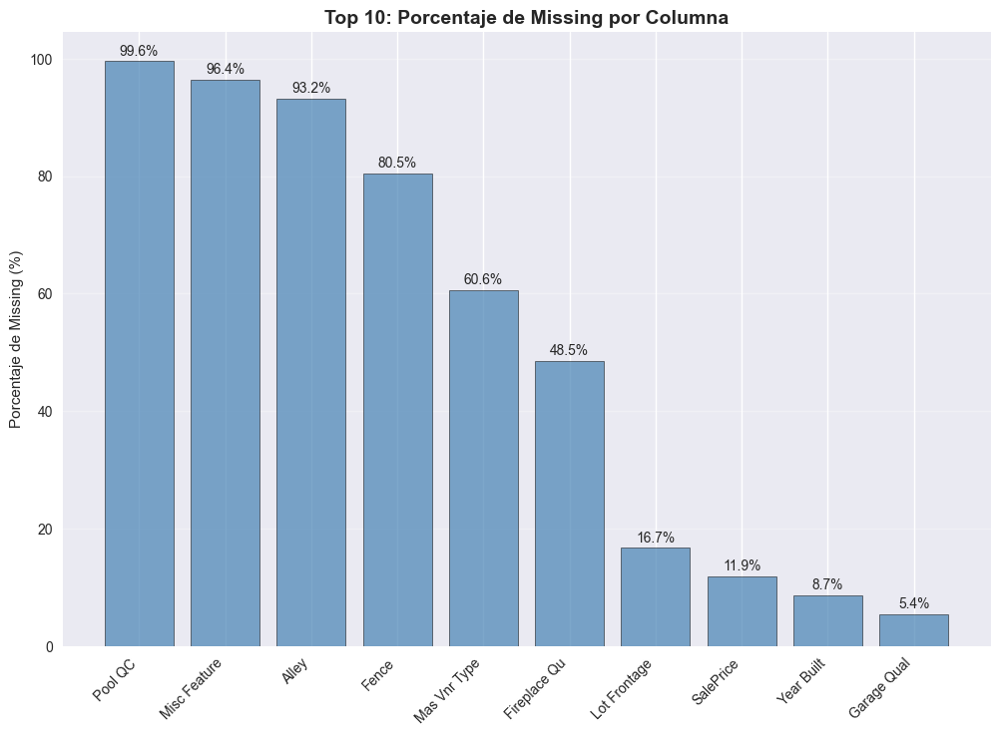
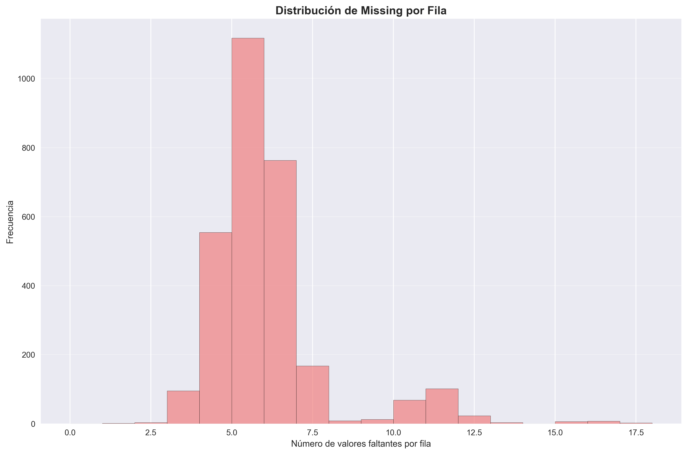
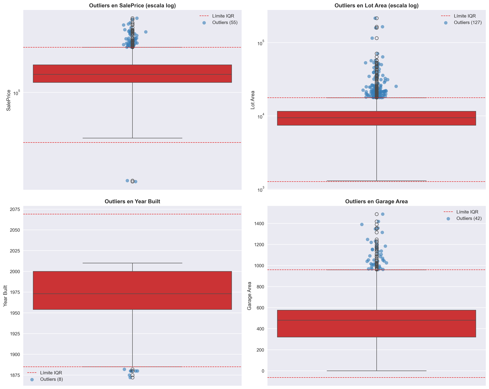
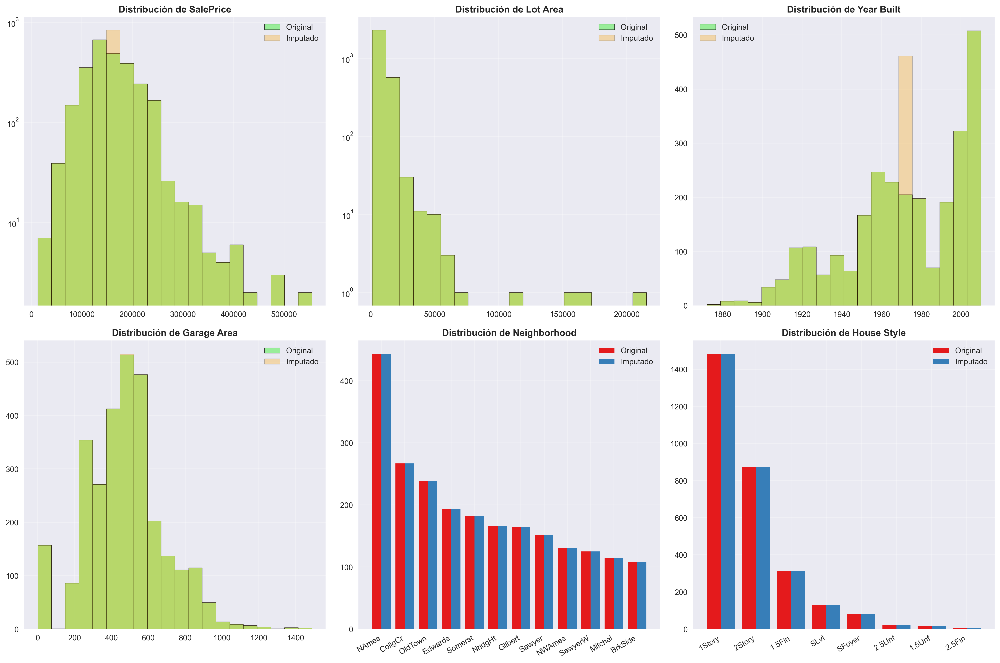
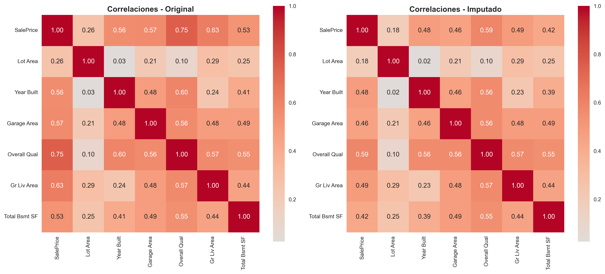

# 🏠 Análisis de calidad de datos e imputación en Ames Housing

## Contexto

Este análisis se centró en evaluar y tratar los problemas de **calidad de datos** del dataset *Ames Housing*, una base de datos ampliamente usada en aprendizaje automático para predecir precios de vivienda. El dataset contiene **2930 registros y 82 columnas**, con una mezcla de variables numéricas (≈ 38) y categóricas (≈ 43). Se abordaron los ejes clave de **valores faltantes**, **outliers** y **preprocesamiento reproducible**, generando visualizaciones y estrategias sistemáticas de imputación y limpieza.

> El trabajo replica un flujo de preprocesamiento profesional, desde la exploración inicial hasta la implementación de pipelines reproducibles en `scikit-learn`.

Esta práctica fue desarrollada en un notebook de jupyter que puedes encontrar [aquí](ames_housing.ipynb)

---

## Objetivos

- [x] Analizar la estructura del dataset e identificar patrones de valores faltantes.
- [x] Clasificar los tipos de *missing data* (MCAR, MAR, MNAR) presentes.
- [x] Implementar y comparar estrategias de imputación simples y "smart".
- [x] Detectar y evaluar outliers mediante métodos IQR y Z-score.
- [x] Crear un pipeline reproducible de limpieza para modelos predictivos.

---

## Desarrollo

### 1. Exploración inicial del dataset

**Setup**
- Dataset: **Ames Housing** (2930 registros y 82 columnas).
- Librerías: `pandas`, `numpy`, `matplotlib`, `seaborn`, `scikit-learn`.
- Análisis de memoria: uso total de aproximadamente **6.9 MB**.

**Proceso**
- Carga y exploración inicial del dataset.
- Análisis de estructura (tipos de datos, shape, memoria).
- Identificación de variables con valores faltantes.

**Resultados clave**

- **29 columnas con valores faltantes** detectadas, con proporciones variables:
  - Variables con >90% de missing: `Pool QC`, `Misc Feature`, `Alley`.
  - Variables con missing moderado (5–10%): `Year Built`, `Garage Type`, `Garage Area`.
  - Variables numéricas críticas como `SalePrice` (≈12% faltante) fueron parcialmente eliminadas para simular *MNAR* (faltantes no aleatorios).

Se elaboraron gráficos de:
- **Top 10 columnas con mayor porcentaje de missing**, destacando `Pool QC` y `Misc Feature` (>95%).
- **Distribución de missing por fila**, que mostró que la mayoría de las filas tienen entre 0 y 5 valores faltantes, con pocos casos extremos.

Estas visualizaciones confirmaron que el problema no está concentrado en pocas observaciones, sino distribuido entre distintas columnas.





### 2. Clasificación del missing data

Se introdujo missing sintético para replicar escenarios reales de pérdida de información:

- **MCAR (Missing Completely At Random)** → `Year Built`: los faltantes no dependen de otras variables ni del propio valor.
- **MAR (Missing At Random)** → `Garage Area`: los faltantes dependen de una variable observable (`Garage Type`).
- **MNAR (Missing Not At Random)** → `SalePrice`: los faltantes se asocian con precios altos, reflejando sesgo en la no respuesta.

Esta diferenciación fue clave para definir **estrategias de imputación adecuadas**.

### 3. Análisis de outliers

**Setup**
- Métodos aplicados: **IQR (1.5×rango intercuartílico)** y **Z-Score (±3 desviaciones estándar)**.

**Proceso**
- Aplicación de ambos métodos a todas las variables numéricas.
- Comparación de resultados entre métodos.
- Visualización de outliers mediante boxplots.

**Resultados clave**

| Método | Criterio | Contexto de uso |
|--------|-----------|----------------|
| IQR | 1.5×rango intercuartílico | Distribuciones sesgadas o con colas pesadas |
| Z-Score | ±3 desviaciones estándar | Distribuciones aproximadamente normales |

- En promedio, un **2.9% de los registros** fueron considerados outliers por IQR.
- Las variables con más outliers fueron `Enclosed Porch`, `BsmtFin SF 2` y `Overall Cond`.
- La comparación mostró que IQR detecta más casos extremos que Z-Score, especialmente en variables sesgadas como `Lot Area` y `SalePrice`.

Se generaron boxplots con límites IQR y visualización logarítmica para `Lot Area` y `SalePrice`, revelando alta asimetría.



### 4. Estrategias de imputación

**Setup**
- Estrategias simples: media, mediana, moda.
- Estrategia "smart": reglas específicas por tipo de variable y contexto.

**Proceso**
- Aplicación de imputación simple (media, mediana, moda).
- Implementación de imputación inteligente basada en agrupaciones.
- Comparación de resultados.

**Resultados clave**

Se ensayaron tres estrategias simples (media, mediana, moda), las tres logrando **0 valores faltantes restantes**, pero con implicancias diferentes en la distribución.

Posteriormente, se implementó una **imputación inteligente (smart)** con reglas específicas por tipo de variable:
- `Year Built`: mediana por *Neighborhood* y *House Style* (MAR).
- `Garage Area`: imputación condicional y creación de *flag* binario para MNAR.
- `SalePrice`: mediana por *Neighborhood*.
- `Garage Type`: moda global.

Esta imputación redujo la pérdida de información estructural, aunque persistieron **~15.591 valores imputados** en variables no críticas.

### 5. Comparación de distribuciones y correlaciones

**Proceso**
- Comparación de histogramas y conteos categóricos entre datos originales e imputados.
- Análisis de correlaciones antes y después de la imputación.

**Resultados clave**

Se compararon histogramas y conteos categóricos entre datos originales e imputados con la estrategia *SMART*. Las diferencias más notorias se observaron en las variables numéricas sesgadas (`Lot Area`, `SalePrice`), aunque la estructura general se mantuvo.



El análisis de correlaciones mostró **cambios menores (<0.2)** tras la imputación, indicando que las relaciones entre variables clave (ej. `Overall Qual` ↔ `SalePrice`) se conservaron.



### 6. Pipeline reproducible

**Setup**
- Librerías: `scikit-learn` (`Pipeline`, `ColumnTransformer`, `SimpleImputer`, `StandardScaler`, `OneHotEncoder`).

**Proceso**
- Creación de pipeline modular que integra imputación, escalamiento y codificación.
- Implementación de transformadores separados para variables numéricas y categóricas.

**Resultados clave**

Se desarrolló un **pipeline modular** con `scikit-learn` que integra:
- Imputación (`SimpleImputer`),
- Escalamiento (`StandardScaler`),
- Codificación categórica (`OneHotEncoder`).

```python
def create_cleaning_pipeline():
    """Crear pipeline de limpieza reproducible"""

    # Definir columnas numéricas y categóricas
    numeric_features = ['SalePrice', 'Lot Area', 'Year Built', 'Garage Area']
    categorical_features = ['Neighborhood', 'House Style', 'Garage Type']

    # Transformadores
    numeric_transformer = Pipeline(steps=[
        ('imputer', SimpleImputer(strategy='median')),  # estrategia de imputación
        ('scaler', StandardScaler())
    ])

    categorical_transformer = Pipeline(steps=[
        ('imputer', SimpleImputer(strategy='most_frequent')),  # estrategia de imputación
        ('onehot', OneHotEncoder(handle_unknown='ignore'))
    ])

    # Combinar transformadores
    preprocessor = ColumnTransformer(
        transformers=[
            ('num', numeric_transformer, numeric_features),
            ('cat', categorical_transformer, categorical_features)
        ]
    )

    return preprocessor
```

El resultado final fue una **matriz de 46 columnas transformadas**, lista para usarse en modelos predictivos sin intervención manual.

---

## 📁 Evidencias

### Análisis de valores faltantes

**Top 10 columnas con mayor porcentaje de missing**


**Patrones de missing por fila**


### Análisis de outliers

**Detección de outliers con IQR y Z-Score**


### Comparación de imputación

**Comparación de distribuciones antes y después de imputación**


**Comparación de correlaciones antes y después de imputación**


### Código de ejemplo: Pipeline reproducible

```python
from sklearn.pipeline import Pipeline
from sklearn.compose import ColumnTransformer
from sklearn.impute import SimpleImputer
from sklearn.preprocessing import StandardScaler, OneHotEncoder

# Crear pipeline de limpieza
preprocessor = create_cleaning_pipeline()

# Aplicar pipeline
X_transformed = preprocessor.fit_transform(X)
```

---

## 💡 Reflexión

### Aprendizajes clave

- **El tratamiento del missing data no puede resolverse de forma genérica**: cada variable requiere entender su origen, relación con otras y posible sesgo. La clasificación MCAR/MAR/MNAR es fundamental para elegir la estrategia correcta.
- **Las imputaciones basadas en agrupaciones** (por barrio o estilo de casa) preservan mejor la estructura interna de los datos que las imputaciones globales simples.
- **Los métodos robustos como IQR son preferibles** frente a Z-Score cuando las distribuciones son asimétricas, ya que no dependen de la normalidad de los datos.
- **Los pipelines reproducibles** son esenciales para mantener la consistencia y facilitar el mantenimiento del código.

### Limitaciones y desafíos

- **Algunas variables con >90% de missing** (ej. `Pool QC`) son prácticamente inutilizables y deberían considerarse para eliminación o tratamiento especial.
- **La imputación puede introducir sesgos** si no se realiza cuidadosamente, especialmente en variables MNAR.
- **El análisis de outliers** requiere interpretación contextual; no todos los outliers son errores, algunos pueden ser valores legítimos pero extremos.

### Próximos pasos

- Explorar técnicas de imputación más avanzadas (KNN imputation, iterative imputation).
- Implementar validación cruzada para evaluar el impacto de la imputación en modelos predictivos.
- Desarrollar estrategias específicas para variables con alta proporción de missing.

!!! warning "Atención"
    La imputación de datos faltantes puede introducir sesgos si no se realiza correctamente. Es crucial entender el mecanismo de missing (MCAR/MAR/MNAR) antes de elegir la estrategia de imputación.

---

## 📚 Referencias

- **Little, R. J. A., & Rubin, D. B. (2019)**. *Statistical Analysis with Missing Data*. Wiley.

- **Kaggle**: *Ames Housing Dataset*.
  [https://www.kaggle.com/c/house-prices-advanced-regression-techniques/data](https://www.kaggle.com/c/house-prices-advanced-regression-techniques/data)

- **van Buuren, S. (2018)**. *Flexible Imputation of Missing Data*. CRC Press.

- **Scikit-learn Documentation**: *Imputer & ColumnTransformer APIs*.
  [https://scikit-learn.org/stable/modules/preprocessing.html](https://scikit-learn.org/stable/modules/preprocessing.html)

- **Notebook completo**: [ames_housing.ipynb](ames_housing.ipynb)

---
