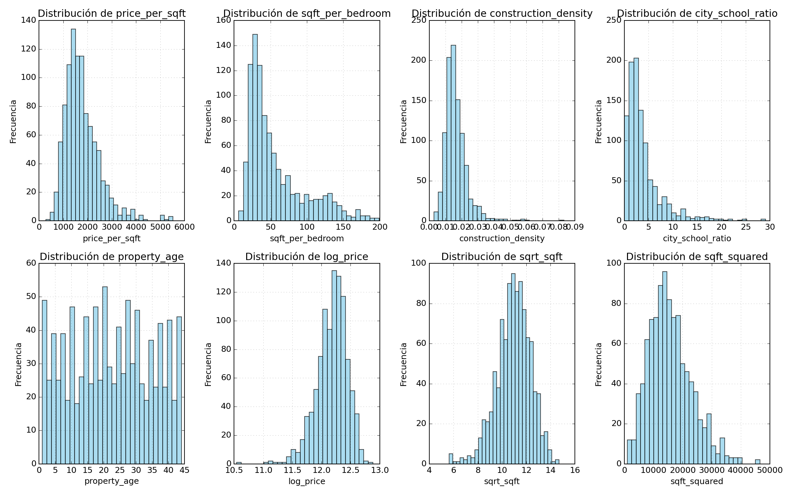
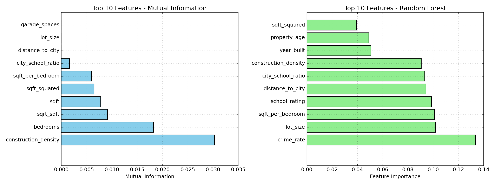
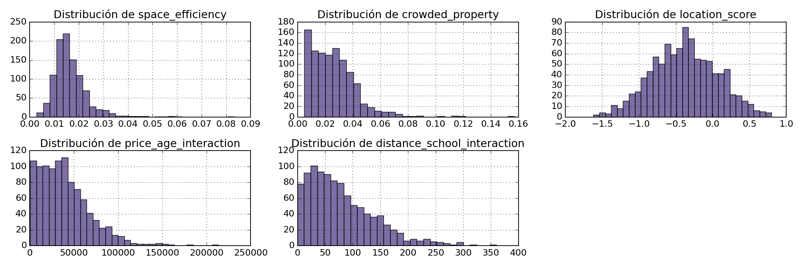

# 🏠 Construyendo valor con datos: Feature Engineering para predecir precios de viviendas

## Contexto

Este análisis se centró en predecir precios de viviendas mediante técnicas de **Feature Engineering**. Se trabajó primero con un **dataset sintético de 1000 registros** con 10 variables iniciales, y luego se aplicaron las mismas técnicas a un dataset real: **Ames Housing**. El objetivo fue encontrar la mejor relación entre las columnas para predecir el precio, creando features derivadas que capturen patrones no obvios en los datos.

> **Objetivo**: demostrar cómo el Feature Engineering puede mejorar la capacidad predictiva de los modelos al crear variables que capturan relaciones más profundas entre las características de las viviendas.

Esta práctica fue desarrollada en un notebook de jupyter que puedes encontrar [aquí](ocho.ipynb)

---

## Objetivos

- [x] Encontrar patrones y correlaciones entre variables.
- [x] Crear features derivadas para encontrar patrones no obvios en los datos.
- [x] Comparar el rendimiento de diferentes tipos de features (ratios, transformaciones, compuestas).
- [x] Evaluar features con datos sintéticos y reales (Ames Housing).
- [x] Predecir precios de viviendas con la mejor precisión.

---

## Desarrollo

### 1. Setup y creación de dataset sintético

**Setup**
- Dataset sintético: **1000 registros** con **10 columnas** iniciales.
- Librerías: `pandas`, `numpy`, `scikit-learn`, `matplotlib`, `seaborn`.
- Variables iniciales: `price`, `sqft`, `bedrooms`, `bathrooms`, `year_built`, `garage_spaces`, `lot_size`, `distance_to_city`, `school_rating`, `crime_rate`.

**Proceso**
- Generación de dataset sintético con distribuciones controladas.
- Definición de rangos para cada variable.
- Verificación de ausencia de valores faltantes.

**Resultados clave**

```python
np.random.seed(42)
n_samples = 1000

data = {
    'price': np.random.normal(200000, 50000, n_samples),
    'sqft': np.random.normal(120, 30, n_samples),
    'bedrooms': np.random.choice([1, 2, 3, 4, 5], n_samples),
    'bathrooms': np.random.choice([1, 2, 3], n_samples),
    'year_built': np.random.choice(range(1980, 2024), n_samples),
    'garage_spaces': np.random.choice([0, 1, 2, 3], n_samples),
    'lot_size': np.random.normal(8000, 2000, n_samples),
    'distance_to_city': np.random.normal(15, 8, n_samples),
    'school_rating': np.random.uniform(1, 10, n_samples),
    'crime_rate': np.random.uniform(0, 100, n_samples)
}
```

Generar este dataset sintético nos asegura de no tener datos nulos y nos permite controlar las relaciones entre variables.

### 2. Creación de features derivadas

**Proceso**
- Creación de features ratio que miden distintas relaciones.
- Aplicación de transformaciones matemáticas.
- Construcción de features compuestas (scores).
- Creación de variables temporales y categóricas.

**Resultados clave**

#### Features Ratio

- **Precio por pie cuadrado**: mide el valor relativo del espacio habitable.
  - Cuánto cuesta cada unidad de superficie construida.
  - Ratios altos → zonas caras o propiedades premium.
  - Ratios bajos → áreas más accesibles o construcciones menos valoradas.

- **Superficie por habitación**: indica la amplitud promedio de los ambientes.
  - Cuánto espacio útil tiene cada dormitorio.
  - Ratios altos → viviendas espaciosas (segmento medio-alto).
  - Ratios bajos → unidades compactas o de densidad alta (segmento económico).

- **Densidad de construcción**: mide la proporción del terreno ocupada por la edificación.
  - Qué parte del lote está construida.
  - Ratios altos → construcciones densas o urbanas.
  - Ratios bajos → viviendas con jardín o terrenos amplios (zonas suburbanas).

- **Ratio entre distancia a ciudad y rating de escuela**: evalúa el equilibrio entre accesibilidad urbana y calidad educativa.
  - Cuánto te alejás del centro por cada punto de calidad escolar.
  - Ratios bajos → zonas bien ubicadas y con buenas escuelas.
  - Ratios altos → barrios lejanos o con baja calidad educativa.

#### Variables Temporales y Categóricas

También capturamos relaciones temporales creando una variable de **antigüedad de la propiedad**, de la que se desprendía una nueva variable (`age_category`) que asignaba a cada casa una entre 3 clasificaciones:
- Nuevo
- Moderno
- Antiguo

De esta nueva variable, construimos una última variable booleana que asignaba `True` **si la propiedad era nueva**.

#### Transformaciones Matemáticas

Luego aplicamos transformaciones matemáticas a las variables del dataset:

- `log_price` — **Logaritmo del precio**: transforma precios altamente dispersos en una escala más homogénea. Permite analizar variaciones porcentuales en lugar de valores absolutos y reduce el impacto de valores extremos.

- `sqrt_sqft` — **Raíz cuadrada del tamaño**: Suaviza la distribución del tamaño de las viviendas. Útil cuando el tamaño crece más rápido que su impacto real en el precio, capturando rendimientos decrecientes del espacio.

- `sqft_squared` — **Tamaño al cuadrado**: Modela relaciones no lineales entre tamaño y precio. Refleja casos donde un incremento en superficie genera un aumento acelerado en valor, típico de propiedades de lujo o alto estándar.

#### Features Compuestas

Y por último concluimos con unas features compuestas que indicaban scores para las viviendas registradas:

- `luxury_score` — **(precio + tamaño + garage)**: Índice sintético de nivel de lujo o equipamiento.

- `location_score` — **(rating escolar − distancia a ciudad)**: Mide la ventaja locacional de una propiedad.

**Total de features creadas**: **12 features derivadas** que ayudan a encontrar relaciones entre esos nuevos ratios y el precio.



### 3. Análisis de importancia de features

**Setup**
- Métodos aplicados:
  1. **Mutual Information (MI)**: mide la dependencia estadística entre cada variable y el objetivo, sin asumir linealidad.
  2. **Random Forest Feature Importance**: evalúa el impacto de cada feature en la reducción del error dentro de un modelo no lineal y de alta capacidad.

**Proceso**
- Aplicación de ambos métodos a las 15 variables predictoras.
- Comparación de resultados entre métodos.
- Análisis de diferencias y complementariedad.

**Resultados clave**

Se evaluó la relevancia de **15 variables predictoras** respecto al precio de vivienda en el dataset.



#### Mutual Information

- La **densidad de construcción** resulta ser el predictor más informativo en sentido general, reflejando una relación fuerte entre la proporción construida del lote y el valor final.
- **Cantidad de dormitorios** y **tamaño transformado (raíz cuadrada o cuadrado)** también aportan información valiosa, lo que sugiere que la **escala del espacio habitable** sigue siendo el factor dominante.
- Variables como `distance_to_city`, `lot_size` o `garage_spaces` presentan información casi nula bajo este enfoque, indicando relaciones no evidentes o más complejas (probablemente no lineales).

#### Random Forest Feature Importance

A diferencia de la MI, el Random Forest detectó **patrones no lineales y combinaciones complejas**:

- El **índice de criminalidad** (`crime_rate`) fue la variable más influyente, evidenciando un fuerte vínculo entre seguridad y valor inmobiliario.
- Factores de **entorno y ubicación** (`distance_to_city`, `school_rating`, `lot_size`) también adquirieron gran relevancia, lo que concuerda con el comportamiento típico del mercado inmobiliario real.
- Variables derivadas como `city_school_ratio` y `construction_density` también destacan, confirmando que las *features compuestas* capturan relaciones más ricas entre ubicación, servicios y estructura.

#### Comparación de métodos

| Enfoque    | Qué captura mejor   | Limitaciones     |
| ---------- | ------------------- | ---------------- |
| **Mutual Information** | Relaciones estadísticas directas y monotónicas        | No detecta interacciones ni efectos combinados           |
| **Random Forest**      | Relaciones no lineales, interacciones entre variables | Menos interpretable y dependiente de los hiperparámetros |

En este caso, ambos métodos se complementan:
- MI enfatiza **estructura física** del inmueble.
- Random Forest destaca **contexto ambiental y social**.

### 4. Investigación libre: features creativas

**Proceso**
- Creación de features adicionales libremente para seguir evaluando patrones.
- Evaluación de correlaciones con el precio.
- Análisis de resultados vs expectativas.

**Resultados clave**

Se crearon otras features libremente para seguir evaluando los patrones:

- `space_efficiency`: mide proporción de superficie cubierta respecto al lote.
- `crowded_property`: densidad de dormitorios por m².
- `location_score`: índice de ubicación combinando crimen, escuela y distancia.

Además se evaluó interacciones como `price_age_interaction` y `distance_school_interaction`.

**Análisis de correlaciones**

Se esperaba que `space_efficiency`, `crowded_property` y `location_score` se correlacionaran positivamente con el precio.

- **`crowded_property`**: mantuvo una correlación levemente positiva, significando que más dormitorios por pie cuadrado aumenta el precio ✅
- **`space_efficiency`**: tuvo una correlación levemente negativa, siendo contrario a lo esperado ⚠️
- **`location_score`**: tuvo una correlación levemente negativa, siendo contrario a lo esperado ⚠️

**Análisis**

`location_score` es una feature creativa porque sintetiza variables externas en un único índice aunque los pesos usados no reflejaron bien la realidad.

**Futuras ideas de features**:
- Ajustar location_score con pesos calibrados (ej. regresión o PCA).
- Variables no lineales (cuadrados, logs) y normalización de distancias.
- Incorporar década de construcción o indicadores de accesibilidad.
- Ratios financieros como precio/ingreso promedio de la zona.



### 5. Prueba con datos reales (Ames Housing)

**Setup**
- Dataset: **Ames Housing** (datos reales de viviendas).
- Variables: `SalePrice`, `GrLivArea`, `BedroomAbvGr`, `FullBath`, `YearBuilt`, `GarageCars`, `LotArea`, `Neighborhood`.
- Objetivo: Aplicar las mismas técnicas de feature engineering a datos reales.

**Proceso**
- Creación de features derivadas similares a las del dataset sintético.
- Análisis de correlaciones con el precio.
- Comparación de resultados entre datos sintéticos y reales.

**Resultados clave**

Con el objetivo de mejorar la capacidad predictiva del modelo, se generaron varias **features derivadas** a partir de las variables originales del dataset de Ames Housing:

- **`space_efficiency`**: relación entre el área habitable (`GrLivArea`) y el área total del lote (`LotArea`). Mide el aprovechamiento del espacio disponible.
  - *Correlación con el precio:* **0.875** → las casas con mayor eficiencia espacial tienden a tener precios más altos.

- **`property_age`**: antigüedad del inmueble calculada como `2025 - YearBuilt`.
  - *Correlación con el precio:* **-0.822** → a mayor antigüedad, menor precio, lo que refleja la depreciación natural con el tiempo.

- **`age_size_interaction`**: producto entre la edad y la superficie (`HouseAge * GrLivArea`). Captura cómo la combinación de una casa grande y vieja puede afectar negativamente el valor.
  - *Correlación con el precio:* **-0.437**, una relación negativa moderada.

- **`bath_per_bedroom`**: proporción entre baños completos y dormitorios. Indica el nivel de confort del hogar.
  - *Correlación con el precio:* **0.658**, mostrando que las casas con más baños por dormitorio suelen ser más costosas.

- **`garage_per_bedroom`**: cantidad de espacios de garaje por dormitorio, como indicador del equipamiento y comodidad.
  - *Correlación con el precio:* **0.658**, similar a la anterior.

En conjunto, estas correlaciones muestran que las *features* diseñadas tienen **fuerte relación con el valor de venta**, especialmente las que reflejan **eficiencia espacial y antigüedad**. Además, las variables que describen **confort relativo** también resultan relevantes para explicar el precio.

#### Preguntas de análisis

**1. ¿Qué features funcionan mejor con datos reales?**

En los datos reales, las *features* que mejor funcionan son las que capturan **relaciones estructurales y contextuales** con sentido económico:
- `space_efficiency` y `property_age` son las más potentes, ya que combinan información de tamaño, uso del espacio y depreciación temporal.
- Las proporciones como `bath_per_bedroom` y `garage_per_bedroom` también aportan valor al representar el confort del inmueble.

Estas variables reflejan comportamientos reales del mercado inmobiliario: el espacio bien aprovechado y la modernidad de la vivienda son factores clave en el precio.

**2. ¿Hay diferencias entre datos sintéticos y reales?**

Sí, existen diferencias importantes:

| Aspecto                   | Datos Sintéticos                                                                             | Datos Reales                                                                                                      |
| ------------------------- | -------------------------------------------------------------------------------------------- | ----------------------------------------------------------------------------------------------------------------- |
| **Patrones**              | Se generan a partir de reglas fijas y aleatorias; las correlaciones pueden ser artificiales. | Reflejan decisiones humanas y del mercado, por lo que las relaciones son más realistas pero también más ruidosas. |
| **Ruido y variabilidad**  | Controlados o inexistentes.                                                                  | Presentes; incluyen errores, valores atípicos y multicolinealidad.                                                |
| **Interpretabilidad**     | Fácil, porque conocemos las reglas de generación.                                            | Requiere análisis y conocimiento del dominio.                                                                     |
| **Valor predictivo real** | Puede sobreestimar resultados (overfitting).                                                 | Permite generalizar mejor a nuevos datos.                                                                         |

**3. ¿Qué nuevas features podrías crear con `Neighborhood`?**

La variable `Neighborhood` contiene información contextual de gran valor, ya que resume el entorno físico y socioeconómico de la vivienda. A partir de ella, se pueden generar varias nuevas *features*:

1. **Estadísticas de vecindario:**
   - Precio medio y desviación estándar por barrio:
     ```python
     df['neigh_price_mean'] = df.groupby('Neighborhood')['SalePrice'].transform('mean')
     df['neigh_price_std'] = df.groupby('Neighborhood')['SalePrice'].transform('std')
     df['price_vs_neigh'] = df['SalePrice'] / df['neigh_price_mean']
     ```
   - Permiten saber si una casa está por encima o por debajo del valor medio de su zona.

2. **Clasificación socioeconómica:**
   - Agrupar vecindarios según su nivel de precio promedio (alto, medio, bajo).
   - Esto convierte la variable categórica en una **feature ordinal** interpretable.

---

## 📁 Evidencias

### Distribución de features derivadas

**Visualización de features creadas**


### Importancia de features

**Comparación entre Mutual Information y Random Forest**


### Distribución de features libres

**Features creativas y sus correlaciones**


### Código de ejemplo: Creación de features

```python
import pandas as pd
import numpy as np

# Features ratio
df['price_per_sqft'] = df['price'] / df['sqft']
df['sqft_per_bedroom'] = df['sqft'] / df['bedrooms']
df['construction_density'] = df['sqft'] / df['lot_size']

# Transformaciones matemáticas
df['log_price'] = np.log1p(df['price'])
df['sqrt_sqft'] = np.sqrt(df['sqft'])
df['sqft_squared'] = df['sqft'] ** 2

# Features compuestas
df['luxury_score'] = df['price'] + df['sqft'] + df['garage_spaces']
df['location_score'] = df['school_rating'] - df['distance_to_city']
```

---

## 💡 Reflexión

### Aprendizajes clave

- **El Feature Engineering es fundamental para mejorar modelos**: Esta práctica demostró la importancia de analizar las relaciones entre las variables para que el modelo encuentre los patrones fácilmente. El Feature Engineering es necesario no solo para mejorar la performance del modelo sino también para crear conocimiento del dominio.
- **Las features derivadas capturan relaciones no obvias**: Features como ratios, transformaciones matemáticas y compuestas pueden capturar relaciones que las variables originales no muestran directamente.
- **Los métodos de importancia de features se complementan**: Mutual Information y Random Forest Feature Importance capturan aspectos diferentes de las relaciones entre variables, siendo complementarios en el análisis.
- **Los datos reales validan las features creadas**: Aplicar las mismas técnicas a datos reales (Ames Housing) confirmó que las features derivadas funcionan bien y tienen sentido en el contexto del mercado inmobiliario.

### Limitaciones y desafíos

- **Features creativas pueden no funcionar como se espera**: Algunas features como `location_score` tuvieron correlaciones contrarias a lo esperado, demostrando que no todas las ideas de features son exitosas.
- **Los datos sintéticos tienen limitaciones**: Aunque útiles para experimentar, los datos sintéticos pueden sobreestimar resultados y no reflejar completamente la complejidad de los datos reales.
- **El conocimiento del dominio es crucial**: Crear features efectivas requiere entender el dominio del problema y las relaciones reales entre variables.

### Próximos pasos

- Explorar técnicas más avanzadas de feature engineering (polynomial features, feature interactions automáticas).
- Implementar selección automática de features para identificar las más relevantes.
- Evaluar el impacto de las features en diferentes tipos de modelos (lineales, no lineales, ensemble).
- Incorporar técnicas de deep learning para feature learning automático.

!!! warning "Atención"
    También descubrí la importancia de los datos reales en comparación a los datasets sintéticos que generan datos con aleatoriedad. Los datos sintéticos son útiles para experimentar, pero siempre deben validarse con datos reales antes de aplicarse en producción.

---

## 📚 Referencias

- **Kaggle (2011)**. *Ames Housing Dataset*.
  [https://www.kaggle.com/datasets/prevek18/ames-housing-dataset](https://www.kaggle.com/datasets/prevek18/ames-housing-dataset)

- **Pandas Documentation**. *User Guide — Working with Missing Data and Feature Creation*.
  [https://pandas.pydata.org/docs/user_guide/index.html](https://pandas.pydata.org/docs/user_guide/index.html)

- **Scikit-learn Documentation**. *Feature Engineering and Preprocessing Modules*.
  [https://scikit-learn.org/stable/modules/preprocessing.html](https://scikit-learn.org/stable/modules/preprocessing.html)

- **Kaggle Course**: *Feature Engineering*.
  [https://www.kaggle.com/learn/feature-engineering](https://www.kaggle.com/learn/feature-engineering)

- **Notebook completo**: [ocho.ipynb](ocho.ipynb)

---
