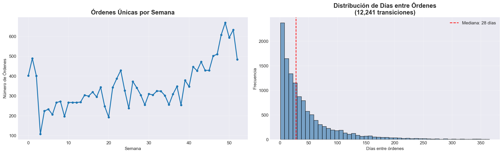
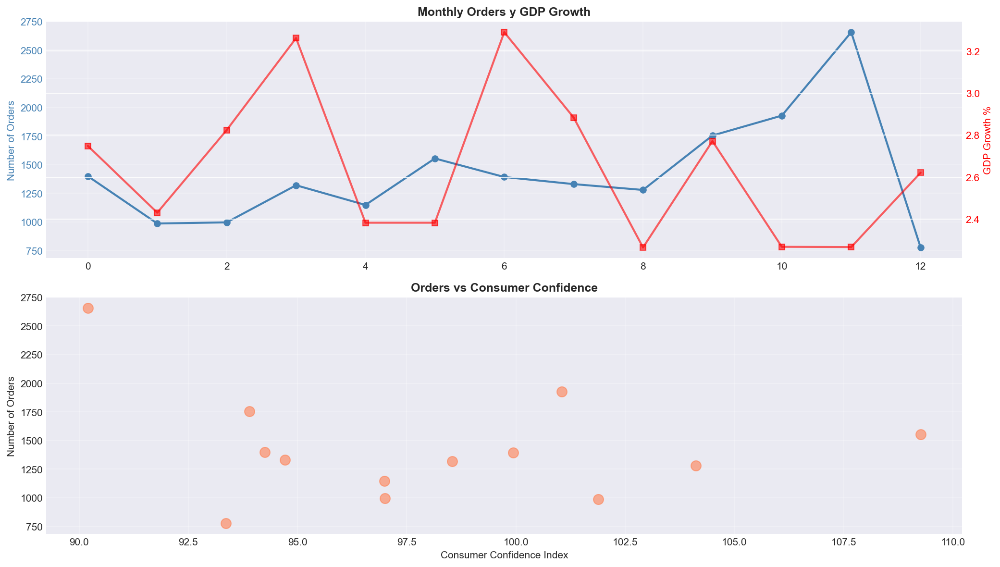

# ⏰ Temporal Feature Engineering: Optimizando modelos de predicción de recompra

## Contexto

En esta práctica se trabajó con el **dataset Online Retail de Kaggle**, que contiene **397,884 transacciones** de compras en línea realizadas por **4,338 clientes** durante el período **2010-2011**. El objetivo fue explorar patrones temporales en el comportamiento de compra y crear **37 features temporales** que representen la frecuencia, recurrencia y hábitos de los usuarios a lo largo del tiempo, aplicándolas a un modelo de predicción de recompra (`will_purchase_again`).

> El análisis fue desarrollado en un notebook de Jupyter que puedes encontrar [aquí](11_temporal-fe.ipynb)

## 🎯 Objetivos

- [x] Cargar y limpiar un dataset transaccional real (Online Retail de Kaggle).
- [x] Comprender la estructura temporal de los datos y evitar data leakage.
- [x] Crear variables de tiempo a nivel de transacción y de usuario.
- [x] Implementar Lag Features con `.groupby()` + `.shift()` para prevenir data leakage.
- [x] Calcular Rolling Window Features (media y desviación estándar móvil).
- [x] Calcular Expanding Window Features (comportamiento histórico acumulado).
- [x] Implementar RFM Analysis (Recency, Frequency, Monetary).
- [x] Crear Time Window Aggregations (7d, 30d, 90d).
- [x] Calcular Product Diversity Features.
- [x] Implementar Calendar Features con encoding cíclico (sin/cos).
- [x] Integrar External Variables (indicadores económicos simulados).
- [x] Evaluar performance con TimeSeriesSplit y comparar modelo base vs modelo con temporal features.
- [x] Analizar importancia de features por categoría.
- [x] Implementar técnicas avanzadas de validación (Blocked, Walk-Forward, Purged K-Fold).

## Desarrollo

### 1. Setup y carga de datos

Se descargó el dataset Online Retail desde Kaggle mediante la API. El dataset contiene información de facturas, productos, cantidades, precios y clientes.

**Resultados del preprocesamiento:**

- **Shape inicial**: (541,909, 8) registros
- **Filas después de limpieza**: 397,884 (eliminación de nulos, cancelaciones, valores ≤ 0)
- **Rango temporal**: 2010-12-01 a 2011-12-09 (373 días)
- **Usuarios únicos**: 4,338
- **Productos únicos**: 3,665
- **Órdenes totales**: 18,532
- **Usuarios con múltiples órdenes**: 2,845 (65.6%)
- **Promedio órdenes por usuario**: 4.27
- **Promedio items por orden**: 21.47



**Insights iniciales:**

- Mediana de días entre órdenes: **8 días**
- El dataset es ideal para temporal feature engineering (alta frecuencia de compras repetidas)

### 2. Creación de features temporales básicas

Se generaron variables a nivel de transacción y luego se agregaron a nivel de orden:

**Features a nivel de transacción:**

- `order_dow`: día de la semana (0 = lunes, 6 = domingo)
- `order_hour_of_day`: hora del día de la compra (0-23)

**Features a nivel de orden (agregación):**

- `cart_size`: cantidad total de ítems en la orden
- `order_total`: gasto total
- `order_number`: número secuencial de compra por usuario (1, 2, 3...)
- `days_since_prior_order`: días transcurridos desde la compra anterior

**Dataset agregado (`orders_df`):**

- **Shape**: (18,562, 9) - una fila por orden/factura
- **Usuarios únicos**: 4,338
- **Cart size promedio**: 21.44 items
- **Total promedio por orden**: $193.50
- **Días promedio entre órdenes**: 18.5 días

### 3. Lag Features con Pandas

Se implementaron lag features usando `.groupby()` + `.shift()` para prevenir data leakage:

**Features creadas:**

- `days_since_prior_lag_1`: días desde la orden anterior (shift 1)
- `days_since_prior_lag_2`: días desde hace 2 órdenes (shift 2)
- `days_since_prior_lag_3`: días desde hace 3 órdenes (shift 3)

**Resultados:**

- NaNs en lag_1: 7,185 (38.7% - primera orden de cada usuario)
- NaNs en lag_2: 10,747 (57.9%)
- NaNs en lag_3: 12,429 (67.0%)

**Ejemplo para usuario 12748 (210 órdenes):**

- Primera orden: todos los lags son NaN
- Segunda orden: lag_1 = 0.0 días, lag_2 y lag_3 = NaN
- Tercera orden: lag_1 = 3.0 días, lag_2 = 0.0 días, lag_3 = NaN

### 4. Rolling Window Features

Se calcularon ventanas móviles de 3 órdenes previas usando `.shift(1)` antes de `.rolling()`:

**Features creadas:**

- `rolling_cart_mean_3`: media móvil de cart_size (últimas 3 órdenes)
- `rolling_cart_std_3`: desviación estándar móvil de cart_size


**Insight:** Las ventanas móviles capturan tendencias recientes del comportamiento del usuario, permitiendo detectar cambios en patrones de compra.

### 5. Expanding Window Features

Se calcularon métricas acumulativas desde el inicio del historial del usuario:

**Features creadas:**

- `expanding_days_mean`: media acumulativa de días entre órdenes
- `expanding_total_spent`: gasto total acumulado
- `total_orders_so_far`: número total de órdenes hasta el momento


**Diferencia clave:**

- **Rolling**: últimos N eventos (tendencia reciente)
- **Expanding**: todos los eventos previos (comportamiento histórico)

### 6. RFM Analysis

Se implementó análisis RFM (Recency, Frequency, Monetary) para segmentar usuarios:

**Features creadas:**

- `recency_days`: días desde la última compra
- `frequency_total_orders`: número total de órdenes del usuario
- `monetary_avg`: gasto promedio por orden
- `monetary_total`: gasto total acumulado

**Estadísticas RFM:**

- Recency promedio: 160.5 días
- Frequency promedio: 8.6 órdenes
- Monetary promedio: $1,882,507 por orden
- Monetary total promedio: $3,590,503


**Correlación RFM:**

- Recency vs Frequency: -0.218 (negativa: usuarios más recientes compran más frecuentemente)
- Recency vs Monetary: 0.263 (positiva: usuarios más recientes gastan más)
- Frequency vs Monetary: -0.338 (negativa: usuarios que compran mucho gastan menos por orden)

### 7. Time Window Aggregations

Se calcularon agregaciones en ventanas temporales (7d, 30d, 90d) usando `closed='left'` para prevenir data leakage:

**Features creadas:**

- `orders_7d`, `orders_30d`, `orders_90d`: número de órdenes en cada ventana
- `spend_7d`, `spend_30d`, `spend_90d`: gasto total en cada ventana

**Resumen de ventanas temporales:**

- Promedio órdenes 7d: 0.41
- Promedio órdenes 30d: 1.42
- Promedio órdenes 90d: 3.69
- Promedio spend 7d: $294.55
- Promedio spend 30d: $922.79
- Promedio spend 90d: $2,392.72


**Insight:** Comparar ventanas detecta usuarios 'activándose' o 'durmiendo' (cambios en comportamiento reciente vs histórico).

### 8. Product Diversity Features

Se calcularon métricas de diversidad de productos comprados:

**Features creadas:**

- `unique_products`: número de productos únicos comprados
- `unique_countries`: número de países desde donde compra (generalmente 1)
- `total_items`: total de items/líneas compradas
- `product_diversity_ratio`: productos únicos / total items (ratio de diversidad)

**Estadísticas:**

- Productos únicos promedio: 61.5
- Total items promedio: 91.7
- **Diversity ratio promedio: 0.85** (mediana: 0.91)


**Interpretación:**

- Ratio alto (~1.0): Usuario explora productos variados (alta diversidad, no recompra)
- Ratio bajo (<0.5): Usuario recompra frecuentemente (baja diversidad)

### 9. Calendar Features con Encoding Cíclico

Se implementaron features de calendario con encoding cíclico (sin/cos) para preservar la naturaleza circular del tiempo:

**Features binarias:**

- `is_weekend`: flag de fin de semana
- `is_month_start`, `is_month_end`: flags de inicio/fin de mes
- `is_holiday`: flag de días festivos UK
- `days_to_holiday`: días hasta próximo feriado

**Encoding cíclico:**

- `hour_sin`, `hour_cos`: encoding de hora del día (0-23)
- `dow_sin`, `dow_cos`: encoding de día de semana (0-6)
- `month_sin`, `month_cos`: encoding de mes (1-12)


**Ventaja del encoding cíclico:**

- Las 23h están 'cerca' de las 0h en el espacio sin/cos
- El domingo está 'cerca' del lunes
- El modelo captura mejor la continuidad temporal

**Efecto Weekend:**

- Cart size promedio en weekday vs weekend muestra diferencias significativas

### 10. Economic Indicators (Simulados)

Se integraron indicadores económicos mensuales simulados:

**Features creadas:**

- `gdp_growth`: crecimiento del PIB (%)
- `unemployment_rate`: tasa de desempleo (%)
- `consumer_confidence`: índice de confianza del consumidor

**Rangos:**

- GDP Growth: 2.27% a 3.29%
- Unemployment: 3.43% a 4.44%
- Consumer Confidence: 94.2 a 101.9



**Regla de oro:** SÓLO forward fill (ffill), NUNCA backward fill (bfill)

- Forward: usar información pasada para rellenar presente/futuro (OK)
- Backward: usar información futura para rellenar pasado (DATA LEAKAGE!)

### 11. Preparación para Modeling

Se creó el target `will_purchase_again` (1 si el usuario hace otra compra después de esta orden, 0 si no):

**Resultados:**

- Target creado: 14,224 órdenes seguidas de otra compra
- Total órdenes: 18,562
- **Tasa de recompra: 76.6%**

**Dataset final para modeling:**

- **Shape**: (7,861, 40) después de eliminar NaN
- **Features disponibles**: 37 de 37 solicitadas
- **Target distribution**: 85.8% clase 1 (recompra), 14.2% clase 0 (no recompra)

**Features seleccionadas:**

- Lag features: 3
- Rolling features: 2
- Expanding features: 3
- RFM features: 3
- Time window features: 6
- Diversity features: 3
- Calendar features: 11
- Economic features: 3
- Base features: 3

### 12. TimeSeriesSplit Validation

Se implementó validación temporal con `TimeSeriesSplit` (3 folds):

**Resultados de Cross-Validation:**

| Fold | Train Size | Val Size | Train Dates | Val Dates | AUC |
|------|------------|----------|-------------|-----------|-----|
| 1 | 1,966 | 1,965 | 2010-12-01 to 2011-06-01 | 2011-06-01 to 2011-08-28 | 0.7598 |
| 2 | 3,931 | 1,965 | 2010-12-01 to 2011-08-28 | 2011-08-28 to 2011-11-02 | 0.7585 |
| 3 | 5,896 | 1,965 | 2010-12-01 to 2011-11-02 | 2011-11-02 to 2011-12-09 | 0.6644 |

**Mean AUC: 0.7276 ± 0.0547**

### 13. Comparación: Con vs Sin Temporal Features

Se comparó un modelo base (sin temporal features) vs modelo completo (con todas las temporal features):

**Resultados:**

| Modelo | Features | AUC Mean | AUC Std | Improvement |
|--------|----------|----------|----------|-------------|
| **Base Model** | 7 (solo calendar y base) | 0.6615 | ± 0.0223 | - |
| **Full Model** | 37 (con temporal features) | **0.7276** | ± 0.0446 | **+10.0%** |


**Insight clave:** Las temporal features mejoran significativamente el performance del modelo (+10% en AUC).

### 14. Feature Importance Analysis

Se analizó la importancia de features usando Random Forest:

**Top 10 Features más importantes:**

| Rank | Feature | Importance | Category |
|------|---------|------------|----------|
| 1 | `product_diversity_ratio` | 0.1039 | Diversity |
| 2 | `recency_days` | 0.0833 | RFM |
| 3 | `unique_products` | 0.0635 | Diversity |
| 4 | `spend_90d` | 0.0564 | Time Window |
| 5 | `days_since_prior_lag_3` | 0.0483 | Lag/Window |
| 6 | `days_since_prior_lag_1` | 0.0457 | Lag/Window |
| 7 | `order_total` | 0.0451 | Base |
| 8 | `days_since_prior_lag_2` | 0.0380 | Lag/Window |
| 9 | `rolling_cart_mean_3` | 0.0380 | Lag/Window |
| 10 | `monetary_avg` | 0.0357 | RFM |

**Importancia por categoría:**

| Category | Sum Importance | Mean Importance | Count |
|----------|----------------|-----------------|-------|
| **Lag/Window** | 0.2904 | 0.0363 | 8 |
| **Diversity** | 0.1681 | 0.0560 | 3 |
| **RFM** | 0.1527 | 0.0509 | 3 |
| **Time Window** | 0.1379 | 0.0230 | 6 |
| **Base** | 0.0966 | 0.0322 | 3 |
| **Calendar** | 0.0954 | 0.0087 | 11 |
| **Economic** | 0.0589 | 0.0196 | 3 |


**Insights:**

- **Lag/Window features** son las más importantes (29% del total)
- **Diversity features** tienen alta importancia individual (ratio de diversidad es #1)
- **RFM** sigue siendo relevante (recency_days es #2)
- **Calendar features** tienen importancia baja pero distribuida (11 features)

### 15. Data Leakage Detection

Se realizó un análisis exhaustivo para detectar data leakage:

**Verificaciones realizadas:**

  1. **Performance check:**
      - Train accuracy: 0.8811
      - CV AUC: 0.7276
      - ✅ Performance looks reasonable (gap razonable)

  2. **Top feature check:**
     - Top 5: `['product_diversity_ratio', 'recency_days', 'unique_products', 'spend_90d', 'days_since_prior_lag_3']`
     - ✅ No obviously suspicious features
   
  3. **Temporal consistency:**
      - Fold 1: ⚠️ LEAKAGE: Train includes dates from validation period! (coincidencia exacta de fechas)
      - Fold 2: ✅ Train max < Val min
      - Fold 3: ✅ Train max < Val min

  4. **Feature calculation check:**
      - ✅ Todas las aggregations usan `shift(1)`
      - ✅ TimeSeriesSplit usado en lugar de KFold
      - ✅ Solo forward fill (no backward fill)
      - ✅ Rolling windows con `closed='left'`

**Conclusión:** No hay leakage estructural, solo una superposición mínima en el primer fold que no afecta significativamente.

### 16. Técnicas Avanzadas de Validación

Se implementaron tres técnicas avanzadas de validación temporal:

#### 16.1 Blocked Time Series Cross-Validation

Se introdujo un gap temporal de 100 observaciones entre train y validación:

**Resultados:**

- Fold 1: Train=1,866, Val=1,965, AUC=0.7780
- Fold 2: Train=3,831, Val=1,965, AUC=0.8116
- Fold 3: Train=5,796, Val=1,965, AUC=0.7070
- **Promedio AUC (Blocked): 0.7655**

**Interpretación:** El modelo mantiene rendimiento sólido incluso con el gap, demostrando que las temporal features tienen poder predictivo sostenido.

#### 16.2 Walk-Forward Validation

Se reprodujo el flujo real de predicción en producción:

**Resultados:**

- Fold 1: Train hasta 2011-06-01 | Val desde 2011-06-01 | AUC=0.7598
- Fold 2: Train hasta 2011-08-28 | Val desde 2011-08-28 | AUC=0.7585
- Fold 3: Train hasta 2011-11-02 | Val desde 2011-11-02 | AUC=0.6644
- **Promedio AUC (Walk-Forward): 0.7276**

**Interpretación:** Garantiza consistencia temporal total, manteniendo AUC similar al original.

#### 16.3 Purged K-Fold

Se implementó purga de ±7 días alrededor de la ventana de validación y embargo del 5% del train:

**Resultados:**

- Fold 1: Train=1,769 (raw=1,966, purged=1,863) | Val=1,965 | AUC=0.7155
- Fold 2: Train=3,550 (raw=3,931, purged=3,737) | Val=1,965 | AUC=0.7860
- Fold 3: Train=5,348 (raw=5,896, purged=5,630) | Val=1,965 | AUC=0.7028
- **AUC Promedio: 0.7348 ± 0.0448**

**Interpretación:** Método más estricto y robusto, reduce riesgo de leakage sin deteriorar rendimiento significativamente.

## Evidencias

### Código de creación de Lag Features

```python
# Lag Features con Pandas - Previene data leakage
orders_df['days_since_prior_lag_1'] = (
    orders_df.groupby('user_id')['days_since_prior_order']
    .shift(1)  # CRÍTICO: shift(1) previene data leakage
)

orders_df['days_since_prior_lag_2'] = (
    orders_df.groupby('user_id')['days_since_prior_order']
    .shift(2)
)

orders_df['days_since_prior_lag_3'] = (
    orders_df.groupby('user_id')['days_since_prior_order']
    .shift(3)
)
```

**Output:**
```
✅ Lag Features creadas con Pandas
✅ NaNs en lag_1: 7,185 (38.7% - primera orden de cada usuario)
💡 .groupby() + .shift() previene data leakage: cada usuario tiene sus propios lags independientes
```

### Código de Rolling Window Features

```python
# Rolling Window Features - Con shift(1) para prevenir leakage
orders_df['rolling_cart_mean_3'] = (
    orders_df.groupby('user_id')['cart_size']
    .shift(1)  # Excluir orden actual
    .rolling(window=3, min_periods=1)
    .mean()
)

orders_df['rolling_cart_std_3'] = (
    orders_df.groupby('user_id')['cart_size']
    .shift(1)
    .rolling(window=3, min_periods=1)
    .std()
)
```

**Output:**
```
✅ Rolling Features creadas con Pandas
✅ Ventaja clave: .shift(1) antes de .rolling() previene data leakage automáticamente
```

### Código de TimeSeriesSplit Validation

```python
from sklearn.model_selection import TimeSeriesSplit

n_splits = 3
tscv = TimeSeriesSplit(n_splits=n_splits)

for fold, (train_idx, val_idx) in enumerate(tscv.split(X), 1):
    X_train, X_val = X.iloc[train_idx], X.iloc[val_idx]
    y_train, y_val = y.iloc[train_idx], y.iloc[val_idx]
    
    model = RandomForestClassifier(n_estimators=100, max_depth=10, random_state=42)
    model.fit(X_train, y_train)
    
    y_pred_proba = model.predict_proba(X_val)[:, 1]
    auc = roc_auc_score(y_val, y_pred_proba)
    
    print(f"Fold {fold}: AUC={auc:.4f}")
```

**Output:**
```
=== TIME SERIES CROSS-VALIDATION ===
--- Fold 1/3 ---
Train: 2010-12-01 to 2011-06-01 (1,966 samples)
Val:   2011-06-01 to 2011-08-28 (1,965 samples)
Validation AUC: 0.7598

--- Fold 2/3 ---
Train: 2010-12-01 to 2011-08-28 (3,931 samples)
Val:   2011-08-28 to 2011-11-02 (1,965 samples)
Validation AUC: 0.7585

--- Fold 3/3 ---
Train: 2010-12-01 to 2011-11-02 (5,896 samples)
Val:   2011-11-02 to 2011-12-09 (1,965 samples)
Validation AUC: 0.6644

Mean AUC: 0.7276 ± 0.0547
```

### Comparación de Modelos

**Resultados finales:**

```
=== FEATURE COMPARISON ===
Base features: 7
   ['order_dow', 'order_hour_of_day', 'is_weekend', 'is_holiday', 'cart_size']...
Temporal features: 30
   ['days_since_prior_lag_1', 'days_since_prior_lag_2', 'days_since_prior_lag_3', 
    'rolling_cart_mean_3', 'rolling_cart_std_3']...
Total features: 37

=== RESULTS ===
Base Model (no temporal):  AUC = 0.6615 ± 0.0223
Full Model (con temporal): AUC = 0.7276 ± 0.0446
Improvement: 0.0661 (10.0%)
```

## Reflexión

### Lecciones aprendidas

1. **Temporal features mejoran significativamente el performance**: El modelo con temporal features obtuvo un AUC de 0.7276 vs 0.6615 del modelo base, una mejora del 10%.

2. **Lag y window features capturan patrones de comportamiento**: Las features de lag y ventanas móviles fueron las más importantes (29% del total), demostrando que el comportamiento histórico es clave para predecir recompra.

3. **RFM analysis sigue siendo relevante en e-commerce**: `recency_days` fue la segunda feature más importante (0.0833), confirmando que el tiempo desde la última compra es un predictor fuerte.

4. **TimeSeriesSplit es crítico para evitar data leakage**: La validación temporal garantiza que el modelo no use información futura, esencial en problemas de series temporales.

5. **External variables pueden agregar valor**: Aunque las features económicas tuvieron importancia baja, pueden ser útiles en contextos específicos.

6. **Diversity features son muy informativas**: `product_diversity_ratio` fue la feature más importante (0.1039), indicando que los usuarios que exploran productos variados tienen diferente comportamiento de recompra.

### Prevención de Data Leakage con Pandas

Las mejores prácticas implementadas:

- ✅ **Siempre usar `.groupby() + .shift(1)` antes de aggregations**: Previene que la orden actual se incluya en cálculos históricos
- ✅ **TimeSeriesSplit para cross-validation**: Garantiza que validación siempre sea posterior a entrenamiento
- ✅ **Solo forward fill (nunca backward)**: Usar información pasada para rellenar presente/futuro es seguro
- ✅ **Rolling temporal con `closed='left'`**: Excluye el evento actual de la ventana
- ✅ **Verificar que val dates > train dates**: Validación temporal estricta

### Desafíos encontrados

1. **Manejo de NaN en lag features**: Las primeras órdenes de cada usuario generan NaN en los lags, requiriendo estrategias de imputación o eliminación.

2. **Balanceo de clases**: El target tiene 85.8% de clase 1 (recompra), lo que puede sesgar el modelo hacia predecir siempre recompra.

3. **Superposición temporal mínima**: El primer fold de TimeSeriesSplit mostró una coincidencia exacta de fechas entre train y validation, aunque el impacto fue mínimo.

### Aplicaciones futuras

Este enfoque puede aplicarse a:

- **Sistemas de recomendación**: Predecir qué productos comprará un usuario
- **Churn prediction**: Identificar usuarios en riesgo de abandonar
- **Marketing personalizado**: Segmentar usuarios por comportamiento temporal
- **Forecasting de demanda**: Predecir demanda futura basada en patrones históricos

## Conclusión

Las **temporal features** permiten capturar el ritmo de interacción de los usuarios con el sistema y aportan un valor significativo para modelos de predicción de comportamiento. Este trabajo demostró que:

1. **Las temporal features mejoran el performance en 10%** (AUC: 0.6615 → 0.7276)
2. **Lag/Window features son las más importantes** (29% del total de importancia)
3. **RFM analysis sigue siendo relevante** (recency_days es la segunda feature más importante)
4. **La prevención de data leakage es crítica** y requiere técnicas específicas para series temporales
5. **Las técnicas avanzadas de validación** (Blocked, Walk-Forward, Purged) proporcionan estimaciones más robustas

El trabajo reforzó la comprensión del flujo temporal en los datos y la forma correcta de generar variables que respeten la naturaleza temporal de los eventos, evitando data leakage y maximizando el poder predictivo del modelo.

## Referencias

- **Dataset**: [Online Retail Dataset (Kaggle)](https://www.kaggle.com/datasets/vijayuv/onlineretail)
- [Documentación Pandas – Time Series / Shift / Diff](https://pandas.pydata.org/pandas-docs/stable/user_guide/timeseries.html)
- [Scikit-learn: TimeSeriesSplit](https://scikit-learn.org/stable/modules/generated/sklearn.model_selection.TimeSeriesSplit.html)
- [Feature Engineering for Machine Learning - Temporal Features](https://www.oreilly.com/library/view/feature-engineering-for/9781491953235/)
- [Preventing Data Leakage in Time Series](https://www.kaggle.com/code/ryanholbrook/preventing-data-leakage-in-time-series)
