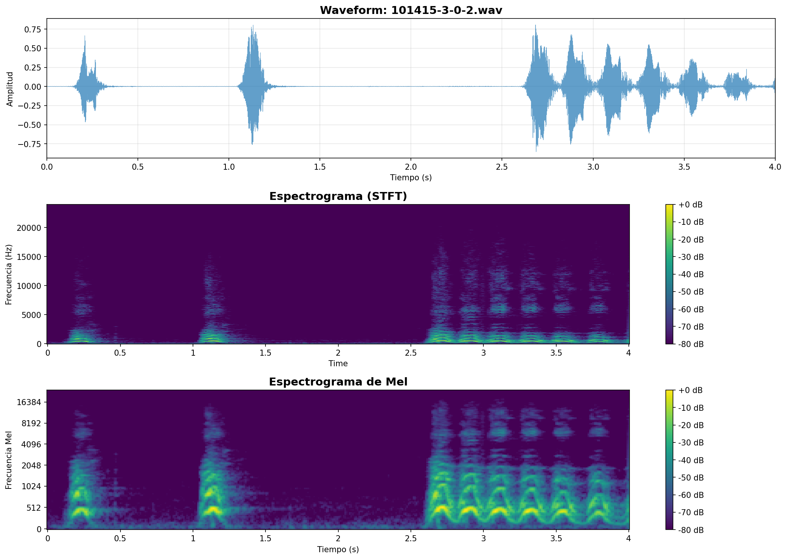
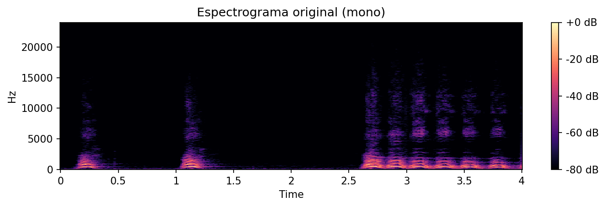
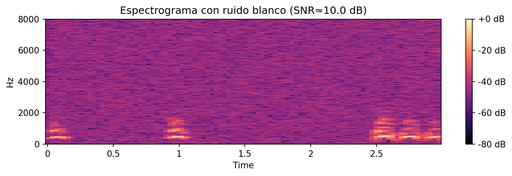
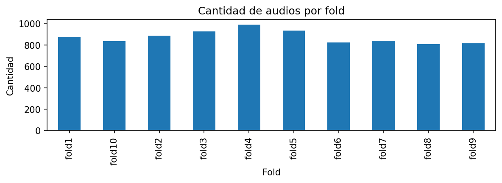
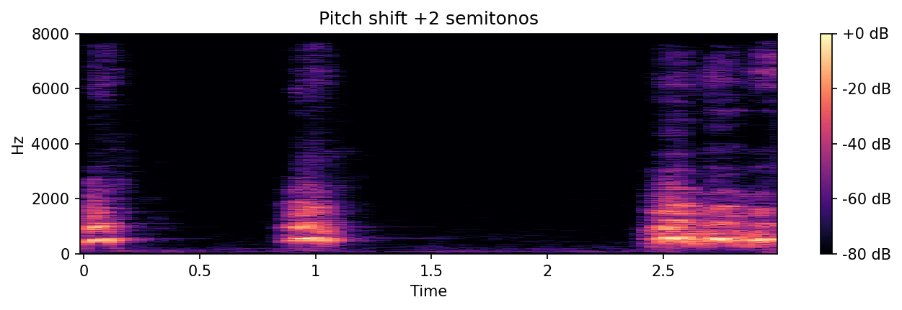

# 🎵 Análisis de audio: formas de onda, espectrogramas y extracción de MFCC

## Contexto

En este trabajo se procesó el dataset **UrbanSound8K** descargado mediante KaggleHub, con el objetivo de comprender la estructura de señales de audio, visualizar la señal y extraer características relevantes para clasificación.

Se utilizaron técnicas estándar de análisis digital de señales: **waveform, espectrogramas Mel, MFCCs y métricas espectrales**, aplicando preprocesamiento para estandarizar los clips a un formato común.

## 🎯 Objetivos

- [x] Descargar y cargar archivos .wav usando KaggleHub.
- [x] Visualizar formas de onda y analizar propiedades básicas.
- [x] Aplicar preprocesamiento: resampleo, recorte de silencios, normalización.
- [x] Generar espectrogramas STFT y Mel.
- [x] Extraer MFCC, centroides espectrales, RMS y ZCR.
- [x] Exportar features en un CSV final.
- [x] Implementar data augmentation (pitch shift, time stretch).

## Desarrollo

### 1. Setup y carga inicial

Se instalaron las librerías necesarias para procesamiento de audio:

```python
%pip install -q librosa soundfile numpy matplotlib pandas scipy kagglehub

import librosa
import librosa.display
import soundfile as sf
import numpy as np
import pandas as pd
import matplotlib.pyplot as plt
```

---

### 2. Descarga del dataset

Se utilizó KaggleHub para descargar el dataset UrbanSound8K:

```python
import kagglehub

download_path = kagglehub.dataset_download("chrisfilo/urbansound8k")
print("Path to dataset files:", download_path)
```

**Resultado:** 8,732 archivos de audio encontrados, distribuidos en 10 folds.

---

### 3. Exploración inicial del audio

Se cargó un archivo de ejemplo y se analizaron sus propiedades:

```python
y, sr = librosa.load(path, sr=None, mono=False)

print("Archivo:", audio_path.name)      # 101415-3-0-2.wav
print("Sample rate original:", sr)       # 48000 Hz
print("Duración (s):", duration_sec)     # 4.0 s
print("Canales:", channels)              # 1 (mono)
print("Amplitud min/max:", y.min(), y.max())  # -0.8535, 0.8065
```

**Observaciones:**
- El audio tiene sample rate de **48,000 Hz** y dura **4.0 segundos**
- La amplitud oscila entre -0.85 y 0.81, indicando que **no está normalizado**
- Es mono, lo cual es adecuado para clasificación de sonidos urbanos


---

### 4. Visualización completa: Waveform y Espectrogramas

Se generó una visualización completa con la forma de onda, espectrograma STFT y espectrograma Mel:

```python
# Espectrograma STFT
D = librosa.stft(y_mono)
S_db = librosa.amplitude_to_db(np.abs(D), ref=np.max)

# Espectrograma Mel
mel_spec = librosa.feature.melspectrogram(y=y_mono, sr=sr, n_mels=128)
mel_spec_db = librosa.power_to_db(mel_spec, ref=np.max)
```



**Características extraídas:**

| Métrica | Valor |
|---------|-------|
| Zero Crossing Rate (promedio) | 0.0248 |
| Spectral Centroid (promedio) | 2,397.17 Hz |
| Spectral Rolloff (promedio) | 5,320.13 Hz |

---

### 5. Preprocesamiento y estandarización

Se definió un pipeline de preprocesamiento para estandarizar todos los clips:

```python
TARGET_SR = 16000          # Hz
TARGET_DURATION = 3.0      # segundos
TARGET_AMPLITUDE = 0.99
TOP_DB = 30.0              # recorte de silencios

def preprocess_audio(path, target_sr, target_duration, top_db):
    y, sr = librosa.load(path, sr=None, mono=False)
    
    # Convertir a mono
    if y.ndim > 1:
        y = np.mean(y, axis=0)
    
    # Recortar silencios
    y_trim, _ = librosa.effects.trim(y, top_db=top_db)
    
    # Resamplear
    y_rs = librosa.resample(y_trim, orig_sr=sr, target_sr=target_sr)
    
    # Ajustar duración (pad/truncate)
    target_len = int(target_sr * target_duration)
    if len(y_rs) > target_len:
        y_rs = y_rs[:target_len]
    else:
        y_rs = np.pad(y_rs, (0, target_len - len(y_rs)))
    
    # Normalizar
    max_abs = np.max(np.abs(y_rs)) or 1.0
    y_norm = (TARGET_AMPLITUDE * y_rs) / max_abs
    
    return y_norm, target_sr
```

**Resultado después del preprocesamiento:**
- Duración: **3.0 segundos** (fija)
- Sample rate: **16,000 Hz**
- Amplitud: **-0.99 a 0.93** (normalizada)


---

### 6. Espectrogramas: Original vs Estandarizado

Se compararon los espectrogramas antes y después del preprocesamiento:




**Observación:** El resampleo a 16 kHz reduce la frecuencia máxima visible (Nyquist = 8 kHz), pero mantiene la información útil para sonidos urbanos.

---

### 7. Análisis de ruido

Se agregó ruido blanco con SNR = 10 dB para evaluar robustez:

```python
def add_white_noise(y, snr_db):
    sig_power = np.mean(y**2)
    snr_linear = 10**(snr_db / 10)
    noise_power = sig_power / snr_linear
    noise = np.sqrt(noise_power) * np.random.randn(*y.shape)
    return (y + noise).astype(np.float32)
```



**Observación:** El ruido blanco se visualiza como energía distribuida uniformemente en todas las frecuencias.

---

### 8. Extracción de MFCC y features

Se extrajeron 13 coeficientes MFCC más métricas adicionales:

```python
def extract_mfcc_features(y, sr, n_mfcc=13):
    mfcc = librosa.feature.mfcc(y=y, sr=sr, n_mfcc=n_mfcc)
    feats = {}
    for i in range(n_mfcc):
        feats[f"mfcc_{i+1}_mean"] = np.mean(mfcc[i])
        feats[f"mfcc_{i+1}_std"] = np.std(mfcc[i])
    feats["rms_mean"] = np.mean(librosa.feature.rms(y=y))
    feats["zcr_mean"] = np.mean(librosa.feature.zero_crossing_rate(y=y))
    return feats
```

**Features extraídos por clip:** 28 columnas (13 MFCC × 2 stats + RMS + ZCR)


---

### 9. Exportación del dataset

Se procesaron 100 clips y se exportó el CSV:

```python
df_features.to_csv("outputs/features/audio_mfcc_features.csv", index=False)
print("Shape:", df_features.shape)  # (100, 31)
```

---

### 10. Distribución del dataset

El dataset UrbanSound8K está organizado en 10 folds para validación cruzada:



| Fold | Cantidad |
|------|----------|
| fold1 | 873 |
| fold2 | 888 |
| fold3 | 925 |
| fold4 | 990 |
| fold5 | 936 |
| fold6 | 823 |
| fold7 | 838 |
| fold8 | 806 |
| fold9 | 816 |
| fold10 | 837 |

---

### 11. Data Augmentation

Se implementaron técnicas de augmentation para expandir el dataset:

#### Pitch Shift (+2 semitonos)

```python
y_pitch = librosa.effects.pitch_shift(y, sr=sr, n_steps=2)
```



#### Time Stretch (0.9x)

```python
y_time = librosa.effects.time_stretch(y, rate=0.9)
```


**Observación:** Estas técnicas permiten generar variantes de los clips originales para aumentar la robustez del modelo.

---

## Evidencias

- **Notebook del trabajo**: [14-audio.ipynb](14-audio.ipynb)
- **Features exportados**: `outputs/features/audio_mfcc_features.csv`
- **Imágenes generadas**: carpeta `img/`

---

## Reflexión

Este trabajo permitió comprender el pipeline completo de procesamiento de audio:

1. **Carga y exploración:** Entender las propiedades básicas (sample rate, duración, canales)
2. **Preprocesamiento:** Estandarizar clips a formato común (16 kHz, 3s, mono, normalizado)
3. **Visualización:** Waveforms y espectrogramas revelan patrones temporales y espectrales
4. **Feature extraction:** MFCCs capturan la textura tonal; ZCR y RMS capturan energía y variabilidad
5. **Augmentation:** Pitch shift y time stretch expanden el dataset sin perder información

El parámetro más importante fue **TARGET_SR = 16,000 Hz** porque balancea calidad vs eficiencia computacional.

---

## Conclusión

Se construyó un pipeline completo de procesamiento de audio:

1. ✅ Descarga del dataset UrbanSound8K (8,732 clips)
2. ✅ Exploración de propiedades de señal
3. ✅ Preprocesamiento (resampleo, trim, normalización)
4. ✅ Visualización (waveform, STFT, Mel spectrogram)
5. ✅ Extracción de features (28 columnas por clip)
6. ✅ Exportación a CSV
7. ✅ Data augmentation (pitch shift, time stretch)

El dataset resultante está listo para entrenar modelos de clasificación de sonidos urbanos.

---

## Referencias

- Librosa Documentation — https://librosa.org/doc/latest/
- KaggleHub — https://github.com/Kaggle/kagglehub
- UrbanSound8K Dataset — Salamon et al., 2014
- MFCC: Davis & Mermelstein (1980)
- Mel Scale: Stevens, Volkmann & Newman (1937)
