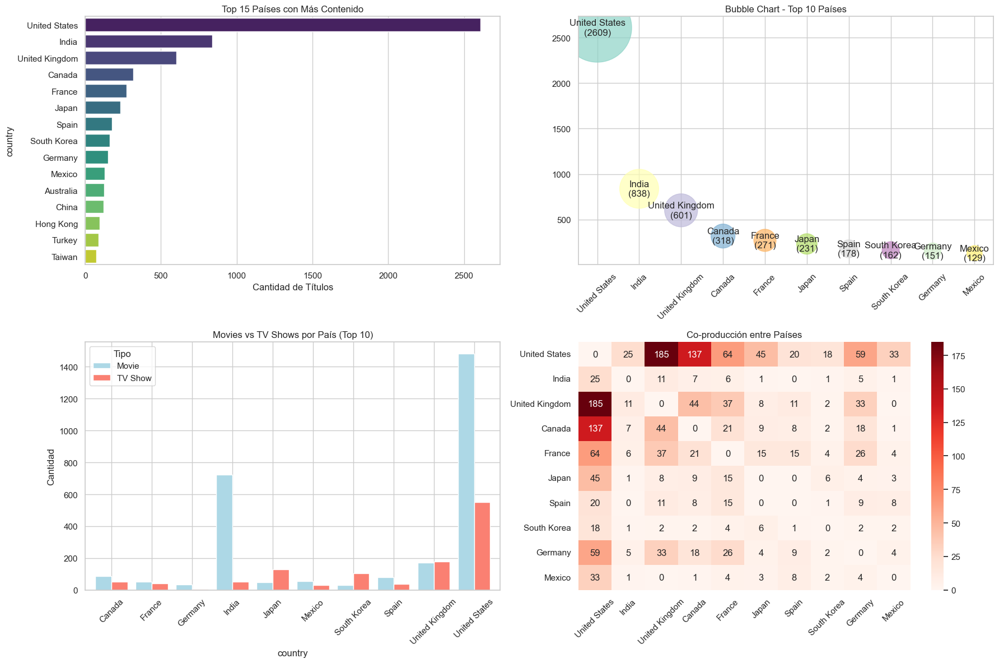
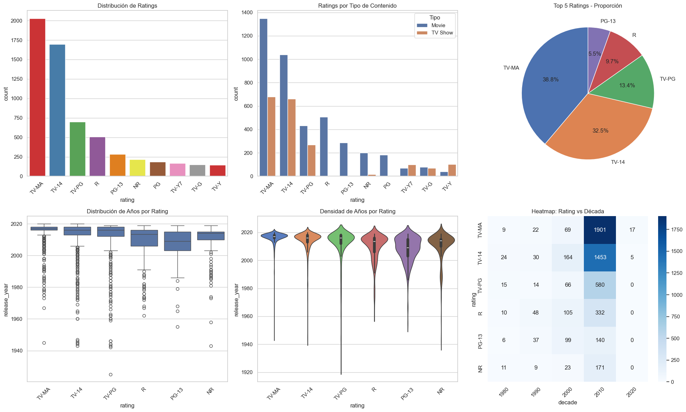
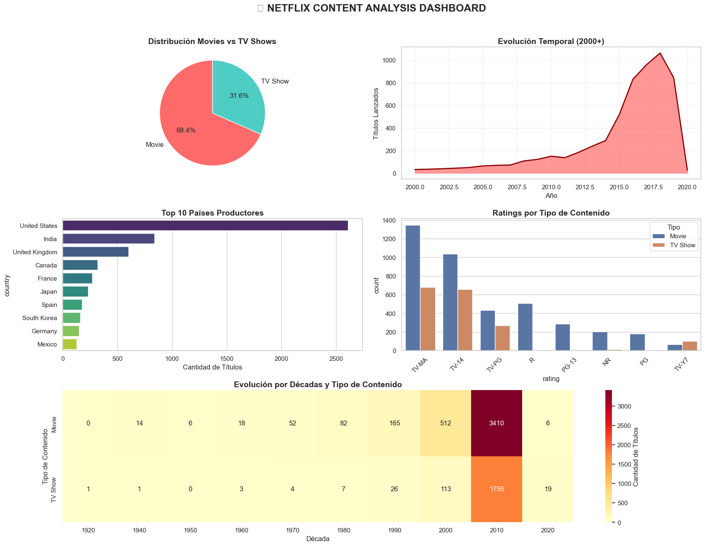
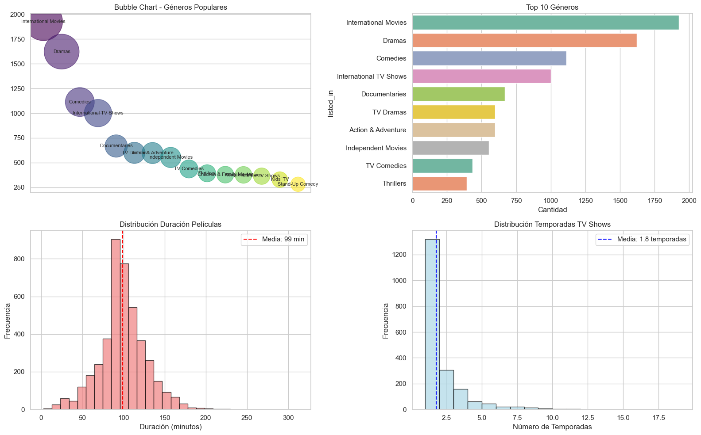

```python
# Importar librerías que vamos a usar
import pandas as pd
import numpy as np
import matplotlib.pyplot as plt
import seaborn as sns
```


```python
# === CARGAR DATOS DE NETFLIX ===

# 1. Cargar el dataset desde una URL
url = "https://raw.githubusercontent.com/swapnilg4u/Netflix-Data-Analysis/refs/heads/master/netflix_titles.csv"
netflix = pd.read_csv(url)  # función para leer archivos CSV desde URL o archivo local

print("🎬 DATASET: Netflix Titles")
print(f"   📊 Forma: {netflix.shape}")
print(f"   📋 Columnas: {list(netflix.columns)}")

# 2. Explorar los datos básicamente
print("\n🔍 Primeras 5 filas:")
print(netflix.head())  # método para mostrar las primeras filas del DataFrame

# 3. Información sobre tipos de datos y memoria
print("\n📋 INFORMACIÓN GENERAL:")
print(netflix.info())  # método que muestra tipos de datos, memoria y valores no nulos

# 4. Estadísticas básicas para columnas numéricas
print("\n📊 ESTADÍSTICAS BÁSICAS:")
print(netflix.describe())  # método que calcula estadísticas descriptivas (mean, std, min, max, etc.)

```

    🎬 DATASET: Netflix Titles
       📊 Forma: (6234, 12)
       📋 Columnas: ['show_id', 'type', 'title', 'director', 'cast', 'country', 'date_added', 'release_year', 'rating', 'duration', 'listed_in', 'description']
    
    🔍 Primeras 5 filas:
        show_id     type                                    title  \
    0  81145628    Movie  Norm of the North: King Sized Adventure   
    1  80117401    Movie               Jandino: Whatever it Takes   
    2  70234439  TV Show                       Transformers Prime   
    3  80058654  TV Show         Transformers: Robots in Disguise   
    4  80125979    Movie                             #realityhigh   
    
                       director  \
    0  Richard Finn, Tim Maltby   
    1                       NaN   
    2                       NaN   
    3                       NaN   
    4          Fernando Lebrija   
    
                                                    cast  \
    0  Alan Marriott, Andrew Toth, Brian Dobson, Cole...   
    1                                   Jandino Asporaat   
    2  Peter Cullen, Sumalee Montano, Frank Welker, J...   
    3  Will Friedle, Darren Criss, Constance Zimmer, ...   
    4  Nesta Cooper, Kate Walsh, John Michael Higgins...   
    
                                        country         date_added  release_year  \
    0  United States, India, South Korea, China  September 9, 2019          2019   
    1                            United Kingdom  September 9, 2016          2016   
    2                             United States  September 8, 2018          2013   
    3                             United States  September 8, 2018          2016   
    4                             United States  September 8, 2017          2017   
    
         rating  duration                           listed_in  \
    0     TV-PG    90 min  Children & Family Movies, Comedies   
    1     TV-MA    94 min                     Stand-Up Comedy   
    2  TV-Y7-FV  1 Season                            Kids' TV   
    3     TV-Y7  1 Season                            Kids' TV   
    4     TV-14    99 min                            Comedies   
    
                                             description  
    0  Before planning an awesome wedding for his gra...  
    1  Jandino Asporaat riffs on the challenges of ra...  
    2  With the help of three human allies, the Autob...  
    3  When a prison ship crash unleashes hundreds of...  
    4  When nerdy high schooler Dani finally attracts...  
    
    📋 INFORMACIÓN GENERAL:
    <class 'pandas.core.frame.DataFrame'>
    RangeIndex: 6234 entries, 0 to 6233
    Data columns (total 12 columns):
     #   Column        Non-Null Count  Dtype 
    ---  ------        --------------  ----- 
     0   show_id       6234 non-null   int64 
     1   type          6234 non-null   object
     2   title         6234 non-null   object
     3   director      4265 non-null   object
     4   cast          5664 non-null   object
     5   country       5758 non-null   object
     6   date_added    6223 non-null   object
     7   release_year  6234 non-null   int64 
     8   rating        6224 non-null   object
     9   duration      6234 non-null   object
     10  listed_in     6234 non-null   object
     11  description   6234 non-null   object
    dtypes: int64(2), object(10)
    memory usage: 584.6+ KB
    None
    
    📊 ESTADÍSTICAS BÁSICAS:
                show_id  release_year
    count  6.234000e+03    6234.00000
    mean   7.670368e+07    2013.35932
    std    1.094296e+07       8.81162
    min    2.477470e+05    1925.00000
    25%    8.003580e+07    2013.00000
    50%    8.016337e+07    2016.00000
    75%    8.024489e+07    2018.00000
    max    8.123573e+07    2020.00000
    


```python
# === DETECTAR Y VISUALIZAR DATOS FALTANTES ===

# 1. Calcular datos faltantes por columna
missing_data = netflix.isnull().sum().sort_values(ascending=False)  # detectar valores nulos y contar por columna
missing_percent = (netflix.isnull().sum() / len(netflix) * 100).sort_values(ascending=False)  # calcular porcentaje de nulos

print("❌ DATOS FALTANTES:")
print(missing_data[missing_data > 0])
print("\n📊 PORCENTAJES:")
print(missing_percent[missing_percent > 0])

# 2. Crear visualización de datos faltantes

plt.style.use('default')
sns.set_theme(style='whitegrid')
plt.figure(figsize=(12, 6))

# Subplot 1: Gráfico de barras de datos faltantes
plt.subplot(1, 2, 1)
sns.barplot(x=missing_percent[missing_percent > 0].values,  # función para crear barras horizontales
            y=missing_percent[missing_percent > 0].index,
            palette='cool')
plt.title('Porcentaje de Datos Faltantes por Columna')
plt.xlabel('Porcentaje (%)')

# Subplot 2: Heatmap de datos faltantes
plt.subplot(1, 2, 2)
sns.heatmap(netflix.isnull(), cbar=True, cmap='plasma', cbar_kws={'label': 'Nulos'})  # función para crear mapa de calor de valores booleanos
plt.title('Patrón de Datos Faltantes')
plt.xticks(rotation=45)

plt.tight_layout()
plt.show()  # función para mostrar/renderizar los gráficos en pantalla

```

    ❌ DATOS FALTANTES:
    director      1969
    cast           570
    country        476
    date_added      11
    rating          10
    dtype: int64
    
    📊 PORCENTAJES:
    director      31.584857
    cast           9.143407
    country        7.635547
    date_added     0.176452
    rating         0.160411
    dtype: float64
    

    C:\Users\juanp\AppData\Local\Temp\ipykernel_28496\356269113.py:20: FutureWarning: 
    
    Passing `palette` without assigning `hue` is deprecated and will be removed in v0.14.0. Assign the `y` variable to `hue` and set `legend=False` for the same effect.
    
      sns.barplot(x=missing_percent[missing_percent > 0].values,  # función para crear barras horizontales
    


    

    


```python
# === DETECCIÓN DE OUTLIERS Y ANOMALÍAS ===

# 1. Analizar años de lanzamiento atípicos
print("🔍 ANÁLISIS DE OUTLIERS EN AÑOS:")
netflix['release_year_clean'] = pd.to_numeric(netflix['release_year'], errors='coerce')
year_stats = netflix['release_year_clean'].describe()
print(year_stats)

# Identificar años sospechosos
very_old = netflix[netflix['release_year_clean'] < 1950]
future_releases = netflix[netflix['release_year_clean'] > 2025]

print(f"\n⚠️ Contenido muy antiguo (< 1950): {len(very_old)} títulos")
if len(very_old) > 0:
    print("Ejemplos:")
    print(very_old[['title', 'release_year', 'type']].head())

print(f"\n⚠️ Lanzamientos futuros (> 2025): {len(future_releases)} títulos")
if len(future_releases) > 0:
    print("Ejemplos:")
    print(future_releases[['title', 'release_year', 'type']].head())

# 2. Crear visualizaciones para detectar outliers
fig, axes = plt.subplots(2, 2, figsize=(15, 10))

# Gráfico 1: Box plot para detectar outliers en años
sns.boxplot(data=netflix, y='release_year_clean', ax=axes[0, 0])  # función para mostrar outliers con cajas
axes[0, 0].set_title('Box Plot - Años de Lanzamiento (Outliers)')
axes[0, 0].set_ylabel('Año de Lanzamiento')

# Gráfico 2: Histograma de años para ver distribución
axes[0, 1].hist(netflix['release_year_clean'].dropna(), bins=50, alpha=0.7, color='skyblue', edgecolor='black')  # histograma con muchos bins
axes[0, 1].set_title('Distribución de Años de Lanzamiento')
axes[0, 1].set_xlabel('Año')
axes[0, 1].set_ylabel('Frecuencia')
axes[0, 1].axvline(netflix['release_year_clean'].mean(), color='red', linestyle='--', label='Media')
axes[0, 1].legend()

# Gráfico 3: Análisis de títulos duplicados
title_counts = netflix['title'].value_counts()  # contar frecuencias de títulos
duplicated_titles = title_counts[title_counts > 1]

print(f"\n🔄 TÍTULOS DUPLICADOS: {len(duplicated_titles)} títulos aparecen múltiples veces")
if len(duplicated_titles) > 0:
    top_duplicates = duplicated_titles.head(10)
    sns.barplot(y=top_duplicates.index, x=top_duplicates.values, ax=axes[1, 0], palette='Reds')  # barras horizontales
    axes[1, 0].set_title('Top 10 Títulos Duplicados')
    axes[1, 0].set_xlabel('Cantidad de Apariciones')
else:
    axes[1, 0].text(0.5, 0.5, 'No se encontraron\ntítulos duplicados', 
                    ha='center', va='center', transform=axes[1, 0].transAxes)
    axes[1, 0].set_title('Títulos Duplicados - Sin Datos')

# Gráfico 4: Longitud de títulos (outliers en texto)
netflix['title_length'] = netflix['title'].str.len()
title_length_stats = netflix['title_length'].describe()

sns.boxplot(data=netflix, y='title_length', ax=axes[1, 1])  # box plot para longitud de títulos
axes[1, 1].set_title('Box Plot - Longitud de Títulos')
axes[1, 1].set_ylabel('Caracteres en el Título')

# Identificar títulos extremadamente largos o cortos
very_long_titles = netflix[netflix['title_length'] > netflix['title_length'].quantile(0.99)]
very_short_titles = netflix[netflix['title_length'] < 5]

print(f"\n📏 TÍTULOS EXTREMOS:")
print(f"   Muy largos (> percentil 99): {len(very_long_titles)} títulos")
if len(very_long_titles) > 0:
    print(f"   Ejemplo más largo: '{very_long_titles.loc[very_long_titles['title_length'].idxmax(), 'title']}'")

print(f"   Muy cortos (< 5 caracteres): {len(very_short_titles)} títulos")
if len(very_short_titles) > 0:
    print("   Ejemplos:")
    print(very_short_titles[['title', 'title_length', 'type']].head())

plt.tight_layout()
plt.show()

print("✅ Análisis de outliers completado!")
```

    🔍 ANÁLISIS DE OUTLIERS EN AÑOS:
    count    6234.00000
    mean     2013.35932
    std         8.81162
    min      1925.00000
    25%      2013.00000
    50%      2016.00000
    75%      2018.00000
    max      2020.00000
    Name: release_year_clean, dtype: float64
    
    ⚠️ Contenido muy antiguo (< 1950): 16 títulos
    Ejemplos:
                             title  release_year   type
    2005   Know Your Enemy - Japan          1945  Movie
    2006        Let There Be Light          1946  Movie
    2009  Nazi Concentration Camps          1945  Movie
    2011            Prelude to War          1942  Movie
    2012                San Pietro          1945  Movie
    
    ⚠️ Lanzamientos futuros (> 2025): 0 títulos
    
    🔄 TÍTULOS DUPLICADOS: 57 títulos aparecen múltiples veces
    

    C:\Users\juanp\AppData\Local\Temp\ipykernel_28496\1140939456.py:46: FutureWarning: 
    
    Passing `palette` without assigning `hue` is deprecated and will be removed in v0.14.0. Assign the `y` variable to `hue` and set `legend=False` for the same effect.
    
      sns.barplot(y=top_duplicates.index, x=top_duplicates.values, ax=axes[1, 0], palette='Reds')  # barras horizontales
    

    
    📏 TÍTULOS EXTREMOS:
       Muy largos (> percentil 99): 62 títulos
       Ejemplo más largo: 'Jim & Andy: The Great Beyond - Featuring a Very Special, Contractually Obligated Mention of Tony Clifton'
       Muy cortos (< 5 caracteres): 173 títulos
       Ejemplos:
        title  title_length   type
    19   Love             4  Movie
    41     PK             2  Movie
    45    ATM             3  Movie
    89    5CM             3  Movie
    209   ARQ             3  Movie
    


    

    


    ✅ Análisis de outliers completado!
    


```python
# === ANÁLISIS DE TIPOS DE CONTENIDO ===

# 1. Calcular frecuencias
type_counts = netflix['type'].value_counts()  # método para contar frecuencias de cada categoría única
type_percent = netflix['type'].value_counts(normalize=True) * 100  # mismo método pero calculando porcentajes

print("🎭 TIPOS DE CONTENIDO:")
print(type_counts)
print(f"\nPorcentajes:")
print(type_percent)

# 2. Crear visualizaciones múltiples
fig, axes = plt.subplots(2, 2, figsize=(15, 10))

# Gráfico 1: Countplot básico
sns.countplot(data=netflix, x='type', ax=axes[0, 0], palette='Set2')  # función para contar y graficar categorías
axes[0, 0].set_title('Distribución: Movies vs TV Shows')
axes[0, 0].set_ylabel('Cantidad')

# Gráfico 2: Pie chart
axes[0, 1].pie(type_counts.values, labels=type_counts.index,  # función para crear gráfico circular/torta
                  autopct='%1.1f%%', startangle=90, colors=['skyblue', 'lightcoral'])
axes[0, 1].set_title('Proporción Movies vs TV Shows')

# Gráfico 3: Barplot horizontal
sns.barplot(y=type_counts.index, x=type_counts.values, ax=axes[1, 0], palette='viridis')  # función para barras horizontales
axes[1, 0].set_title('Cantidad por Tipo (Horizontal)')
axes[1, 0].set_xlabel('Cantidad')

# Gráfico 4: Donut chart (más avanzado)
wedges, texts, autotexts = axes[1, 1].pie(type_counts.values, labels=type_counts.index,  # misma función de torta para donut
                                             autopct='%1.1f%%', startangle=90,
                                             colors=['gold', 'lightgreen'])
# Crear el hueco del donut
centre_circle = plt.Circle((0,0), 0.70, fc='white')
axes[1, 1].add_artist(centre_circle)
axes[1, 1].set_title('Donut Chart - Tipos de Contenido')

plt.tight_layout()
plt.show()
```

    🎭 TIPOS DE CONTENIDO:
    type
    Movie      4265
    TV Show    1969
    Name: count, dtype: int64
    
    Porcentajes:
    type
    Movie      68.415143
    TV Show    31.584857
    Name: proportion, dtype: float64
    

    C:\Users\juanp\AppData\Local\Temp\ipykernel_28496\1519036403.py:16: FutureWarning: 
    
    Passing `palette` without assigning `hue` is deprecated and will be removed in v0.14.0. Assign the `x` variable to `hue` and set `legend=False` for the same effect.
    
      sns.countplot(data=netflix, x='type', ax=axes[0, 0], palette='Set2')  # función para contar y graficar categorías
    C:\Users\juanp\AppData\Local\Temp\ipykernel_28496\1519036403.py:26: FutureWarning: 
    
    Passing `palette` without assigning `hue` is deprecated and will be removed in v0.14.0. Assign the `y` variable to `hue` and set `legend=False` for the same effect.
    
      sns.barplot(y=type_counts.index, x=type_counts.values, ax=axes[1, 0], palette='viridis')  # función para barras horizontales
    


    

    


```python
# === ANÁLISIS DE TENDENCIAS TEMPORALES ===

# 1. Preparar datos temporales
netflix['release_year'] = pd.to_numeric(netflix['release_year'], errors='coerce')  # convertir a numérico, NaN si no es posible
yearly_releases = netflix['release_year'].value_counts().sort_index()  # contar frecuencias por año y ordenar

# Filtrar años recientes para mejor visualización
recent_years = yearly_releases[yearly_releases.index >= 2000]

# 2. Crear visualizaciones temporales múltiples
fig, axes = plt.subplots(2, 2, figsize=(16, 12))

# Gráfico 1: Línea temporal
axes[0, 0].plot(recent_years.index, recent_years.values,  # función para crear líneas conectando puntos
                  marker='o', linewidth=2, markersize=4, color='darkblue')
axes[0, 0].set_title('Cantidad de Contenido por Año (2000-2021)')
axes[0, 0].set_xlabel('Año')
axes[0, 0].set_ylabel('Cantidad de Títulos')
axes[0, 0].grid(True, alpha=0.3)

# Gráfico 2: Área bajo la curva
axes[0, 1].fill_between(recent_years.index, recent_years.values,  # función para rellenar área bajo la línea
                  alpha=0.7, color='lightcoral')
axes[0, 1].set_title('Área - Lanzamientos por Año')
axes[0, 1].set_xlabel('Año')
axes[0, 1].set_ylabel('Cantidad')

# Gráfico 3: Análisis por tipo de contenido
netflix_recent = netflix[netflix['release_year'] >= 2010]
yearly_by_type = netflix_recent.groupby(['release_year', 'type']).size().unstack(fill_value=0)

yearly_by_type.plot(kind='bar', ax=axes[1, 0],  # tipo de gráfico con barras lado a lado (no apiladas)
                    color=['skyblue', 'lightgreen'], alpha=0.8)
axes[1, 0].set_title('Lanzamientos por Tipo (2010-2021)')
axes[1, 0].set_xlabel('Año')
axes[1, 0].set_ylabel('Cantidad')
axes[1, 0].legend(title='Tipo')

# Gráfico 4: Heatmap de lanzamientos por década y tipo
netflix['decade'] = (netflix['release_year'] // 10) * 10
decade_type = netflix.groupby(['decade', 'type']).size().unstack(fill_value=0)
sns.heatmap(decade_type, annot=True, fmt='d', ax=axes[1, 1], cmap='YlOrRd')  # función para mapa de calor con anotaciones
axes[1, 1].set_title('Heatmap: Lanzamientos por Década y Tipo')

plt.tight_layout()
plt.show()

print("📅 AÑOS CON MÁS LANZAMIENTOS:")
print(yearly_releases.tail(10))
```


    

    


    📅 AÑOS CON MÁS LANZAMIENTOS:
    release_year
    2011     136
    2012     183
    2013     237
    2014     288
    2015     517
    2016     830
    2017     959
    2018    1063
    2019     843
    2020      25
    Name: count, dtype: int64
    


```python
# === ANÁLISIS DE PAÍSES CON VISUALIZACIONES ===

# 1. Preparar datos de países (limpiar y separar países múltiples)
netflix_countries = netflix.dropna(subset=['country']).copy()

# Separar países que están separados por comas
countries_expanded = netflix_countries['country'].str.split(', ').explode()
country_counts = countries_expanded.value_counts().head(20)  # contar frecuencias de países y tomar top 20

print("🌍 TOP 20 PAÍSES CON MÁS CONTENIDO:")
print(country_counts)

# 2. Crear visualizaciones geográficas
fig, axes = plt.subplots(2, 2, figsize=(18, 12))

# Gráfico 1: Top 15 países - barras horizontales
top_15_countries = country_counts.head(15)
sns.barplot(y=top_15_countries.index, x=top_15_countries.values,  # función para barras horizontales
           ax=axes[0, 0], palette='viridis')
axes[0, 0].set_title('Top 15 Países con Más Contenido')
axes[0, 0].set_xlabel('Cantidad de Títulos')

# Gráfico 2: Treemap simulado con scatter
top_10 = country_counts.head(10)
colors = plt.cm.Set3(np.linspace(0, 1, len(top_10)))
axes[0, 1].scatter(range(len(top_10)), top_10.values,  # función para gráfico de burbujas/puntos
                  s=top_10.values*3, c=colors, alpha=0.7)
for i, (country, count) in enumerate(top_10.items()):
    axes[0, 1].annotate(f'{country}\n({count})', 
                       (i, count), ha='center', va='center')
axes[0, 1].set_title('Bubble Chart - Top 10 Países')
axes[0, 1].set_xticks(range(len(top_10)))
axes[0, 1].set_xticklabels(top_10.index, rotation=45)

# Gráfico 3: Análisis de contenido por país y tipo
top_countries = country_counts.head(10).index
netflix_top_countries = netflix_countries[netflix_countries['country'].isin(top_countries)]
country_type = netflix_top_countries.groupby(['country', 'type']).size().unstack(fill_value=0)

country_type.plot(kind='bar', ax=axes[1, 0],  # tipo de gráfico con barras agrupadas lado a lado
                  color=['lightblue', 'salmon'], width=0.8)
axes[1, 0].set_title('Movies vs TV Shows por País (Top 10)')
axes[1, 0].set_ylabel('Cantidad')
axes[1, 0].legend(title='Tipo')
axes[1, 0].tick_params(axis='x', rotation=45)

# Gráfico 4: Heatmap de correlación entre países principales
# Crear matriz de co-ocurrencia de países
from itertools import combinations
co_occurrence = {}
for countries_str in netflix_countries['country']:
    if pd.notna(countries_str) and ',' in countries_str:
        countries_list = [c.strip() for c in countries_str.split(',')]
        for c1, c2 in combinations(countries_list, 2):
            if c1 in top_10.index and c2 in top_10.index:
                key = tuple(sorted([c1, c2]))
                co_occurrence[key] = co_occurrence.get(key, 0) + 1

# Crear matriz para heatmap
co_matrix = np.zeros((len(top_10), len(top_10)))
for i, c1 in enumerate(top_10.index):
    for j, c2 in enumerate(top_10.index):
        if i != j:
            key = tuple(sorted([c1, c2]))
            co_matrix[i, j] = co_occurrence.get(key, 0)

sns.heatmap(co_matrix, annot=True, fmt='.0f',  # función para mapa de calor (formato .0f para números flotantes)
           xticklabels=top_10.index, yticklabels=top_10.index,
           ax=axes[1, 1], cmap='Reds')
axes[1, 1].set_title('Co-producción entre Países')
axes[1, 1].tick_params(axis='x', rotation=45)
axes[1, 1].tick_params(axis='y', rotation=0)

plt.tight_layout()
plt.show()
```

    🌍 TOP 20 PAÍSES CON MÁS CONTENIDO:
    country
    United States     2609
    India              838
    United Kingdom     601
    Canada             318
    France             271
    Japan              231
    Spain              178
    South Korea        162
    Germany            151
    Mexico             129
    Australia          126
    China              120
    Hong Kong           97
    Turkey              87
    Taiwan              75
    Argentina           68
    Italy               67
    Belgium             66
    Brazil              66
    Thailand            56
    Name: count, dtype: int64
    

    C:\Users\juanp\AppData\Local\Temp\ipykernel_28496\849680032.py:18: FutureWarning: 
    
    Passing `palette` without assigning `hue` is deprecated and will be removed in v0.14.0. Assign the `y` variable to `hue` and set `legend=False` for the same effect.
    
      sns.barplot(y=top_15_countries.index, x=top_15_countries.values,  # función para barras horizontales
    


    

    


```python
# === ANÁLISIS DE RATINGS Y GÉNEROS ===

# 1. Preparar datos de ratings
rating_counts = netflix['rating'].value_counts().head(10)  # contar frecuencias de ratings y tomar top 10

print("🔞 TOP 10 RATINGS MÁS COMUNES:")
print(rating_counts)

# 2. Crear dashboard de ratings
fig, axes = plt.subplots(2, 3, figsize=(20, 12))

# Gráfico 1: Countplot de ratings
sns.countplot(data=netflix, x='rating', order=rating_counts.index,  # función para contar y graficar categorías ordenadas
           ax=axes[0, 0], palette='Set1')
axes[0, 0].set_title('Distribución de Ratings')
axes[0, 0].tick_params(axis='x', rotation=45)

# Gráfico 2: Ratings por tipo de contenido
sns.countplot(data=netflix, x='rating', hue='type',  # misma función pero separando por otra variable (hue)
           order=rating_counts.index, ax=axes[0, 1])
axes[0, 1].set_title('Ratings por Tipo de Contenido')
axes[0, 1].tick_params(axis='x', rotation=45)
axes[0, 1].legend(title='Tipo')

# Gráfico 3: Pie chart de ratings principales
top_5_ratings = rating_counts.head(5)
axes[0, 2].pie(top_5_ratings.values, labels=top_5_ratings.index,  # función para gráfico circular/torta
                  autopct='%1.1f%%', startangle=90)
axes[0, 2].set_title('Top 5 Ratings - Proporción')

# Gráfico 4: Box plot de años de lanzamiento por rating
netflix_clean = netflix.dropna(subset=['rating', 'release_year'])
top_ratings = rating_counts.head(6).index
netflix_top_ratings = netflix_clean[netflix_clean['rating'].isin(top_ratings)]

sns.boxplot(data=netflix_top_ratings, x='rating', y='release_year',  # función para mostrar distribución con cajas y bigotes
           order=top_ratings, ax=axes[1, 0])
axes[1, 0].set_title('Distribución de Años por Rating')
axes[1, 0].tick_params(axis='x', rotation=45)

# Gráfico 5: Violin plot alternativo
sns.violinplot(data=netflix_top_ratings, x='rating', y='release_year',  # función para mostrar densidad como "violines"
           order=top_ratings, ax=axes[1, 1], palette='muted')
axes[1, 1].set_title('Densidad de Años por Rating')
axes[1, 1].tick_params(axis='x', rotation=45)

# Gráfico 6: Heatmap de rating vs década
netflix_clean['decade'] = (netflix_clean['release_year'] // 10) * 10
rating_decade = netflix_clean.groupby(['rating', 'decade']).size().unstack(fill_value=0)
# Filtrar solo ratings principales y décadas recientes
rating_decade_filtered = rating_decade.loc[top_ratings, rating_decade.columns >= 1980]

sns.heatmap(rating_decade_filtered, annot=True, fmt='d',  # función para mapa de calor con valores enteros
           ax=axes[1, 2], cmap='Blues')
axes[1, 2].set_title('Heatmap: Rating vs Década')
axes[1, 2].tick_params(axis='x', rotation=45)

plt.tight_layout()
plt.show()
```

    🔞 TOP 10 RATINGS MÁS COMUNES:
    rating
    TV-MA    2027
    TV-14    1698
    TV-PG     701
    R         508
    PG-13     286
    NR        218
    PG        184
    TV-Y7     169
    TV-G      149
    TV-Y      143
    Name: count, dtype: int64
    

    C:\Users\juanp\AppData\Local\Temp\ipykernel_28496\4139662000.py:13: FutureWarning: 
    
    Passing `palette` without assigning `hue` is deprecated and will be removed in v0.14.0. Assign the `x` variable to `hue` and set `legend=False` for the same effect.
    
      sns.countplot(data=netflix, x='rating', order=rating_counts.index,  # función para contar y graficar categorías ordenadas
    C:\Users\juanp\AppData\Local\Temp\ipykernel_28496\4139662000.py:42: FutureWarning: 
    
    Passing `palette` without assigning `hue` is deprecated and will be removed in v0.14.0. Assign the `x` variable to `hue` and set `legend=False` for the same effect.
    
      sns.violinplot(data=netflix_top_ratings, x='rating', y='release_year',  # función para mostrar densidad como "violines"
    C:\Users\juanp\AppData\Local\Temp\ipykernel_28496\4139662000.py:48: SettingWithCopyWarning: 
    A value is trying to be set on a copy of a slice from a DataFrame.
    Try using .loc[row_indexer,col_indexer] = value instead
    
    See the caveats in the documentation: https://pandas.pydata.org/pandas-docs/stable/user_guide/indexing.html#returning-a-view-versus-a-copy
      netflix_clean['decade'] = (netflix_clean['release_year'] // 10) * 10
    


    

    


```python
# === CREAR DASHBOARD FINAL INTERACTIVO ===

# 1. Calcular estadísticas finales
total_titles = len(netflix)
total_movies = len(netflix[netflix['type'] == 'Movie'])
total_shows = len(netflix[netflix['type'] == 'TV Show'])
latest_year = netflix['release_year'].max()
oldest_year = netflix['release_year'].min()

print(f"📊 RESUMEN EJECUTIVO NETFLIX:")
print(f"   Total de títulos: {total_titles:,}")
print(f"   Películas: {total_movies:,} ({total_movies/total_titles*100:.1f}%)")
print(f"   Series: {total_shows:,} ({total_shows/total_titles*100:.1f}%)")
print(f"   Rango de años: {oldest_year} - {latest_year}")

# 2. Crear figura principal con subplots
fig = plt.figure(figsize=(20, 15))
gs = fig.add_gridspec(3, 4, hspace=0.3, wspace=0.3)

# Dashboard panel 1: Tipos (grande)
ax1 = fig.add_subplot(gs[0, :2])
type_data = netflix['type'].value_counts()
colors = ['#FF6B6B', '#4ECDC4']
wedges, texts, autotexts = ax1.pie(type_data.values, labels=type_data.index,  # función para gráfico de torta en dashboard
                                       autopct='%1.1f%%', startangle=90,
                                       colors=colors, textprops={'fontsize': 12})
ax1.set_title('Distribución Movies vs TV Shows', fontsize=14, fontweight='bold')

# Dashboard panel 2: Timeline
ax2 = fig.add_subplot(gs[0, 2:])
yearly = netflix.groupby('release_year').size()
recent_years = yearly[yearly.index >= 2000]
ax2.fill_between(recent_years.index, recent_years.values, color='#FF6B6B', alpha=0.7)  # función para rellenar área bajo curva
ax2.plot(recent_years.index, recent_years.values, color='darkred', linewidth=2)
ax2.set_title('Evolución Temporal (2000+)', fontsize=14, fontweight='bold')
ax2.set_xlabel('Año')
ax2.set_ylabel('Títulos Lanzados')
ax2.grid(True, alpha=0.3)

# Dashboard panel 3: Top países
ax3 = fig.add_subplot(gs[1, :2])
country_clean = netflix.dropna(subset=['country'])['country'].str.split(', ').explode()
top_countries = country_clean.value_counts().head(10)
sns.barplot(y=top_countries.index, x=top_countries.values, ax=ax3, palette='viridis')  # función para barras horizontales
ax3.set_title('Top 10 Países Productores', fontsize=14, fontweight='bold')
ax3.set_xlabel('Cantidad de Títulos')

# Dashboard panel 4: Ratings
ax4 = fig.add_subplot(gs[1, 2:])
top_ratings = netflix['rating'].value_counts().head(8)
sns.countplot(data=netflix[netflix['rating'].isin(top_ratings.index)],  # función para contar categorías separadas por hue
           x='rating', hue='type', order=top_ratings.index, ax=ax4)
ax4.set_title('Ratings por Tipo de Contenido', fontsize=14, fontweight='bold')
ax4.tick_params(axis='x', rotation=45)
ax4.legend(title='Tipo')

# Dashboard panel 5: Heatmap temporal (full width)
ax5 = fig.add_subplot(gs[2, :])
netflix['decade'] = (netflix['release_year'] // 10) * 10
year_type_decade = netflix.groupby(['decade', 'type']).size().unstack(fill_value=0)
sns.heatmap(year_type_decade.T, annot=True, fmt='d', ax=ax5,  # función para mapa de calor transpuesto (.T)
           cmap='YlOrRd', cbar_kws={'label': 'Cantidad de Títulos'})
ax5.set_title('Evolución por Décadas y Tipo de Contenido', fontsize=14, fontweight='bold')
ax5.set_xlabel('Década')
ax5.set_ylabel('Tipo de Contenido')

# Guardar el dashboard
plt.suptitle('📊 NETFLIX CONTENT ANALYSIS DASHBOARD', fontsize=18, fontweight='bold', y=0.95)
plt.savefig(f'netflix_dashboard.png', dpi=300, bbox_inches='tight')  # función para guardar figura como archivo
plt.show()

print("\n✅ Dashboard guardado como 'netflix_dashboard.png'")
```

    📊 RESUMEN EJECUTIVO NETFLIX:
       Total de títulos: 6,234
       Películas: 4,265 (68.4%)
       Series: 1,969 (31.6%)
       Rango de años: 1925 - 2020
    

    C:\Users\juanp\AppData\Local\Temp\ipykernel_28496\2389097445.py:44: FutureWarning: 
    
    Passing `palette` without assigning `hue` is deprecated and will be removed in v0.14.0. Assign the `y` variable to `hue` and set `legend=False` for the same effect.
    
      sns.barplot(y=top_countries.index, x=top_countries.values, ax=ax3, palette='viridis')  # función para barras horizontales
    C:\Users\juanp\AppData\Local\Temp\ipykernel_28496\2389097445.py:69: UserWarning: Glyph 128202 (\N{BAR CHART}) missing from font(s) Arial.
      plt.savefig(f'netflix_dashboard.png', dpi=300, bbox_inches='tight')  # función para guardar figura como archivo
    c:\Users\juanp\OneDrive - Universidad Católica del Uruguay\UCU\Semestre 4\Ingeniería de Datos\portafolio-ia\.ven\Lib\site-packages\IPython\core\pylabtools.py:170: UserWarning: Glyph 128202 (\N{BAR CHART}) missing from font(s) Arial.
      fig.canvas.print_figure(bytes_io, **kw)
    


    

    


    
    ✅ Dashboard guardado como 'netflix_dashboard.png'
    


```python
# === ANÁLISIS AVANZADO DE GÉNEROS ===

# 1. Separar géneros que están en lista separada por comas
genres_expanded = netflix.dropna(subset=['listed_in'])['listed_in'].str.split(', ').explode()
top_genres = genres_expanded.value_counts().head(15)  # contar frecuencias de géneros y tomar top 15

print("🎬 TOP 15 GÉNEROS MÁS POPULARES:")
print(top_genres)

# 2. Crear visualización de géneros
fig, axes = plt.subplots(2, 2, figsize=(16, 10))

# Word cloud simulado con scatter
axes[0, 0].scatter(range(len(top_genres)), top_genres.values,  # función para gráfico de burbujas (scatter)
                  s=top_genres.values*2, alpha=0.6, c=range(len(top_genres)), cmap='viridis')
for i, (genre, count) in enumerate(top_genres.items()):
    axes[0, 0].annotate(genre, (i, count), ha='center', va='center', fontsize=8)
axes[0, 0].set_title('Bubble Chart - Géneros Populares')
axes[0, 0].set_xticks([])

# Barras horizontales de géneros
sns.barplot(y=top_genres.head(10).index, x=top_genres.head(10).values,  # función para barras horizontales
           ax=axes[0, 1], palette='Set2')
axes[0, 1].set_title('Top 10 Géneros')
axes[0, 1].set_xlabel('Cantidad')

# Análisis de duración de películas
movies_netflix = netflix[netflix['type'] == 'Movie'].copy()
movies_netflix['duration_min'] = movies_netflix['duration'].str.extract('(\d+)').astype(float)

axes[1, 0].hist(movies_netflix['duration_min'], bins=30, alpha=0.7, color='lightcoral', edgecolor='black')  # función para histograma de frecuencias
axes[1, 0].set_title('Distribución Duración Películas')
axes[1, 0].set_xlabel('Duración (minutos)')
axes[1, 0].set_ylabel('Frecuencia')
axes[1, 0].axvline(movies_netflix['duration_min'].mean(), color='red', linestyle='--', 
                   label=f'Media: {movies_netflix["duration_min"].mean():.0f} min')
axes[1, 0].legend()

# Análisis de temporadas de series
tv_shows_netflix = netflix[netflix['type'] == 'TV Show'].copy()
tv_shows_netflix['seasons'] = tv_shows_netflix['duration'].str.extract('(\d+)').astype(float)

axes[1, 1].hist(tv_shows_netflix['seasons'], bins=range(1, 20), alpha=0.7, color='lightblue', edgecolor='black')  # función para histograma con bins personalizados
axes[1, 1].set_title('Distribución Temporadas TV Shows')
axes[1, 1].set_xlabel('Número de Temporadas')
axes[1, 1].set_ylabel('Frecuencia')
axes[1, 1].axvline(tv_shows_netflix['seasons'].mean(), color='blue', linestyle='--',
                   label=f'Media: {tv_shows_netflix["seasons"].mean():.1f} temporadas')
axes[1, 1].legend()

plt.tight_layout()
plt.show()

print(f"\n📊 ESTADÍSTICAS DE DURACIÓN:")
print(f"   Película promedio: {movies_netflix['duration_min'].mean():.0f} minutos")
print(f"   Película más corta: {movies_netflix['duration_min'].min():.0f} minutos")
print(f"   Película más larga: {movies_netflix['duration_min'].max():.0f} minutos")
print(f"   Serie promedio: {tv_shows_netflix['seasons'].mean():.1f} temporadas")
print(f"   Serie más larga: {tv_shows_netflix['seasons'].max():.0f} temporadas")
```

    <>:29: SyntaxWarning: invalid escape sequence '\d'
    <>:41: SyntaxWarning: invalid escape sequence '\d'
    <>:29: SyntaxWarning: invalid escape sequence '\d'
    <>:41: SyntaxWarning: invalid escape sequence '\d'
    C:\Users\juanp\AppData\Local\Temp\ipykernel_28496\1168155730.py:29: SyntaxWarning: invalid escape sequence '\d'
      movies_netflix['duration_min'] = movies_netflix['duration'].str.extract('(\d+)').astype(float)
    C:\Users\juanp\AppData\Local\Temp\ipykernel_28496\1168155730.py:41: SyntaxWarning: invalid escape sequence '\d'
      tv_shows_netflix['seasons'] = tv_shows_netflix['duration'].str.extract('(\d+)').astype(float)
    

    🎬 TOP 15 GÉNEROS MÁS POPULARES:
    listed_in
    International Movies        1927
    Dramas                      1623
    Comedies                    1113
    International TV Shows      1001
    Documentaries                668
    TV Dramas                    599
    Action & Adventure           597
    Independent Movies           552
    TV Comedies                  436
    Thrillers                    392
    Children & Family Movies     378
    Romantic Movies              376
    Crime TV Shows               363
    Kids' TV                     328
    Stand-Up Comedy              281
    Name: count, dtype: int64
    

    C:\Users\juanp\AppData\Local\Temp\ipykernel_28496\1168155730.py:22: FutureWarning: 
    
    Passing `palette` without assigning `hue` is deprecated and will be removed in v0.14.0. Assign the `y` variable to `hue` and set `legend=False` for the same effect.
    
      sns.barplot(y=top_genres.head(10).index, x=top_genres.head(10).values,  # función para barras horizontales
    


    

    


    
    📊 ESTADÍSTICAS DE DURACIÓN:
       Película promedio: 99 minutos
       Película más corta: 3 minutos
       Película más larga: 312 minutos
       Serie promedio: 1.8 temporadas
       Serie más larga: 15 temporadas
    

# PREGUNTAS A RESPONDER

1.  ¿Qué tipo de visualización es más efectiva para mostrar distribuciones temporales? 💡 PISTA: Compara line plot vs area plot vs bar plot

2. ¿Por qué usamos diferentes tipos de gráficos para diferentes datos? 💡 PISTA: 🔗 Guía de tipos de gráficos

3. ¿Qué insights de negocio obtuviste que Netflix podría usar? 💡 PISTA: Piensa en estrategias de contenido, mercados objetivo, tipos de producción

4. ¿Cuál fue la visualización más reveladora y por qué? 💡 PISTA: ¿Qué patrón no esperabas ver?

5. ¿Cómo mejorarías este análisis con más datos? 💡 PISTA: Datos de audiencia, ratings de IMDb, presupuestos, etc.

# RESPUESTAS

1. La mejor es la de area plot ya que muestra de forma más directa y efectiva la variacion de los datos en el tiempo. La que le sigue es line plot y por ultimo bar plot porque no se nota la continuidad de los datos durante el tiempo. 

2. Depende de lo que desees visualizar, cual tipo de grafico te sirve más. En otras palabras, hay algunos graficos que se ajustan más a cierto tipo de comunicación de análisis y es preferible elegirlos para graficar. Un ejemplo sería el uso de las visualizaciones tipo heatmap para identificar patrones, áreas de interés, puntos de fricción o oportunidades de mejora. Así como el uso de la psicología del color, donde puede cambiar la perspectiva de quien observa la visualización dependiendo de la escala de colores elegida para el heatmap por ejemplo, pudiendo ser en escala de rojos o colores cálidos en general, dando a entender una connotación negativa o mala mientras más intenso se vuelve el color, o el caso contrario con colores fríos.

3. 
