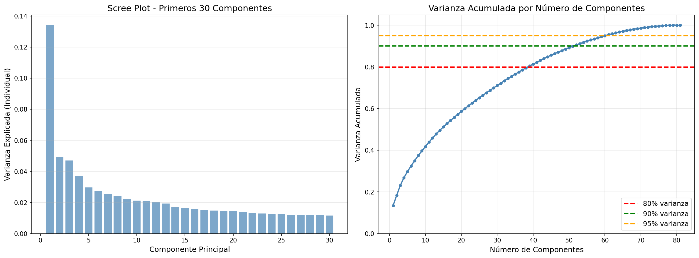
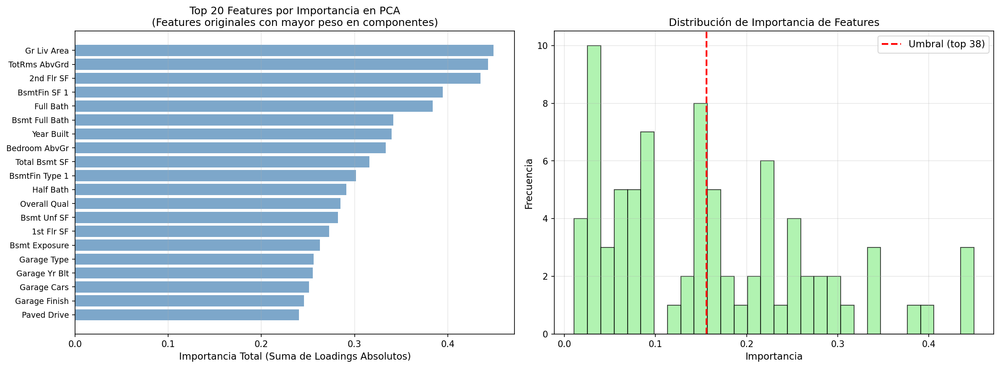
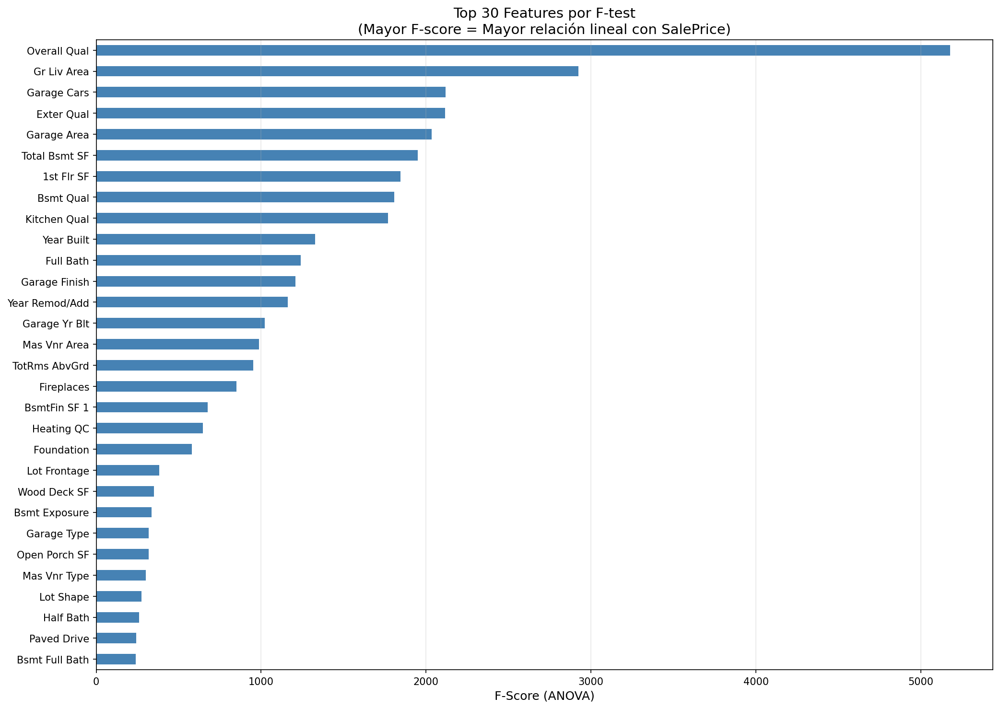
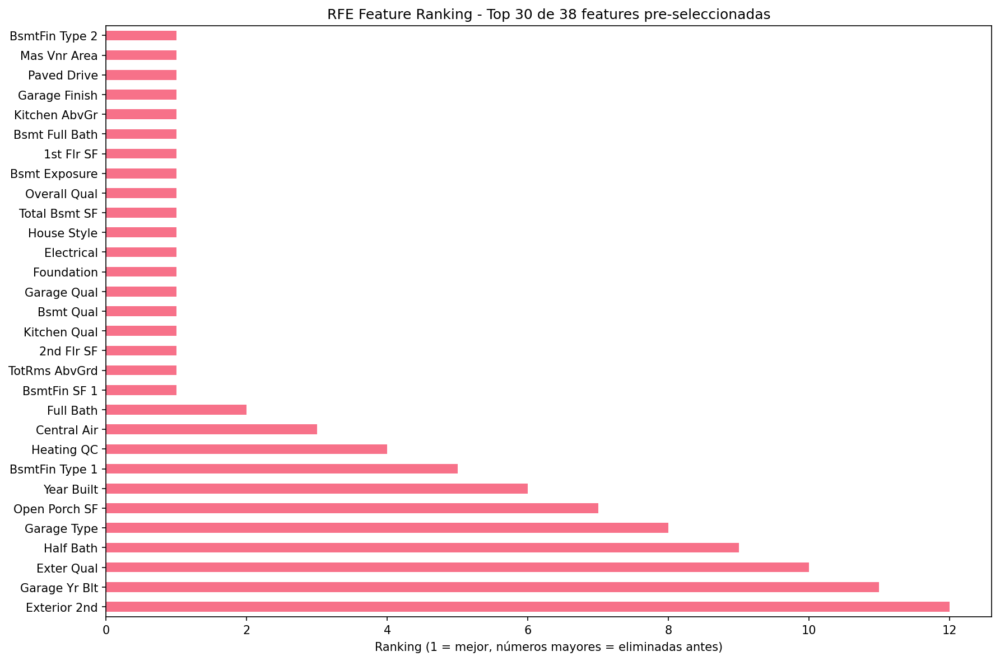
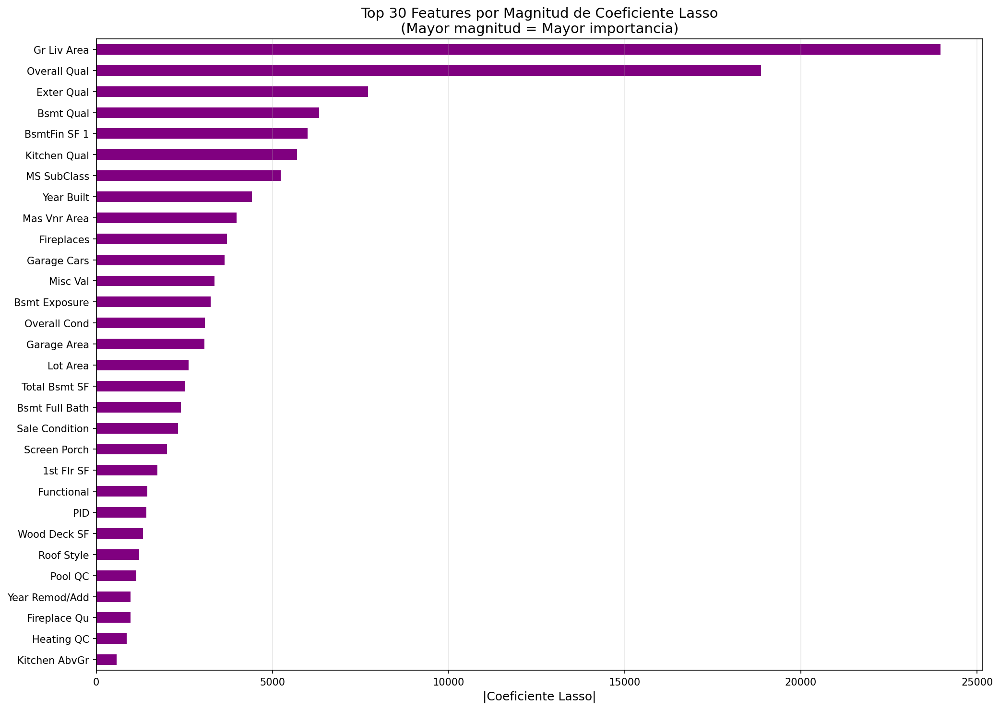

# 🔍 PCA y Feature Selection: Optimizando modelos de precios inmobiliarios

## Contexto

En esta práctica se exploraron técnicas de **reducción de dimensionalidad** y **selección de variables** aplicadas al dataset **Ames Housing**, que contiene **2,930 casas** con **81 features** (38 numéricas y 43 categóricas) para predecir el precio de venta (`SalePrice`). El objetivo fue identificar las variables más influyentes y evaluar cómo conservar la mayor cantidad de información con menos dimensiones, balanceando **precisión del modelo** con **interpretabilidad** y **eficiencia computacional**.

> El análisis fue desarrollado en un notebook de Jupyter que puedes encontrar [aquí](../ut3-pca/10_pca.ipynb)

## Objetivos

- [x] Cargar y preprocesar el dataset Ames Housing (imputación, encoding).
- [x] Estandarizar features antes de aplicar PCA (PCA es sensible a escala).
- [x] Aplicar PCA y analizar varianza explicada por componentes principales.
- [x] Determinar número óptimo de componentes (80%, 90%, 95% varianza).
- [x] Implementar Feature Selection basada en PCA loadings (mantener interpretabilidad).
- [x] Comparar métodos Filter (F-test, Mutual Information), Wrapper (Forward, Backward, RFE) y Embedded (Random Forest Importance, Lasso).
- [x] Evaluar performance (RMSE, R²) de cada método con Random Forest.
- [x] Analizar trade-offs entre reducción dimensional, precisión e interpretabilidad.

## Desarrollo

### 1. Setup y preprocesamiento

Se cargó el dataset Ames Housing desde `data/AmesHousing.csv` con **2,930 registros** y **82 columnas** (incluyendo `Id` y `SalePrice`). Se realizó:

- **Eliminación de `Id`** (no predictivo).
- **Imputación de valores faltantes**: mediana para numéricas, moda para categóricas.
- **Label encoding** para variables categóricas (43 features).
- **Separación de features y target**: `X` con 81 features, `y` con `SalePrice`.

**Resultados del preprocesamiento:**
- Features numéricas: 38
- Features categóricas: 43 (encoded)
- Precio promedio: $180,796
- Precio mediana: $160,000

### 2. Estandarización

PCA es **sensible a la escala** de las variables, por lo que se aplicó `StandardScaler` para normalizar todas las features (media ≈ 0, desviación estándar ≈ 1).

**Verificación:**
- Mean después de scaling: -0.000000 (esperado: ~0)
- Std después de scaling: 1.000000 (esperado: ~1)
- Ejemplo: `Gr Liv Area` pasó de mean=1500, std=506 a mean=0.000000, std=1.000000

### 3. Análisis de Componentes Principales (PCA)

Se aplicó PCA sin restricciones para generar todos los componentes posibles (81 componentes).

**Varianza explicada por componentes principales:**

- **PC1**: 13.409% (el más importante)
- **PC2**: 4.956%
- **PC3**: 4.709%
- **PC4**: 3.690%
- **PC5**: 2.974%

**Top 10 componentes (varianza acumulada):**

- PC1: 13.409% | Acumulada: 13.409%
- PC2: 4.956% | Acumulada: 18.365%
- PC3: 4.709% | Acumulada: 23.074%
- PC4: 3.690% | Acumulada: 26.765%
- PC5: 2.974% | Acumulada: 29.739%
- PC6: 2.727% | Acumulada: 32.466%
- PC7: 2.550% | Acumulada: 35.017%
- PC8: 2.404% | Acumulada: 37.420%
- PC9: 2.239% | Acumulada: 39.659%
- PC10: 2.121% | Acumulada: 41.780%

### 4. Decisión de dimensionalidad

Se analizó cuántos componentes se necesitan para retener diferentes niveles de varianza:

**Resultados:**

- **80% varianza**: 38 componentes (53.1% reducción: 81 → 38)
- **90% varianza**: 51 componentes (37.0% reducción: 81 → 51)
- **95% varianza**: 59 componentes (27.2% reducción: 81 → 59)

**Decisión:** Se utilizaron **38 componentes (80% varianza)** para balancear reducción dimensional con retención de información.



### 5. Feature Selection basada en PCA Loadings

En lugar de usar componentes principales (PC1, PC2...), se seleccionaron las **features originales** con mayor peso (loading) en los componentes principales, manteniendo **interpretabilidad**.

**Top 20 features por importancia en PCA (suma de loadings absolutos):**

1. Gr Liv Area: 0.4494
2. TotRms AbvGrd: 0.4431
3. 2nd Flr SF: 0.4354
4. BsmtFin SF 1: 0.3946
5. Full Bath: 0.3841
6. Bsmt Full Bath: 0.3415
7. Year Built: 0.3399
8. Bedroom AbvGr: 0.3335
9. Total Bsmt SF: 0.3159
10. BsmtFin Type 1: 0.3014

Se seleccionaron las **top 38 features** basadas en loadings de PCA, reduciendo de 81 a 38 features manteniendo interpretabilidad.



### 6. Evaluación de performance: PCA vs Original

Se evaluaron tres enfoques con **Random Forest Regressor** y **cross-validation (5 folds)**:

**Resultados comparativos:**

| Método | Features | RMSE | R² | Reducción |
|--------|----------|------|-----|-----------|
| **Original** | 81 | $26,342 ± 4,353$ | $0.8885 ± 0.0311$ | 0% |
| **PCA Componentes** | 38 | $26,620 ± 4,082$ | $0.8859 ± 0.0317$ | 53.1% |
| **PCA Loadings** | 38 | $27,020 ± 4,051$ | $0.8830 ± 0.0295$ | 53.1% |

**Análisis:**

- **PCA Componentes**: Mantiene performance similar (RMSE +1.1%) con 53% reducción, pero pierde interpretabilidad (componentes son combinaciones lineales).
- **PCA Loadings**: Mantiene performance similar (RMSE +2.6%) con 53% reducción y **preserva interpretabilidad** (usa features originales).

### 7. Métodos Filter: F-test y Mutual Information

#### 7.1 F-test (ANOVA)

F-test mide la **relación lineal** entre cada feature y el target.

**Top 15 F-scores:**

1. Overall Qual: 5,179
2. Gr Liv Area: 2,923
3. Garage Cars: 2,117
4. Exter Qual: 2,115
5. Garage Area: 2,035

**Performance con 38 features seleccionadas:**

- RMSE: $26,395 ± 4,083$
- R²: $0.8883 ± 0.0289$



#### 7.2 Mutual Information

Mutual Information mide **dependencia no-lineal** entre features y target.

**Performance con 38 features seleccionadas:**

- RMSE: $26,279 ± 4,514$
- R²: $0.8891 ± 0.0318$


**Resultado:** Mutual Information obtuvo el **mejor RMSE** ($26,279) entre todos los métodos evaluados.

### 8. Métodos Wrapper: Forward Selection, Backward Elimination y RFE

Se aplicaron métodos wrapper sobre features pre-seleccionadas por PCA (38 features), refinando a **19 features**.

#### 8.1 Forward Selection

- **Tiempo**: 163.5 segundos
- **Features seleccionadas**: 19
- **RMSE**: $27,036 ± 3,795$
- **R²**: $0.8828 ± 0.0283$

#### 8.2 Backward Elimination

- **Tiempo**: 251.5 segundos
- **Features seleccionadas**: 19
- **RMSE**: $27,084 ± $2,945$
- **R²**: $0.8827 ± 0.0222$

#### 8.3 RFE (Recursive Feature Elimination)

- **Tiempo**: 7.0 segundos
- **Features seleccionadas**: 19
- **RMSE**: $27,557 ± 4,051$
- **R²**: $0.8782 ± 0.0304$

**Observación:** RFE es **mucho más rápido** que Forward/Backward Selection (7s vs 163-251s) con performance similar.



### 9. Métodos Embedded: Random Forest Importance y Lasso

#### 9.1 Random Forest Feature Importance

**Top 10 features por importancia:**

1. Overall Qual: 0.639275
2. Gr Liv Area: 0.109502
3. Total Bsmt SF: 0.033898
4. 1st Flr SF: 0.032558
5. BsmtFin SF 1: 0.019934

**Performance con 38 features:**

- RMSE: $26,238 ± 4,514$
- R²: $0.8894 ± 0.0318$


#### 9.2 Lasso (L1 Regularization)

Lasso penaliza coeficientes, forzando a 0 features no importantes.

**Resultados:**

- **Alpha seleccionado**: 1375.3800
- **Features con coeficiente no-cero**: 41 de 81
- **Top features por magnitud de coeficiente:**
    
    1. Gr Liv Area: |23965.93|
    2. Overall Qual: |18865.44|
    3. Exter Qual: |7716.36|
    4. Bsmt Qual: |6329.48|
    5. BsmtFin SF 1: |5992.86|

**Performance con 38 features:**

- RMSE: $26,090 ± 4,264$
- R²: $0.8908 ± 0.0298$



**Resultado:** Lasso obtuvo el **mejor R²** (0.8908) entre todos los métodos.

### 10. Comparación final de todos los métodos

**Tabla comparativa (ordenada por RMSE):**

| Método | Features | RMSE | R² | Reducción |
|--------|----------|------|-----|-----------|
| **Lasso** | 38 | $26,090 | 0.8908 | 53.1% |
| **RF Importance** | 38 | $26,238 | 0.8894 | 53.1% |
| **Mutual Information** | 38 | $26,279 | 0.8891 | 53.1% |
| **Original** | 81 | $26,342 | 0.8885 | 0% |
| **F-test** | 38 | $26,395 | 0.8883 | 53.1% |
| **PCA Componentes** | 38 | $26,620 | 0.8859 | 53.1% |
| **PCA Loadings** | 38 | $27,020 | 0.8830 | 53.1% |
| **Forward** | 19 | $27,036 | 0.8828 | 76.5% |
| **Backward** | 19 | $27,084 | 0.8827 | 76.5% |
| **RFE** | 19 | $27,557 | 0.8782 | 76.5% |

**Features consistentes** (en múltiples métodos): 15 features aparecen en al menos 3 métodos, incluyendo `Overall Qual`, `Gr Liv Area`, `Exter Qual`, `Total Bsmt SF`, entre otras.

## 📁 Evidencias

### Carga y preprocesamiento

```python
def quick_load_and_preprocess_ames(filepath='AmesHousing.csv'):
    df = pd.read_csv(filepath)
    df = df.drop('Id', axis=1, errors='ignore')
    
    # Imputación
    num_imputer = SimpleImputer(strategy='median')
    cat_imputer = SimpleImputer(strategy='most_frequent')
    
    # Label encoding
    le = LabelEncoder()
    for col in categorical_cols:
        df[col] = le.fit_transform(df[col].astype(str))
    
    X = df.drop('SalePrice', axis=1)
    y = df['SalePrice']
    return X, y, X.columns.tolist()
```

### Estandarización
```python
from sklearn.preprocessing import StandardScaler

scaler = StandardScaler()
X_scaled = scaler.fit_transform(X)
# Verificación: mean ≈ 0, std ≈ 1
```

### Aplicación de PCA
```python
from sklearn.decomposition import PCA

pca = PCA()  # Todos los componentes
X_pca = pca.fit_transform(X_scaled)

explained_variance = pca.explained_variance_ratio_
cumulative_variance = np.cumsum(explained_variance)

# Decisión: 38 componentes para 80% varianza
n_components_80 = np.argmax(cumulative_variance >= 0.80)
```

### Feature Selection basada en PCA Loadings
```python
# Obtener loadings de primeros componentes
all_loadings = pca.components_[:n_top_components, :]
loadings_all = pd.DataFrame(
    all_loadings.T,
    columns=[f'PC{i+1}' for i in range(n_top_components)],
    index=X.columns
)

# Sumar loadings absolutos
feature_importance_from_pca = loadings_all.abs().sum(axis=1)
selected_features_pca = feature_importance_from_pca.head(k).index.tolist()
```

### Evaluación con Random Forest
```python
from sklearn.ensemble import RandomForestRegressor
from sklearn.model_selection import cross_val_score

rf = RandomForestRegressor(random_state=42, n_estimators=100, max_depth=15)
scores_mse = -cross_val_score(rf, X_selected, y, cv=5, 
                               scoring='neg_mean_squared_error')
rmse = np.sqrt(scores_mse)
```

### Métodos Filter
```python
from sklearn.feature_selection import SelectKBest, f_regression, mutual_info_regression

# F-test
selector_f = SelectKBest(score_func=f_regression, k=38)
X_filter_f = selector_f.fit_transform(X_scaled, y)

# Mutual Information
selector_mi = SelectKBest(score_func=mutual_info_regression, k=38)
X_filter_mi = selector_mi.fit_transform(X_scaled, y)
```

### Métodos Wrapper
```python
from sklearn.feature_selection import SequentialFeatureSelector, RFE

# Forward Selection
selector_forward = SequentialFeatureSelector(
    estimator=RandomForestRegressor(random_state=42),
    n_features_to_select=19,
    direction='forward',
    cv=3
)

# RFE
selector_rfe = RFE(estimator=RandomForestRegressor(random_state=42), 
                   n_features_to_select=19)
```

### Métodos Embedded
```python
# Random Forest Importance
rf_embedded = RandomForestRegressor(random_state=42, n_estimators=200)
rf_embedded.fit(X_scaled, y)
importances = pd.Series(rf_embedded.feature_importances_, index=X.columns)

# Lasso
from sklearn.linear_model import LassoCV
lasso = LassoCV(cv=5, random_state=42, max_iter=1000)
lasso.fit(X_scaled, y)
coef_abs = pd.Series(np.abs(lasso.coef_), index=X.columns)
```

## 💡 Reflexión

### Sobre PCA

**Interpretabilidad:** PC1 captura la variabilidad más relevante del dataset; en bienes raíces, representa combinaciones lineales de tamaño, calidad y ubicación. Para un agente inmobiliario, esto es poco útil porque no puede explicar al cliente por qué su casa vale X basándose en un número abstracto.

**Varianza explicada:** PC1 con 13.4% varianza retiene una fracción de la información multivariada. El 86.6% restante incluye variaciones de menor impacto pero aún significativas; pérdida inevitable, coste de la reducción dimensional.

**Cuándo usar PCA:**

1. **Procesamiento de imágenes**: reduce dimensiones manteniendo información visual y velocidad de inferencia.

2. **Microarrays genómicos**: miles de genes correlacionados; PCA comprime y preserva patrones biológicos.

3. **Búsqueda de patrones ambientales**: múltiples sensores capturan redundancias; PCA extrae señales naturales.

**Limitaciones:** En bienes raíces, los componentes principales no son interpretables; no puedes decir "PC1 influye más en el precio" porque los stakeholders necesitan atributos concretos (metros cuadrados, ubicación, calidad).

### Sobre Feature Selection

**Consistencia:** Si los métodos difieren, priorizo la **intersección** de los más interpretables (F-test, RF Importance, Lasso); uso un ensamble de 2-3 métodos por robustez y verifico la estabilidad con cross-validation.

**Features redundantes:** Entre `GarageArea` y `GarageCars` correlacionadas, elimino la más débil según importance y contexto; en este caso, mantengo `GarageArea` por continuidad. Si ambas aportan, conservo las dos hasta validar pérdida de precisión.

**Filter vs Wrapper:** RFE es más lento porque entrena el modelo en cada iteración, mientras F-test calcula estadísticas en O(n). El tiempo extra se justifica con menos de ~100 variables para capturar interacciones modelo-específicas y mejorar la generalización.

**Lasso Shrinkage:** Si Lasso eliminó 40 de 81 features (forzó a coeficiente 0), indica **redundancia fuerte** y estructura lineal subyacente; el dataset es altamente colineal. Esto guía decisiones de encoding, combinación de variables y viabilidad de modelos más simples.

### Trade-offs y recomendaciones

**Para producción:** Aunque **Lasso** obtuvo el mejor R² (0.8908) y **Mutual Information** el mejor RMSE ($26,279), en producción priorizo **interpretabilidad**: Feature Selection (Forward/RFE/RF Importance) mantiene features originales y permite explicar decisiones.

**Comunicación al CEO (no técnico):**

1. **Reducción dimensional viable**: 38 features (≈53%) retienen ≈80% de la información, con RMSE controlado.

2. **Interpretabilidad vs precisión**: Feature Selection apenas pierde vs PCA y permite explicar por qué un inmueble vale X.

3. **Trade-off**: 2.6% de pérdida de precisión a cambio de 53% menos complejidad y decisiones explicables.

**¿Por qué Feature Selection es preferible a PCA en bienes raíces?** Feature Selection preserva interpretabilidad ("GrLivArea es importante"); PCA la pierde con combinaciones lineales. En bienes raíces, la interpretabilidad es crucial para confianza, transparencia y regulación.

## 📚 Referencias

- [Scikit-learn: PCA](https://scikit-learn.org/stable/modules/generated/sklearn.decomposition.PCA.html)
- [Scikit-learn: Feature Selection](https://scikit-learn.org/stable/modules/feature_selection.html)
- [Ames Housing Dataset](https://www.kaggle.com/c/house-prices-advanced-regression-techniques)
- Documentación: `pandas`, `numpy`, `matplotlib`, `seaborn`, `sklearn`

---