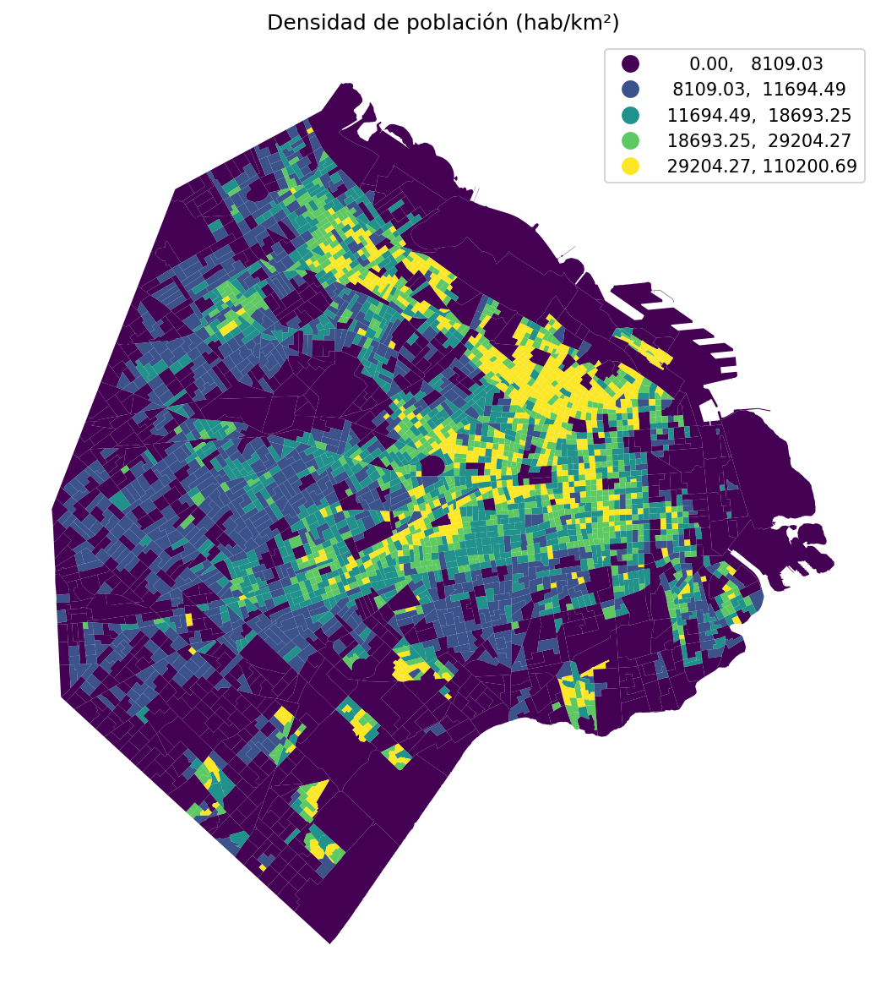
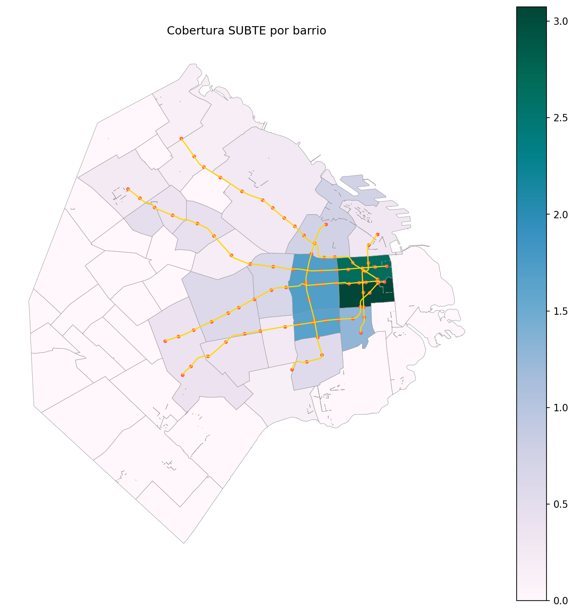

# 🗺️ Análisis geoespacial con GeoPandas: proyecciones, coropletas y contactos per cápita

## Contexto

En este trabajo se utilizaron datos geoespaciales de la Ciudad Autónoma de Buenos Aires para explorar proyecciones cartográficas, unir datasets y construir mapas coropléticos.  
Se emplearon herramientas como **GeoPandas, Shapely, Folium y Mapclassify** para realizar un análisis completo que incluyó:  

- Carga de geometrías  
- Cambio de proyección  
- Clasificación temática  
- Cálculo de indicadores per cápita  
- Identificación de hotspots  

## 🎯 Objetivos

- [x] Cargar datos geográficos desde archivos GeoJSON.  
- [x] Convertir el CRS a un sistema métrico adecuado (EPSG:3857).  
- [x] Explorar esquemas de clasificación cartográfica.  
- [x] Unir datos socio-territoriales con datos agregados por barrio.  
- [x] Calcular tasas per cápita y detectar los barrios con valores más altos.  
- [x] Visualizar los resultados en mapas coropléticos.  
- [x] Analizar cobertura del SUBTE por barrio.

## Desarrollo

### 1. Setup e instalación

Se instalaron las librerías necesarias:

```python
!pip install -q geopandas shapely pyproj fiona rtree contextily folium mapclassify

import geopandas as gpd
import pandas as pd
import numpy as np
import matplotlib.pyplot as plt
import contextily as cx
```

---

### 2. Carga de los radios censales de CABA

Se utilizó un GeoJSON público con workaround para evitar errores de SSL:

```python
import requests
from io import BytesIO

url = "https://bitsandbricks.github.io/data/CABA_rc.geojson"
response = requests.get(url)
radios = gpd.read_file(BytesIO(response.content))

print(radios.crs)  # EPSG:4326
print("Filas:", len(radios))  # 3554 radios censales
```

Esto permitió visualizar:

- Columnas disponibles (RADIO_ID, BARRIO, COMUNA, POBLACION, etc.)
- Cantidad de radios: **3,554**
- Sistema de referencia original: **CRS EPSG:4326**

---

### 3. Cambio de proyección a un CRS métrico

Como las geometrías vienen en lat/long, se proyectaron a EPSG:3857, lo cual permite trabajar en metros para cálculo de áreas, distancias o densidades.

```python
radios_m = radios.to_crs(epsg=3857)
radios_m["area_m2"] = radios_m.geometry.area
radios_m["densidad_hab_km2"] = radios_m["POBLACION"] / (radios_m["area_m2"] / 1e6)
```

Esto facilita la comparación espacial y la legibilidad de los mapas temáticos.


---

### 4. Clasificaciones coropléticas

Se aplicó una clasificación por **quantiles (k=5)** para la densidad de población:

```python
radios_m.plot(column="densidad_hab_km2", scheme='quantiles', k=5,
              legend=True, cmap="viridis", linewidth=0)
```

Se evaluaron aspectos como:

- Continuidad visual  
- Segmentación entre grupos  
- Estabilidad frente a outliers  

**Top 3 radios por densidad (hab/km²):**

| RADIO_ID | BARRIO | POBLACION | densidad_hab_km2 |
|----------|--------|-----------|------------------|
| 7_17_4   | FLORES | 1645      | 110,200.69       |
| 1_3_16   | RETIRO | 726       | 109,875.59       |
| 1_3_8    | RETIRO | 797       | 109,194.72       |



---

### 5. Densidad con mapa base (Contextily)

Se superpuso la coropleta sobre un mapa base de CartoDB para mejorar la interpretación visual:

```python
fig, ax = plt.subplots(figsize=(8,8))
radios_m.to_crs(epsg=3857).plot(ax=ax, column="densidad_hab_km2", cmap="viridis", legend=True)
cx.add_basemap(ax, source=cx.providers.CartoDB.Positron)
```


---

### 6. Datos SUACI y agregación por barrio

Se cargó un dataset adicional con contactos ciudadanos y se agregaron por barrio:

```python
suaci = pd.read_csv("http://bitsandbricks.github.io/data/gcba_suaci_comunas.csv", encoding='ISO-8859-1')
suaci_barrio = suaci.groupby("BARRIO", as_index=False)["total"].sum()

# Agregado geográfico por barrio (disolver)
barrios_m = radios_m.dissolve(by="BARRIO", aggfunc={
    "POBLACION": "sum",
    "VIVIENDAS": "sum",
    "HOGARES": "sum",
    "area_m2": "sum"
}).reset_index()

barrios_m = barrios_m.merge(suaci_barrio, on="BARRIO", how="left")
```

---

### 7. Cálculo de contactos per cápita

Se creó un indicador para comparar barrios proporcionalmente a su población:

```python
barrios_m["contactos_pc"] = barrios_m["total"] / barrios_m["POBLACION"]
top3 = barrios_m.nlargest(3, "contactos_pc")[["BARRIO", "POBLACION", "total", "contactos_pc"]]
```

**Top 3 barrios por contactos per cápita:**

| BARRIO      | POBLACION | total    | contactos_pc |
|-------------|-----------|----------|--------------|
| SAN NICOLAS | 29,273    | 399,369  | 13.643       |
| MONSERRAT   | 39,914    | 227,337  | 5.696        |
| VERSALLES   | 13,822    | 12,414   | 0.898        |


---

### 8. Análisis de cobertura del SUBTE

Se cargaron las líneas y estaciones del SUBTE para analizar la cobertura por barrio:

```python
# Cargar líneas y estaciones
lineas = gpd.read_file(BytesIO(requests.get(url_lineas).content)).to_crs(barrios_m.crs)
estaciones = gpd.read_file(BytesIO(requests.get(url_estaciones).content)).to_crs(barrios_m.crs)

# Conteo de estaciones por barrio
est_x_barrio = gpd.sjoin(estaciones, barrios_m[["BARRIO", "geometry"]], how="left")
barrios_m["estaciones_por_km2"] = barrios_m["n_estaciones"] / (barrios_m["area_m2"] / 1e6)
```

Se calculó la distancia mínima desde el centroide de cada barrio a la estación más cercana usando `sjoin_nearest`:

```python
barrios_centroides["geometry"] = barrios_centroides.geometry.centroid
nearest = gpd.sjoin_nearest(barrios_centroides, estaciones, distance_col='dist_min')
```

**Barrio con peor cobertura (mayor distancia):**

| BARRIO          | dist_min_m |
|-----------------|------------|
| VILLA RIACHUELO | 6,636 m    |



---

### 9. Mapa interactivo con Folium

Se construyó un mapa interactivo que combina la coropleta de contactos per cápita con las estaciones del SUBTE:

```python
import folium
from folium import Choropleth, Marker

m = folium.Map(location=[-34.61, -58.44], tiles='cartodbpositron', zoom_start=11)
Choropleth(
    geo_data=barrios_ll.__geo_interface__,
    data=barrios_ll.set_index("BARRIO")["contactos_pc"],
    fill_color='YlOrRd', legend_name='Contactos per cápita'
).add_to(m)

m.save("img/06_mapa_folium.html")
```

📍 [Ver mapa interactivo](img/06_mapa_folium.html)

---

## Evidencias

- **Notebook del trabajo**: [12-bsas.ipynb](12-bsas.ipynb)  
- **Imágenes generadas**: carpeta `img/`

---

## Reflexión

Este ejercicio permitió consolidar el uso de **GeoPandas** y comprender la importancia del CRS al trabajar con datos espaciales. También fue clave evaluar distintos esquemas de clasificación, ya que afectan directamente la narrativa del mapa.  

El cálculo **per cápita** mostró cómo un indicador simple puede transformar la interpretación de los datos cuando se ajusta por población. Los barrios centrales como San Nicolás y Monserrat tienen mucha más interacción por persona que otros con más habitantes.

El análisis de cobertura del SUBTE reveló que **Villa Riachuelo** tiene la peor conectividad, estando a más de 6.6 km de la estación más cercana.

---

## Conclusión

Se construyó un flujo geoespacial completo:

1. ✅ Carga de datos GeoJSON
2. ✅ Proyección a CRS métrico (EPSG:3857)
3. ✅ Combinación de datasets (radios + SUACI + SUBTE)
4. ✅ Cálculo de indicadores (densidad, contactos per cápita, cobertura)
5. ✅ Visualización con coropletas estáticas y mapas interactivos

El resultado es un análisis que integra datos demográficos, administrativos y de transporte para detectar patrones territoriales relevantes en CABA.

---

## Referencias

- GeoPandas Documentation — https://geopandas.org/  
- Mapclassify — https://pysal.org/mapclassify/  
- Folium — https://python-visualization.github.io/folium/  
- Contextily — https://contextily.readthedocs.io/  
- Datos de CABA utilizados: Bits & Bricks (GeoJSON públicos)
