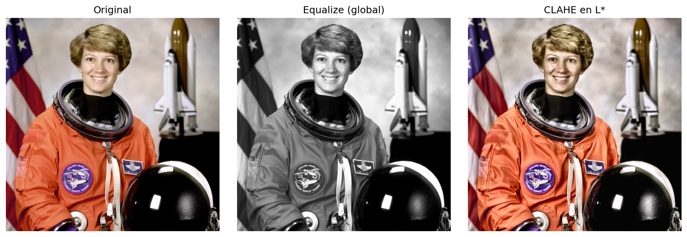
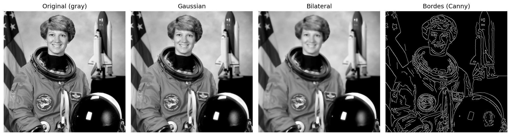

# 🖼️ Procesamiento digital de imágenes: equalización, filtros, bordes y features

## Contexto

En esta práctica se trabajó con técnicas fundamentales de procesamiento digital de imágenes usando **OpenCV, NumPy, Matplotlib y Scikit-Image**.  
El objetivo fue aplicar transformaciones básicas—como conversión a grises, equalización de histograma, smoothing (suavizado), detección de bordes y extracción de features—para comprender cómo cada operación modifica la estructura visual y la información contenida en una imagen.

## 🎯 Objetivos

- [x] Cargar y visualizar imágenes en distintos espacios de color (RGB, HSV, LAB).
- [x] Analizar histogramas de intensidad y por canal.
- [x] Aplicar equalización de histograma (global y CLAHE).
- [x] Comparar filtros de suavizado: Gaussian Blur y Bilateral.
- [x] Evaluar cómo los filtros afectan la detección de bordes con Canny.
- [x] Extraer y comparar keypoints con ORB.
- [x] Analizar matching de features entre variantes de imagen.

## Desarrollo

### 1. Setup e importación de librerías

Se instalaron las librerías necesarias para procesamiento de imágenes:

```python
!pip install -q opencv-python opencv-contrib-python numpy matplotlib scikit-image pandas

import cv2
import numpy as np
import pandas as pd
import matplotlib.pyplot as plt
from skimage import exposure, filters, feature, color, img_as_float
```

Se descargaron imágenes de prueba de scikit-image:

```python
from skimage import data as skdata, io as skio

samples_sk = {
    "camera.png": skdata.camera(),
    "astronaut.png": skdata.astronaut(),
    "coffee.png": skdata.coffee(),
    # ...
}
```

---

### 2. Carga y visualización de la imagen

Se cargó una imagen base y se analizaron sus propiedades:

```python
img_bgr = cv2.imread(str(path), cv2.IMREAD_COLOR)
img_rgb = cv2.cvtColor(img_bgr, cv2.COLOR_BGR2RGB)
img_gray = cv2.cvtColor(img_bgr, cv2.COLOR_BGR2GRAY)

print("H, W, C:", height, width, channels)  # 512 512 3
print("dtype:", dtype, "rango:", (0, 255), "mean_gray:", 115.41)
```

Se visualizó el histograma de intensidades y los histogramas por canal RGB:


**Observaciones:**
- El rango dinámico fue de **0 a 255** (buena amplitud tonal)
- El histograma indica **medio a alto contraste**
- El canal con mayor dominancia fue **R (rojo)** por el traje del astronauta

---

### 3. Espacios de color: HSV y LAB

Se convirtió la imagen a diferentes espacios de color para análisis:

```python
img_hsv = cv2.cvtColor(img_bgr, cv2.COLOR_BGR2HSV)
img_lab = cv2.cvtColor(img_bgr, cv2.COLOR_BGR2LAB)
```

**Canales más informativos:**
- **HSV:** Canal H (Hue) para información de color
- **LAB:** Canal L (Luminancia) para operaciones de contraste

---

### 4. Equalización de histograma

Se compararon dos métodos de mejora de contraste:

#### a) Equalización Global

```python
eq_gray = cv2.equalizeHist(img_gray)
```

#### b) CLAHE (Contrast Limited Adaptive Histogram Equalization)

```python
clahe = cv2.createCLAHE(clipLimit=2.0, tileGridSize=(15, 25))
L_clahe = clahe.apply(L)
lab_clahe = cv2.merge([L_clahe, A, B])
rgb_clahe = cv2.cvtColor(lab_clahe, cv2.COLOR_LAB2RGB)
```

**Métricas de contraste (STD):**

| Variante | STD |
|----------|-----|
| Original | 75.12 |
| Equalize (global) | 80.25 |
| CLAHE en L* | 76.51 |



**Observaciones:**
- CLAHE mejoró menos que la ecualización global en zonas homogéneas
- CLAHE evita la sobreexpansión del histograma preservando texturas suaves
- La ecualización global puede generar saturaciones

---

### 5. Filtros de suavizado

Se aplicaron dos filtros principales y se evaluó su impacto:

#### a) Gaussian Blur

```python
gaussian = cv2.GaussianBlur(img_gray, ksize=(3, 3), sigmaX=1.5)
```

Características:
- Suaviza ruido de alta frecuencia
- Afecta bordes al difuminarlos ligeramente

#### b) Bilateral Filter

```python
bilateral = cv2.bilateralFilter(img_gray, d=9, sigmaColor=75, sigmaSpace=75)
```

Características:
- Suaviza ruido sin borrar bordes
- Mantiene contornos nítidos
- Popular en preprocesamiento facial y reducción de ruido no lineal

**Métricas de varianza del gradiente:**

| Variante | Var(grad) |
|----------|-----------|
| Original | 10,788.16 |
| Gaussian | 6,351.84 |
| Bilateral | 5,488.11 |

---

### 6. Detección de bordes con Canny

Se evaluó cómo los filtros previos afectan la detección de bordes:

```python
edges_before = cv2.Canny(img_gray, threshold1=50, threshold2=150)
edges_gauss = cv2.Canny(gaussian, threshold1=50, threshold2=150)
edges_bilat = cv2.Canny(bilateral, threshold1=25, threshold2=55)
```

**Ratio de bordes detectados:**

| Variante | Edge Ratio |
|----------|------------|
| Original | 0.102 |
| Gaussian | 0.077 |
| Bilateral | 0.077 |



**Observaciones:**
- El filtrado **bilateral** conservó mejor los bordes principales
- El ratio alto en la imagen original sugiere detección de ruido como bordes falsos
- Para escenas nocturnas, se recomienda thresholds más bajos (20, 50)

---

### 7. Extracción de Features con ORB

Se extrajeron keypoints usando el detector ORB:

```python
orb = cv2.ORB_create(nfeatures=1500, scaleFactor=1.2, nlevels=8)
kp, des = orb.detectAndCompute(img, None)
```

**Keypoints por variante:**

| Variante | Num Keypoints |
|----------|---------------|
| Original | 1,500 |
| Gaussian | 1,500 |
| CLAHE L* | 1,500 |


**Observación:** La variante CLAHE mostró una distribución más uniforme de keypoints gracias al aumento del micro-contraste local.

---

### 8. Matching de Features

Se emparejaron features entre la imagen original y la procesada con CLAHE:

```python
bf = cv2.BFMatcher(cv2.NORM_HAMMING, crossCheck=True)
matches = bf.match(des1, des2)
```

**Resultados:**
- Keypoints original: **1,500**
- Keypoints CLAHE: **1,500**
- Matches válidos: **856**
- **Ratio de repetibilidad: 0.57**


**Observación:** CLAHE mejoró la repetibilidad porque al mejorar la luminancia sin deformar la geometría, las características detectadas son más estables entre variantes.

---

## Evidencias

- **Notebook del trabajo**: [13_images.ipynb](13_images.ipynb)
- **Imágenes generadas**: carpeta `img/`

---

## Reflexión

Este trabajo permitió observar visualmente cómo cada transformación altera la estructura interna de la imagen:

1. **Equalización:** La ecualización global mejora contraste pero puede saturar; CLAHE ofrece un balance más controlado.
2. **Filtros:** El Gaussian suaviza todo uniformemente; el Bilateral preserva bordes mientras reduce ruido.
3. **Bordes:** Canny es sensible al preprocesamiento; filtrar antes reduce falsos positivos.
4. **Features:** CLAHE mejora la estabilidad de keypoints sin distorsionar la geometría.

---

## Conclusión

Se construyó un pipeline completo de procesamiento de imágenes:

1. ✅ Carga y análisis de propiedades
2. ✅ Conversión a espacios de color (RGB, HSV, LAB)
3. ✅ Mejora de contraste (Equalize, CLAHE)
4. ✅ Suavizado (Gaussian, Bilateral)
5. ✅ Detección de bordes (Canny)
6. ✅ Extracción y matching de features (ORB)

Cada técnica tiene efectos distintos y elegir la correcta depende del objetivo del proyecto. Para tareas de matching, CLAHE demostró ser la mejor opción con un ratio de repetibilidad del **57%**.

---

## Referencias

- OpenCV Documentation — https://docs.opencv.org/
- Scikit-Image — https://scikit-image.org/
- Gonzalez & Woods — Digital Image Processing
- ORB: An efficient alternative to SIFT or SURF — Rublee et al., 2011
