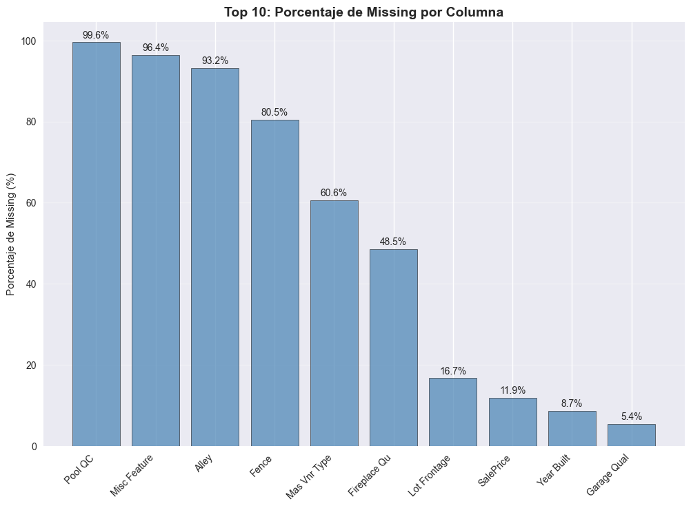
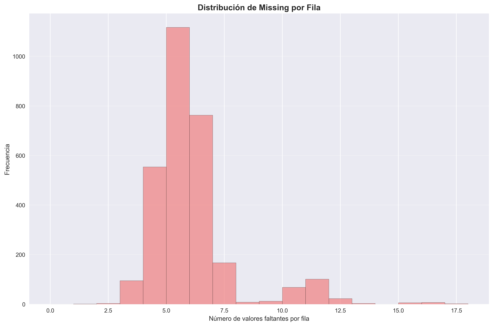
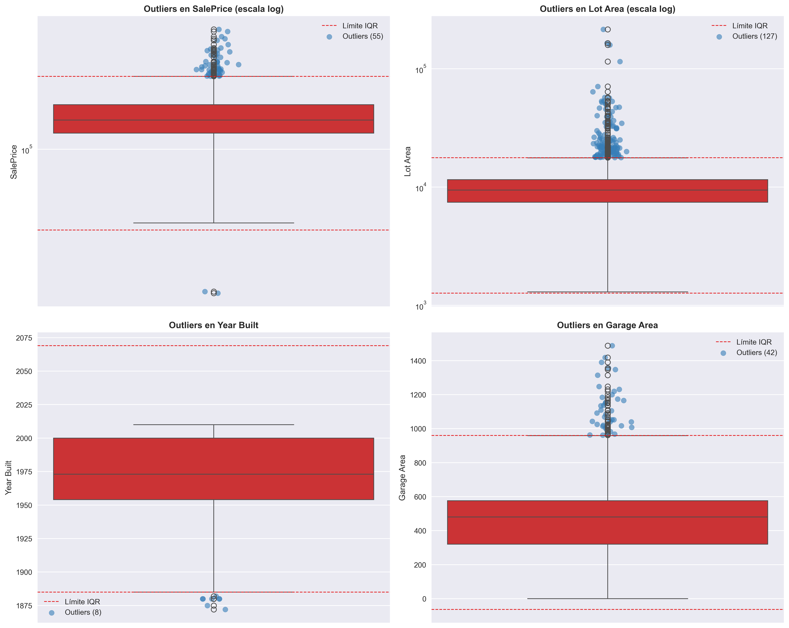
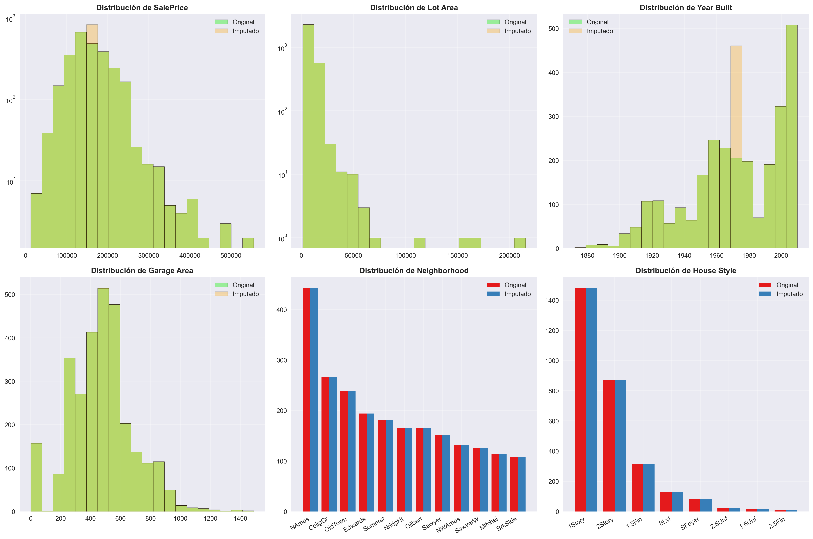
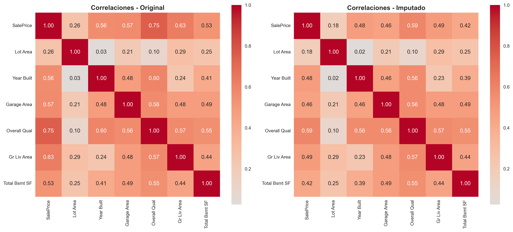

# Análisis de calidad de datos e imputación en Ames Housing

## Contexto
Este análisis se centró en evaluar y tratar los problemas de **calidad de datos** del dataset *Ames Housing*, una base de datos ampliamente usada en aprendizaje automático para predecir precios de vivienda.  
Se abordaron los ejes clave de **valores faltantes**, **outliers** y **preprocesamiento reproducible**, generando visualizaciones y estrategias sistemáticas de imputación y limpieza.

> El trabajo replica un flujo de preprocesamiento profesional, desde la exploración inicial hasta la implementación de pipelines reproducibles en `scikit-learn`.

---

## Objetivos
- [x] Analizar la estructura del dataset e identificar patrones de valores faltantes.
- [x] Clasificar los tipos de *missing data* (MCAR, MAR, MNAR) presentes.
- [x] Implementar y comparar estrategias de imputación simples y “smart”.
- [x] Detectar y evaluar outliers mediante métodos IQR y Z-score.
- [x] Crear un pipeline reproducible de limpieza para modelos predictivos.

---

## Desarrollo

### 1. Exploración inicial del dataset
El dataset contiene **2930 registros y 82 columnas**, con una mezcla de variables numéricas (≈ 38) y categóricas (≈ 43).  
El análisis de memoria reveló un uso total de aproximadamente **6.9 MB**, con algunas variables categóricas.

Se detectaron **29 columnas con valores faltantes**, con proporciones variables:
- Variables con >90% de missing: `Pool QC`, `Misc Feature`, `Alley`.
- Variables con missing moderado (5–10%): `Year Built`, `Garage Type`, `Garage Area`.
- Variables numéricas críticas como `SalePrice` (≈12% faltante) fueron parcialmente eliminadas para simular *MNAR* (faltantes no aleatorios).}

Se elaboraron gráficos de:
- **Top 10 columnas con mayor porcentaje de missing**, destacando `Pool QC` y `Misc Feature` (>95%).
- **Distribución de missing por fila**, que mostró que la mayoría de las filas tienen entre 0 y 5 valores faltantes, con pocos casos extremos.

Estas visualizaciones confirmaron que el problema no está concentrado en pocas observaciones, sino distribuido entre distintas columnas.





---

### 2. Clasificación del missing data
Se introdujo missing sintético para replicar escenarios reales de pérdida de información:
- **MCAR (Missing Completely At Random)** → `Year Built`: los faltantes no dependen de otras variables ni del propio valor.
- **MAR (Missing At Random)** → `Garage Area`: los faltantes dependen de una variable observable (`Garage Type`).
- **MNAR (Missing Not At Random)** → `SalePrice`: los faltantes se asocian con precios altos, reflejando sesgo en la no respuesta.

Esta diferenciación fue clave para definir **estrategias de imputación adecuadas**.

---

### 4. Análisis de outliers
Se aplicaron dos enfoques complementarios:

| Método | Criterio | Contexto de uso |
|--------|-----------|----------------|
| IQR | 1.5×rango intercuartílico | Distribuciones sesgadas o con colas pesadas |
| Z-Score | ±3 desviaciones estándar | Distribuciones aproximadamente normales |

**Resultados:**
- En promedio, un **2.9% de los registros** fueron considerados outliers por IQR.  
- Las variables con más outliers fueron `Enclosed Porch`, `BsmtFin SF 2` y `Overall Cond`.
- La comparación mostró que IQR detecta más casos extremos que Z-Score, especialmente en variables sesgadas como `Lot Area` y `SalePrice`.

Se generaron boxplots con límites IQR y visualización logarítmica para `Lot Area` y `SalePrice`, revelando alta asimetría.



---

### 5. Estrategias de imputación

Se ensayaron tres estrategias simples (media, mediana, moda), las tres logrando **0 valores faltantes restantes**, pero con implicancias diferentes en la distribución.

Posteriormente, se implementó una **imputación inteligente (smart)** con reglas específicas por tipo de variable:
- `Year Built`: mediana por *Neighborhood* y *House Style* (MAR).  
- `Garage Area`: imputación condicional y creación de *flag* binario para MNAR.  
- `SalePrice`: mediana por *Neighborhood*.  
- `Garage Type`: moda global.

Esta imputación redujo la pérdida de información estructural, aunque persistieron **~15.591 valores imputados** en variables no críticas.

---

### 6. Comparación de distribuciones y correlaciones
Se compararon histogramas y conteos categóricos entre datos originales e imputados con la estrategia *SMART*.  
Las diferencias más notorias se observaron en las variables numéricas sesgadas (`Lot Area`, `SalePrice`), aunque la estructura general se mantuvo.



El análisis de correlaciones mostró **cambios menores (<0.2)** tras la imputación, indicando que las relaciones entre variables clave (ej. `Overall Qual` ↔ `SalePrice`) se conservaron.



---

### 7. Pipeline reproducible
Se desarrolló un **pipeline modular** con `scikit-learn` que integra:
- Imputación (`SimpleImputer`),
- Escalamiento (`StandardScaler`),
- Codificación categórica (`OneHotEncoder`).

```python
def create_cleaning_pipeline():
    """Crear pipeline de limpieza reproducible"""

    # Definir columnas numéricas y categóricas
    numeric_features = ['SalePrice', 'Lot Area', 'Year Built', 'Garage Area']
    categorical_features = ['Neighborhood', 'House Style', 'Garage Type']

    # Transformadores
    numeric_transformer = Pipeline(steps=[
        ('imputer', SimpleImputer(strategy='median')),  # estrategia de imputación
        ('scaler', StandardScaler())
    ])

    categorical_transformer = Pipeline(steps=[
        ('imputer', SimpleImputer(strategy='most_frequent')),  # estrategia de imputación
        ('onehot', OneHotEncoder(handle_unknown='ignore'))
    ])

    # Combinar transformadores
    preprocessor = ColumnTransformer(
        transformers=[
            ('num', numeric_transformer, numeric_features),
            ('cat', categorical_transformer, categorical_features)
        ]
    )

    return preprocessor
```

El resultado final fue una **matriz de 46 columnas transformadas**, lista para usarse en modelos predictivos sin intervención manual.

---

## Reflexión

Este análisis me demostró que el tratamiento del *missing data* no puede resolverse de forma genérica; cada variable requiere entender su origen, relación con otras y posible sesgo.

### Aprendizajes clave:

- Las imputaciones basadas en agrupaciones (por barrio o estilo de casa) preservan mejor la estructura interna de los datos.
- Los métodos robustos como IQR son preferibles frente a Z-Score cuando las distribuciones son asimétricas.

### Limitaciones:

- Algunas variables con >90% de missing (ej. `Pool QC`) son prácticamente inutilizables.

---

## 📚 Referencias
- Little, R. J. A., & Rubin, D. B. (2019). *Statistical Analysis with Missing Data*. Wiley.  
- Kaggle: [Ames Housing Dataset](https://www.kaggle.com/c/house-prices-advanced-regression-techniques/data)  
- Documentation: *scikit-learn Imputer & ColumnTransformer APIs*.  
- van Buuren, S. (2018). *Flexible Imputation of Missing Data*.
- Accede [aquí](ames_housing.ipynb) al notebook con todo el código

---
