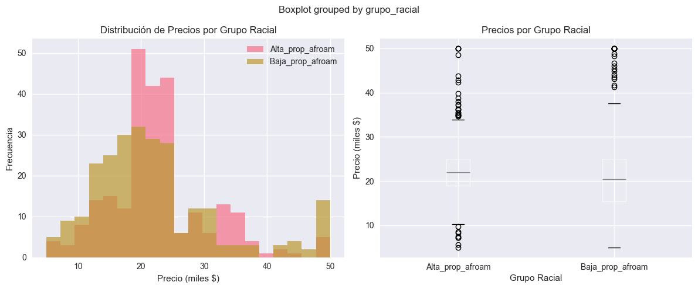

---

title: "Detección y mitigación de sesgo con Fairlearn"
date: 2025-10-12
author: "Juan Paroli"
categories: ["Fairness", "Responsible AI", "Modeling"]
tags: ["Fairlearn", "Bias Detection", "Mitigation", "Boston Housing", "Titanic"]

---

# Detección y mitigación de sesgo con Fairlearn

## Contexto

Esta práctica aborda cómo **detectar** y **mitigar** sesgos en modelos de *ML* usando `fairlearn`.
Trabajé dos casos complementarios:

1. **Boston Housing (regresión)** — ejemplo histórico con una **variable racial** (`B`) problemática.
2. **Titanic (clasificación)** — sesgos por **género** y **clase** (paridad demográfica).

> Objetivo: evaluar métricas de equidad, visualizar brechas y aplicar mitigación con ExponentiatedGradient bajo la restricción de Demographic Parity, discutiendo los trade-offs éticos y de performance.

---

## Objetivos

* [x] Identificar variables sensibles y cuantificar su relación con el target.
* [x] Medir **brechas** de resultados entre grupos y evaluar **paridad demográfica**.
* [x] Aplicar **mitigación** (ExponentiatedGradient + DemographicParity) y comparar con baseline.
* [x] Elaborar un **marco de decisión ética** para uso responsable en producción.

---

## Desarrollo

### 1. Boston Housing — Sesgo racial histórico (Regresión)

**Setup**

* Fuente: CMU `boston` (506 filas).
* `B` (1978) codifica de forma indirecta la **proporción de población afroamericana**.

**Señales clave**

* Correlación entre `B` y `MEDV`: **0.333**.
* Modelo lineal **con** `B`: **R² = 0.7112** (mejora predictiva **pero** con riesgo de perpetuar sesgo).
* **Brecha de precios** por grupo (media):

  * Alta_prop_afroam: **$22.81k**
  * Baja_prop_afroam: **$22.25k**
  * Diferencia: **−$0.56k (−2.4%)**
    *(en este corte particular no hay brecha a favor del grupo históricamente desfavorecido, pero el uso de `B` sigue siendo éticamente problemático)*

* `B` es una variable **históricamente sesgada**.
* **NO** se debe usar en producción; **sí** en **ámbitos educativos** para estudiar sesgo.
* **Alternativas**: retirar `B`, documentar limitaciones, buscar **features menos problemáticas** (`LSTAT`, `RM`, `CRIM`, `TAX`, `PTRATIO` mostraron correlaciones relevantes sin codificación racial explícita).

---

### 2. Titanic — Paridad demográfica (Clasificación)

* Features: `pclass`, `age`, `sibsp`, `parch`, `fare`; target `survived`; atributo sensible `sex`.

**Detección de sesgo (dataset)**

* **Gender gap** (tasa de supervivencia): +54.8% a favor de mujeres.
* **Class gap**: +41.3% a favor de pasajeros de 1ra vs 3ra.

**Baseline (RandomForest)**

* **Accuracy**: 0.673**
* **Demographic Parity Difference (DPD)**: 0.113

**Mitigación (ExponentiatedGradient + DemographicParity)**

* **Accuracy**: 0.617
* **DPD**: 0.035
* **Trade-off**:

  * *Performance loss*: 8.3%
  * *Fairness gain*: 0.079

**Recomendación**

* **Evaluar caso por caso.** La mejora de equidad es clara, pero la caída en accuracy supera el 5% en este setting. En dominios sensibles (p.ej., salud/finanzas) podría justificarse; en otros, debe manejarse con criterios de **riesgo**, **impacto** y **aceptación regulatoria**.

---

## Reflexión

### Detección vs. Corrección

- Detectar es crucial cuando el sesgo es **histórico/estructural** (Boston): hace falta **transparencia** y **trazabilidad** antes de cualquier corrección.
- Corregir (Titanic) conlleva **trade-offs**: se gana en equidad (baja DPD) bajando la exactitud. El umbral aceptable depende del **dominio** y del **daño potencial**.

### Transparencia vs. Utilidad

- Documentar **qué métrica de equidad** se impone y **qué se sacrifica** (accuracy, recall, etc.).
- Preferir **modelos explicables**.

### Responsabilidades éticas

* **Reconocer** sesgos no corregibles y **no reforzarlos**.
* **Evitar** variables sensibles salvo fines educativos o investigación controlada.
* **Reportar** sistemáticamente las métricas de equidad junto con las de performance.

---

## 📚 Referencias

* `fairlearn` — *metrics* (DP, EO) & *reductions* (ExponentiatedGradient, DemographicParity).
* Lineamientos de **Responsible/Trustworthy AI** (auditoría, documentación, monitoring).
* Notas históricas sobre **Boston Housing** y controversias del feature `B`.
* Dataset *Titanic* (Seaborn/Kaggle): análisis clásico de sesgos por género/clase.

---
