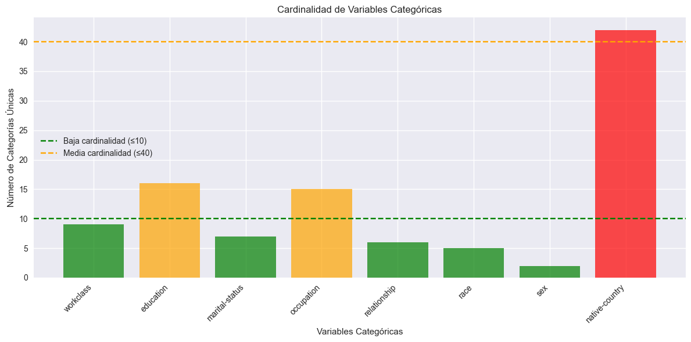
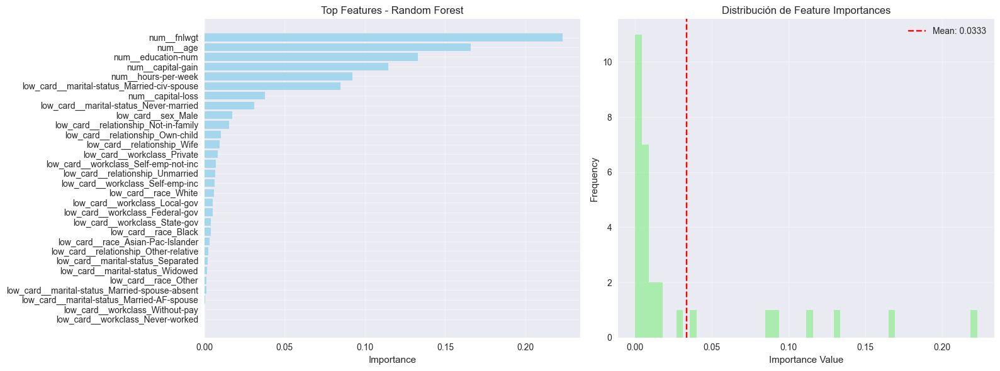

---

title: "Encoding Avanzado"
date: 2025-10-22
author: "Juan Paroli"
categories: 
tags: 

---

# Target Encoding sobre sueldo de Adultos

## Contexto

En esta práctica se aborda como **predecir** si el ingreso anual de una persona supera 50k$ basándose en datos del censo. Se comparan distintas técnicas de encoding para maximizar la precisión del modelo de clasificación.

El **dataset** abarco un censo del 1994 de Estados Unidos con *32561* registros, y es un dataset clásico del Machine Learningy benchmarking.

## Objetivos

- [x] Identificar relaciones de las variables con el target.
- [x] Comparar diferentes tecnicas de encoding.
- [x] Encontrar restricciones en aplicaciones como OneHotEncoding

---

## Desarrollo

### 1. Adult Data — Censo estadounidense del 1994

**Setup**

- Fuente: UCI `adult` (32561 filas).
-  menores a 50k de ingresos: 24,720 (75.9%)
-  mayores a 50K de ingresos:  7,841 (24.1%)

**Señales clave**
- No hay valores faltantes

---

### 2. Análisis de cardinalidad

Variables categóricas encontradas: 8

`workclass`, `education`, `marital-status`, `occupation`, `relationship`, `race`, `sex` y `native-country`

A cada variable categórica se le analizó cuantos valores únicos toma para analizar la cardinalidad de cada variable. Si aplicamos OHE a estas columnas podemos tener problemas de dimensionalidad extremos.

**Análisis de cardinalidad**

Se clasificó la cardinalidad de las features como:

- Baja <= 10
- 10 < Media <= 40
- Alta > 40  

Lo que clasificó a las features de esta manera:

- `workclass`: 9 categorías únicas (BAJA)
- `education`: 16 categorías únicas (MEDIA)
- `marital-status`: 7 categorías únicas (BAJA)
- `occupation`: 15 categorías únicas (MEDIA)
- `relationship`: 6 categorías únicas (BAJA)
- `race`: 5 categorías únicas (BAJA)
- `sex`: 2 categorías únicas (BAJA)
- `native-country`: 42 categorías únicas (ALTA)

**Problema de dimensionalidad con OneHotEncoding**:

- workclass: 9 categorías → 8 columnas one-hot
- education: 16 categorías → 15 columnas one-hot
- marital-status: 7 categorías → 6 columnas one-hot
- occupation: 15 categorías → 14 columnas one-hot
- relationship: 6 categorías → 5 columnas one-hot
- race: 5 categorías → 4 columnas one-hot
- sex: 2 categorías → 1 columnas one-hot
- native-country: 42 categorías → 41 columnas one-hot

One-hot encoding **NO** es viable para variables de alta cardinalidad (como aparece en este dataset). Por lo tanto, necesitamos técnicas alternativas:

- Label
- Target
- Hash
- Binary encoding

### 3. Label Encoding

Aplicamos Label Encoding para las columnas categóricas y luego evaluamos el performance al utilizar RandomForest

Label Encoding aplicado a 14 features. Los resultados obtenidos fueron:

- 📊 Accuracy: 0.8632
- 📊 AUC-ROC: 0.9101
- 📊 F1-Score: 0.6931
- ⏱️ Training time: 0.77s

### 4. OHE para features con baja cardinalidad

Tambien aplicamos OneHotEncoding únicamente a las variables con baja cardinalidad. Por el problema de dimensionalidad que mencionamos de OHE. Y posteriormente entrenamos un Random Forest.

Los resultados obtenidos son levemente peores en comparación a Label Encoding:

- 📊 Accuracy: 0.8483
- 📊 AUC-ROC: 0.8995
- 📊 F1-Score: 0.6633
- ⏱️  Training time: 0.67s

### 5. Target Encoding con alta cardinalidad

Para la feature con alta cardinalidad `native-country` aplicamos Target Encoding. Con esta técnica es importante el uso de cross-validation para prevenir DATA LEAKAGE.

Entrenamos un Random Forest nuevamente y estos fueron los resultados obtenidos:

- 📊 Accuracy: 0.8092
- 📊 AUC-ROC: 0.8318
- 📊 F1-Score: 0.5658
- ⏱️  Training time: 1.63s

### 6. Analisis de Feature Importance

Luego de analizar las distintas tencicas de encoding con las features de baja y alta cardinalidad, aplicamos un Pipeline con branching de 3 ramas:

- Rama 1: One-Hot para baja cardinalidad (5 cols)
- Rama 2: Target Encoding para alta cardinalidad (1 cols)
- Rama 3: StandardScaler para numéricas (6 cols)

Este Pipeline generaba una cantidad de columnas nuevas considerable, sabiendo que partíamos de un todal de **12** Features originales. La transformación generó un total de **31** features que se puede considerar de **dimensionalidad media**.

Entrenamos un Random Forest con estas Features y los resultados obtenidos fueron:

- 📊 Accuracy: 0.8488
- 📊 AUC-ROC: 0.9021
- 📊 F1-Score: 0.6671
- ⏱️  Training time: 2.08s

Las columnas con más importancia en el entrenamiento del Random Fores fueron:

📊 Analizando modelo con Pipeline Branching...
✅ Features extraídas: 30
🔝 Top Features más importantes:

📊 Analizando modelo con Pipeline Branching...
✅ Features extraídas: 30

🔝 Top Features (feature importance)

| Rank | Feature                  | Importance |
|-----:|:-------------------------|-----------:|
| 1    | num__fnlwgt              | 0.223091   |
| 2    | num__age                 | 0.165969   |
| 3    | num__education-num       | 0.132941   |
| 4    | num__capital-gain        | 0.114665   |
| 5    | num__hours-per-week      | 0.092367   |

Las **variables más importantes** según el análisis de feature importance fueron principalmente **numéricas**, destacándose:

- fnlwgt
- age
- education-num
- capital-gain
- hours-per-week.

Estas concentraron más del **75% de la importancia total del modelo**, lo que muestra que las variables continuas aportan la mayor capacidad predictiva sobre los ingresos.

No hubo variables de alta cardinalidad (target encoded) relevantes en este caso, ya que el dataset Adult Income prácticamente no contenía variables de ese tipo (todas eran de baja o media cardinalidad).

El tipo de codificación influye directamente en cómo el modelo interpreta la información:

- One-Hot Encoding logró capturar bien la información de variables con baja cardinalidad, manteniendo buena interpretabilidad, pero **aumenta la dimensionalidad** (≈11× más columnas).
- Label Encoding generó resultados sólidos y simples, aunque puede introducir una relación ordinal artificial entre categorías que no la tienen.
- Target Encoding, aplicado a las de mayor cardinalidad, resultó útil pero menos destacable aquí por la ausencia de columnas con muchas categorías.
- En términos de métricas, las diferencias fueron pequeñas, aunque Label Encoding y Branched Pipeline mostraron un mejor balance entre rendimiento y eficiencia.

Las variables numéricas originales dominaron claramente al modelo, tanto en importancia total como promedio.

Esto sugiere que, en este dataset, la información estructural y cuantitativa (edad, años de educación, capital, horas trabajadas) es mucho más informativa que las categorías sociales o demográficas.

Las variables numéricas (age, education-num, capital-gain, hours-per-week) continúan siendo las más influyentes sobre la probabilidad de tener ingresos mayores a 50K.

SHAP también muestra que las interacciones entre sex y marital-status influyen levemente, reflejando sesgos estructurales (por ejemplo, hombres casados tienden a tener mayor probabilidad de alto ingreso).

No aparecen nuevas features altamente relevantes que el Random Forest haya ignorado, lo cual indica consistencia entre ambas metodologías.

**Desde una perspectiva analítica y de negocio:**

- Los factores que más predicen el ingreso son edad, nivel educativo, tipo de empleo y capital acumulado, lo que coincide con patrones socioeconómicos reales.
- Las categorías relacionadas con el estado civil también inciden, lo que puede reflejar correlaciones indirectas con estabilidad laboral o responsabilidades familiares.
- No se detectaron variables categóricas con alta cardinalidad que aporten valor adicional.
- Para aplicaciones prácticas, esto implica que los modelos predictivos de ingresos pueden simplificarse priorizando las variables numéricas, reduciendo complejidad sin perder rendimiento.
- Además, es importante considerar posibles sesgos de género o de relación familiar, ya que el modelo podría reproducir desigualdades presentes en los datos originales del censo.

---

## Reflexión

El experimento sobre **encoding avanzado** en el dataset *Adult Income* pone de manifiesto una verdad recurrente en proyectos reales de Machine Learning: **no siempre la complejidad en la representación de los datos garantiza un mejor rendimiento del modelo**.

A pesar de probar estrategias de codificación más elaboradas —como *Target Encoding* o *branching pipelines*—, los resultados muestran que las **variables numéricas** (edad, años de educación, capital y horas trabajadas) concentran la mayor parte del poder predictivo. Este hallazgo coincide con una característica estructural del problema: la desigualdad de ingresos responde en gran medida a factores cuantificables y menos a categorías cualitativas.

La comparación entre métodos de codificación deja varias lecciones:

1. **Label Encoding** emerge como una opción eficiente y estable cuando el modelo no asume relaciones lineales estrictas (como los árboles de decisión). Su simplicidad evita la explosión dimensional y mantiene una excelente capacidad predictiva.
2. **One-Hot Encoding** es útil en variables de baja cardinalidad y mantiene interpretabilidad, aunque penaliza en escalabilidad y rendimiento cuando el número de categorías crece.
3. **Target Encoding**, si bien teóricamente más informativo para variables de alta cardinalidad, requiere una estructura de datos más compleja y un manejo cuidadoso del *data leakage*. En este caso, la falta de columnas realmente “altas” en cardinalidad limitó su aporte.
4. **Pipelines combinados (branching)** aportan modularidad y reproducibilidad, pero su ventaja práctica solo se justifica en escenarios con estructuras mixtas de datos o cardinalidades extremas.

Este estudio demuestra que la **selección de técnicas de encoding** debe guiarse por la naturaleza de los datos y no por la sofisticación del método. En datasets con predominio de variables numéricas y categóricas de baja cardinalidad, una arquitectura simple —como Label Encoding o una combinación controlada con OHE— logra un balance óptimo entre interpretabilidad, costo computacional y precisión.

> **La clave no está en usar el encoding más avanzado, sino en usar el más adecuado.**
> La explicabilidad, la alineación con el contexto del negocio y la prevención del sobreajuste son tan importantes como la métrica final de performance.

---

## 📚 Referencias

- **Dua, D., & Graff, C. (2019).** *UCI Machine Learning Repository — Adult Data Set.* University of California, Irvine.
  [https://archive.ics.uci.edu/ml/datasets/adult](https://archive.ics.uci.edu/ml/datasets/adult)

- **Micci-Barreca, D. (2001).** *A Preprocessing Scheme for High-Cardinality Categorical Attributes in Classification and Prediction Problems.* SIGKDD Explorations, 3(1), 27–32.
 
- **Lemaître, G., Nogueira, F., & Aridas, C. K. (2017).** *Imbalanced-learn: A Python Toolbox to Tackle the Curse of Imbalanced Datasets in Machine Learning.* Journal of Machine Learning Research, 18(17), 1–5.

- **Scikit-learn Developers (2024).** *User Guide: Encoding categorical features.*
  [https://scikit-learn.org/stable/modules/preprocessing.html#encoding-categorical-features](https://scikit-learn.org/stable/modules/preprocessing.html#encoding-categorical-features)

- **Category Encoders (2017–2024).** *Official Documentation — TargetEncoder, OrdinalEncoder, OneHotEncoder.*
  [https://contrib.scikit-learn.org/category_encoders/](https://contrib.scikit-learn.org/category_encoders/)

- **Lundberg, S. M., & Lee, S.-I. (2017).** *A Unified Approach to Interpreting Model Predictions (SHAP).* Advances in Neural Information Processing Systems (NeurIPS).
  [https://arxiv.org/abs/1705.07874](https://arxiv.org/abs/1705.07874)
  
- **Kaggle (2023).** *Adult Census Income Prediction — Benchmark Notebook.*
  [https://www.kaggle.com/uciml/adult-census-income](https://www.kaggle.com/uciml/adult-census-income)

- [Notebook Completo](nueve.ipynb)

---
