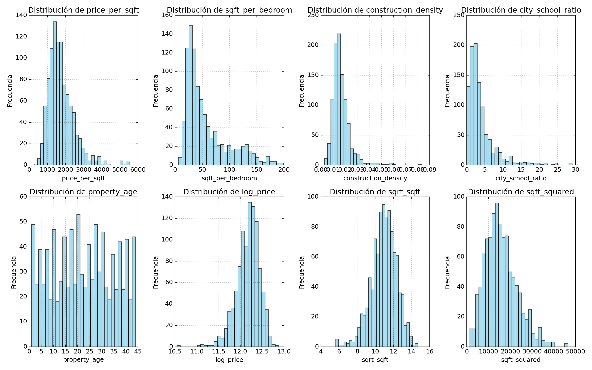
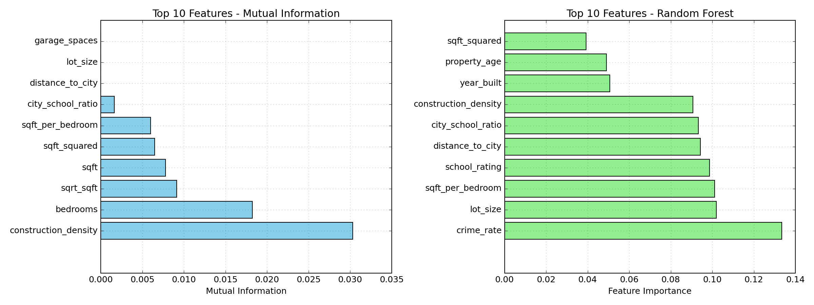

# 🏠 Construyendo valor con datos: Feature Engineering para predecir precios de viviendas

## Contexto

Este análisis se centró en predecir precios de viviendas de un dataset sintético. Ajustamos algunas features mediante Feature Engineering para encontrar la mejor relación entre las columnas para predecir el precio.

Las mismas técnicas de Feature Engineering fueron aplicadas a un dataset con datos reales de casas: *Ames Housing*.

---

## Objetivos

- [x] Encontrar patrones y correlaciones entre variables.
- [x] Crear features para encontrar patrones no obvios en los datos.
- [x] Predecir precios de la viviendas con la mejor precisión.

---

## Desarrollo

Desarrollamos un dataset sintético con **1000 registros**.
Definimos **10 columnas** en las que definimos los rangos de que los registros iban a tomar.

```python
np.random.seed(42)
n_samples = 1000

data = {
    'price': np.random.normal(200000, 50000, n_samples),
    'sqft': np.random.normal(120, 30, n_samples),
    'bedrooms': np.random.choice([1, 2, 3, 4, 5], n_samples),
    'bathrooms': np.random.choice([1, 2, 3], n_samples),
    'year_built': np.random.choice(range(1980, 2024), n_samples),
    'garage_spaces': np.random.choice([0, 1, 2, 3], n_samples),
    'lot_size': np.random.normal(8000, 2000, n_samples),
    'distance_to_city': np.random.normal(15, 8, n_samples),
    'school_rating': np.random.uniform(1, 10, n_samples),
    'crime_rate': np.random.uniform(0, 100, n_samples)
}
```
Generar este dataset sintético nos asegura de no tener datos nulos.

### Creación de Features

Comenzamos creando varibles ratio que miden distintas relaciones:

- **Precio por pie cuadrado**: mide el valor relativo del espacio habitable.
    - Cuánto cuesta cada unidad de superficie construida.
    - Ratios altos → zonas caras o propiedades premium.
    - Ratios bajos → áreas más accesibles o construcciones menoS valoradas.

- **Superficie por habitación**: indica la amplitud promedio de los ambientes.
    - Cuánto espacio útil tiene cada dormitorio.
    - Ratios altos → viviendas espaciosas (segmento medio-alto).
    - Ratios bajos → unidades compactas o de densidad alta (segmento económico).
  
- **Densidad de construcción**: mide la proporción del terreno ocupada por la edificación.
  - Qué parte del lote está construida.
  - Ratios altos → construcciones densas o urbanas.
  - Ratios bajos → viviendas con jardín o terrenos amplios (zonas suburbanas).

- **Ratio entre distancia a ciudad y rating de escuela**: evalúa el equilibrio entre accesibilidad urbana y calidad educativa.
    - Cuánto te alejás del centro por cada punto de calidad escolar.
    - Ratios bajos → zonas bien ubicadas y con buenas escuelas.
    - Ratios altos → barrios lejanos o con baja calidad educativa.

Tambien capturamos relaciones temporales creando una varible de **antigüedad de la propiedad**, de la que se desprendía una nueva variable (`age_category`) que asignaba a cada casa una entre 3 clasificaciones:

- Nuevo
- Moderno
- Antiguo

De esta nueva variable, construiumos una última variable booleana que asignaba `True` **si la propiedad era nueva**.

Luego aplicamos transformaciones matemáticas a las varibles del dataset:

- `log_price` — Logaritmo del precio: transforma precios altamente dispersos en una escala más homogénea. Permite analizar variaciones porcentuales en lugar de valores absolutos y reduce el impacto de valores extremos.

- `sqrt_sqft` — Raíz cuadrada del tamaño: Suaviza la distribución del tamaño de las viviendas. Útil cuando el tamaño crece más rápido que su impacto real en el precio, capturando rendimientos decrecientes del espacio.

- `sqft_squared` — Tamaño al cuadrado: Modela relaciones no lineales entre tamaño y precio. Refleja casos donde un incremento en superficie genera un aumento acelerado en valor, típico de propiedades de lujo o alto estándar.

Y por último conluimos con unas features compuestas que indicaban scores para las viviendas registradas.

- `luxury_score` — (precio + tamaño + garage): Índice sintético de nivel de lujo o equipamiento.

- `location_score` — (rating escolar − distancia a ciudad): Mide la ventaja locacional de una propiedad.

En resumen creamos 12 features que ayudan a encontrar relaciones entre esos nuevos ratios y el precio.



---

### Importancia de Features

Se evaluó la relevancia de **15 variables predictoras** respecto al precio de vivienda en el dataset. Se aplicaron dos enfoques complementarios:

1. **Mutual Information (MI):** mide la dependencia estadística entre cada variable y el objetivo, sin asumir linealidad.

2. **Random Forest Feature Importance:** evalúa el impacto de cada feature en la reducción del error dentro de un modelo no lineal y de alta capacidad.



Para **mutual information**:

- La **densidad de construcción** resulta ser el predictor más informativo en sentido general, reflejando una relación fuerte entre la proporción construida del lote y el valor final.

- **Cantidad de dormitorios** y **tamaño transformado (raíz cuadrada o cuadrado)** también aportan información valiosa, lo que sugiere que la **escala del espacio habitable** sigue siendo el factor dominante.

- Variables como `distance_to_city`, `lot_size` o `garage_spaces` presentan información casi nula bajo este enfoque, indicando relaciones no evidentes o más complejas (probablemente no lineales).

---

Para **Random Forest**:

A diferencia de la MI, el Random Forest detectó **patrones no lineales y combinaciones complejas**.

- El **índice de criminalidad** (`crime_rate`) fue la variable más influyente, evidenciando un fuerte vínculo entre seguridad y valor inmobiliario.
- Factores de **entorno y ubicación** (`distance_to_city`, `school_rating`, `lot_size`) también adquirieron gran relevancia, lo que concuerda con el comportamiento típico del mercado inmobiliario real.
- Variables derivadas como `city_school_ratio` y `construction_density` también destacan, confirmando que las *features compuestas* capturan relaciones más ricas entre ubicación, servicios y estructura.

Comparando los dos métodos:

| Enfoque    | Qué captura mejor   | Limitaciones     |
| ---------- | ------------------- | ---------------- |
| **Mutual Information** | Relaciones estadísticas directas y monotónicas        | No detecta interacciones ni efectos combinados           |
| **Random Forest**      | Relaciones no lineales, interacciones entre variables | Menos interpretable y dependiente de los hiperparámetros |

En este caso, ambos métodos se complementan:

- MI enfatiza **estructura física** del inmueble.
- Random Forest destaca **contexto ambiental y social**.

---

### Investigación Libre

Se crearon otras features libremente para seguir evaluando los patrones:

- `space_efficiency`: mide proporción de superficie cubierta respecto al lote.
- `crowded_property`: densidad de dormitorios por m².
- `location_score`: índice de ubicación combinando crimen, escuela y distancia.
   
Además se evaluó interacciones como `price_age_interaction` y `distance_school_interaction`.

Se esperaba que `space_efficiency`, `crowded_property` y `location_score` se correlacionaran positivamente con el precio.

Las espectativas se cumplieron para `crowded_property` qye mantuvo una correlación levemente positiva, significando que más dormitoríos por pie cuadrado aumenta el precio.
Sin embargo, `space_efficiency` y `location_score` tuvieron una correlacion levemente negativa, siendo contrario a lo esperado. 

`location_score` es una feature creativa porque sintetiza variables externas en un único índice aunque los pesos usados no reflejaron bien la realidad.

Futuras ideas de features:

- Ajustar location_score con pesos calibrados (ej. regresión o PCA).
- Variables no lineales (cuadrados, logs) y normalización de distancias.
- Incorporar década de construcción o indicadores de accesibilidad.
- Ratios financieros como precio/ingreso promedio de la zona.


---

### Prueba con datos reales

Luego de evaluar las predicciones con datos sintéticos, realizamos los mismos ratios pero para datos reales de datos extraidos de AmesHousing.

```python
ames_data = {
    'SalePrice': [215000, 105000, 172000, 244000, 189900],
    'GrLivArea': [1710, 856, 1262, 1710, 1362],
    'BedroomAbvGr': [3, 3, 3, 3, 3],
    'FullBath': [2, 1, 2, 2, 1],
    'YearBuilt': [2003, 1961, 1958, 2000, 1992],
    'GarageCars': [2, 1, 2, 2, 1],
    'LotArea': [8450, 9600, 11250, 9550, 10140],
    'Neighborhood': ['CollgCr', 'Veenker', 'Crawfor', 'NoRidge', 'Mitchel']
}
```

Con el objetivo de mejorar la capacidad predictiva del modelo, se generaron varias **features derivadas** a partir de las variables originales del dataset de Ames Housing. Estas nuevas variables buscan capturar relaciones más profundas entre el tamaño, la antigüedad y el nivel de confort de la vivienda.

Las variables creadas fueron:

- **`space_efficiency`**: relación entre el área habitable (`GrLivArea`) y el área total del lote (`LotArea`). Mide el aprovechamiento del espacio disponible.
  - *Correlación con el precio:* **0.875** → las casas con mayor eficiencia espacial tienden a tener precios más altos.

- **`property_age`**: antigüedad del inmueble calculada como `2025 - YearBuilt`.
  - *Correlación con el precio:* **-0.822** → a mayor antigüedad, menor precio, lo que refleja la depreciación natural con el tiempo.

- **`age_size_interaction`**: producto entre la edad y la superficie (`HouseAge * GrLivArea`). Captura cómo la combinación de una casa grande y vieja puede afectar negativamente el valor.
  - *Correlación con el precio:* **-0.437**, una relación negativa moderada.

- **`bath_per_bedroom`**: proporción entre baños completos y dormitorios. Indica el nivel de confort del hogar.
  - *Correlación con el precio:* **0.658**, mostrando que las casas con más baños por dormitorio suelen ser más costosas.

- **`garage_per_bedroom`**: cantidad de espacios de garaje por dormitorio, como indicador del equipamiento y comodidad.
  - *Correlación con el precio:* **0.658**, similar a la anterior.

En conjunto, estas correlaciones muestran que las *features* diseñadas tienen **fuerte relación con el valor de venta**, especialmente las que reflejan **eficiencia espacial y antigüedad**. Además, las variables que describen **confort relativo** también resultan relevantes para explicar el precio.

---

#### 1. ¿Qué features funcionan mejor con datos reales?

En los datos reales, las *features* que mejor funcionan son las que capturan **relaciones estructurales y contextuales** con sentido económico:

- `space_efficiency` y `property_age` son las más potentes, ya que combinan información de tamaño, uso del espacio y depreciación temporal.
- Las proporciones como `bath_per_bedroom` y `garage_per_bedroom` también aportan valor al representar el confort del inmueble.

Estas variables reflejan comportamientos reales del mercado inmobiliario: el espacio bien aprovechado y la modernidad de la vivienda son factores clave en el precio.

---

#### 2. ¿Hay diferencias entre datos sintéticos y reales?

Sí, existen diferencias importantes:

| Aspecto                   | Datos Sintéticos                                                                             | Datos Reales                                                                                                      |
| ------------------------- | -------------------------------------------------------------------------------------------- | ----------------------------------------------------------------------------------------------------------------- |
| **Patrones**              | Se generan a partir de reglas fijas y aleatorias; las correlaciones pueden son artificiales. | Reflejan decisiones humanas y del mercado, por lo que las relaciones son más realistas pero también más ruidosas. |
| **Ruido y variabilidad**  | Controlados o inexistentes.                                                                  | Presentes; incluyen errores, valores atípicos y multicolinealidad.                                                |
| **Interpretabilidad**     | Fácil, porque conocemos las reglas de generación.                                            | Requiere análisis y conocimiento del dominio.                                                                     |
| **Valor predictivo real** | Puede sobreestimar resultados (overfitting).                                                 | Permite generalizar mejor a nuevos datos.                                                                         |


---

#### 3. ¿Qué nuevas features podrías crear con `Neighborhood`?

La variable `Neighborhood` contiene información contextual de gran valor, ya que resume el entorno físico y socioeconómico de la vivienda. A partir de ella, se pueden generar varias nuevas *features*:

1. **Estadísticas de vecindario:**

   * Precio medio y desviación estándar por barrio:

     ```python
     df['neigh_price_mean'] = df.groupby('Neighborhood')['SalePrice'].transform('mean')
     df['neigh_price_std'] = df.groupby('Neighborhood')['SalePrice'].transform('std')
     df['price_vs_neigh'] = df['SalePrice'] / df['neigh_price_mean']
     ```

     ➤ Permiten saber si una casa está por encima o por debajo del valor medio de su zona.

2. **Clasificación socioeconómica:**

   * Agrupar vecindarios según su nivel de precio promedio (alto, medio, bajo).
     Esto convierte la variable categórica en una **feature ordinal** interpretable.

---

## Reflexión

Esta práctica me hizo notar la importancia que tiene analizar las relaciones entre las variables para que el modelo utilizado encuentre los patrones fácilmente. Son necesarios en todos los análisis de dataset no solo para mejorar la perfomance del modelo sino que nos ayuda a crear conocimiento del dominio.

!!! warning "Atención"
    Tambien descubrí la importancia de los datos reales en comparación a los datasets sintéticos que generan datos con aleatoriedad.


## 📚 Referencias

- **Kaggle (2011). Ames Housing Dataset**. [Disponible aquí](https://www.kaggle.com/datasets/prevek18/ames-housing-dataset)


- **Pandas Documentation**. User Guide — Working with Missing Data and Feature Creation.
https://pandas.pydata.org/docs/user_guide/index.html

- **Scikit-learn Documentation**. Feature Engineering and Preprocessing Modules.
https://scikit-learn.org/stable/modules/preprocessing.html

- **Kaggle Course**: Feature Engineering.
https://www.kaggle.com/learn/feature-engineering

- **Notebook de Jupyter**: El notebook donde se realizaron los códigos de python se pueed encontrar [aquí](ocho.ipynb)

---
